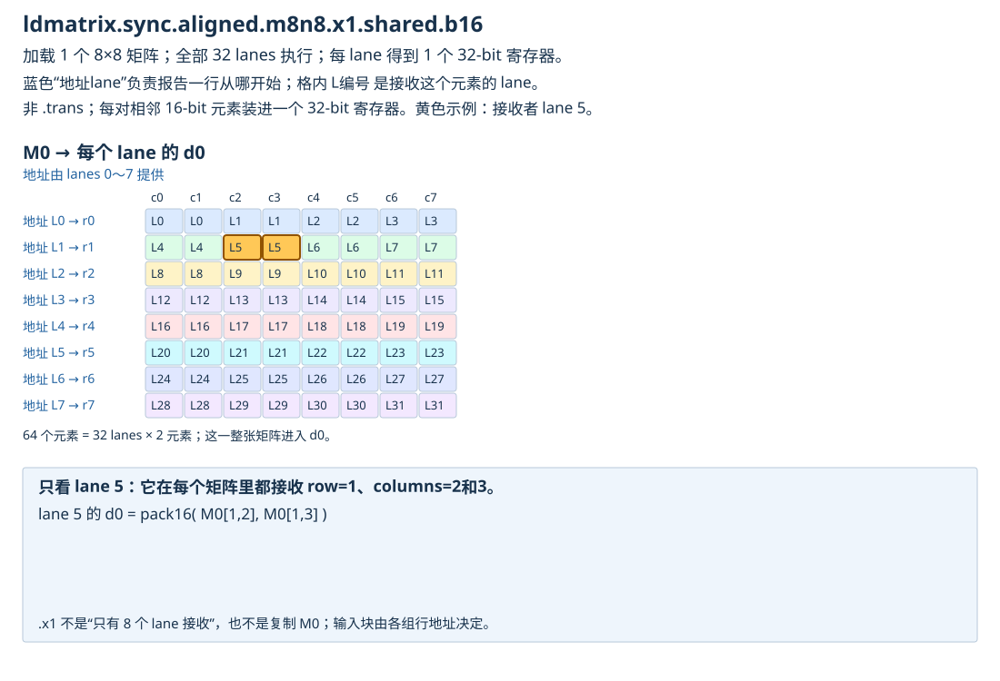
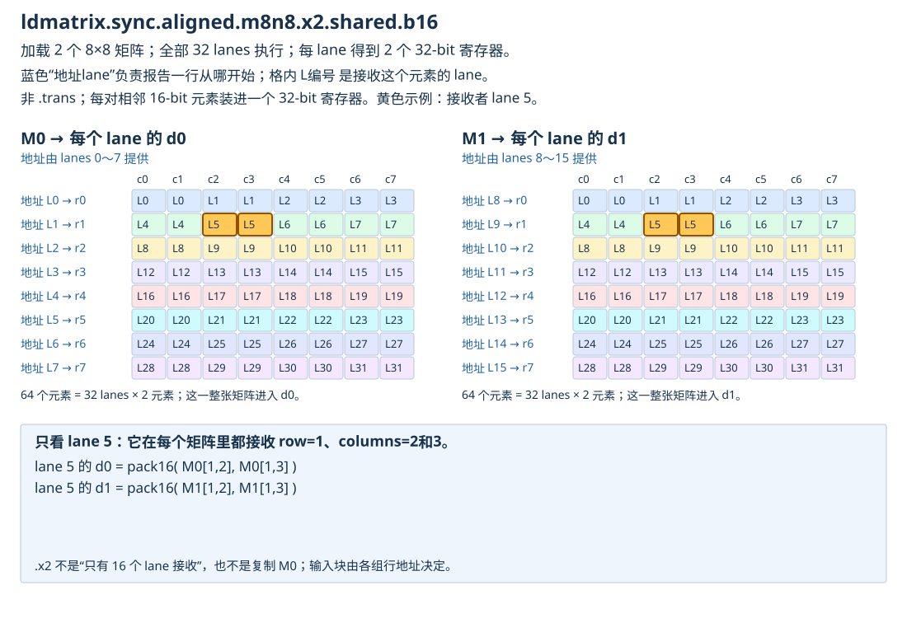
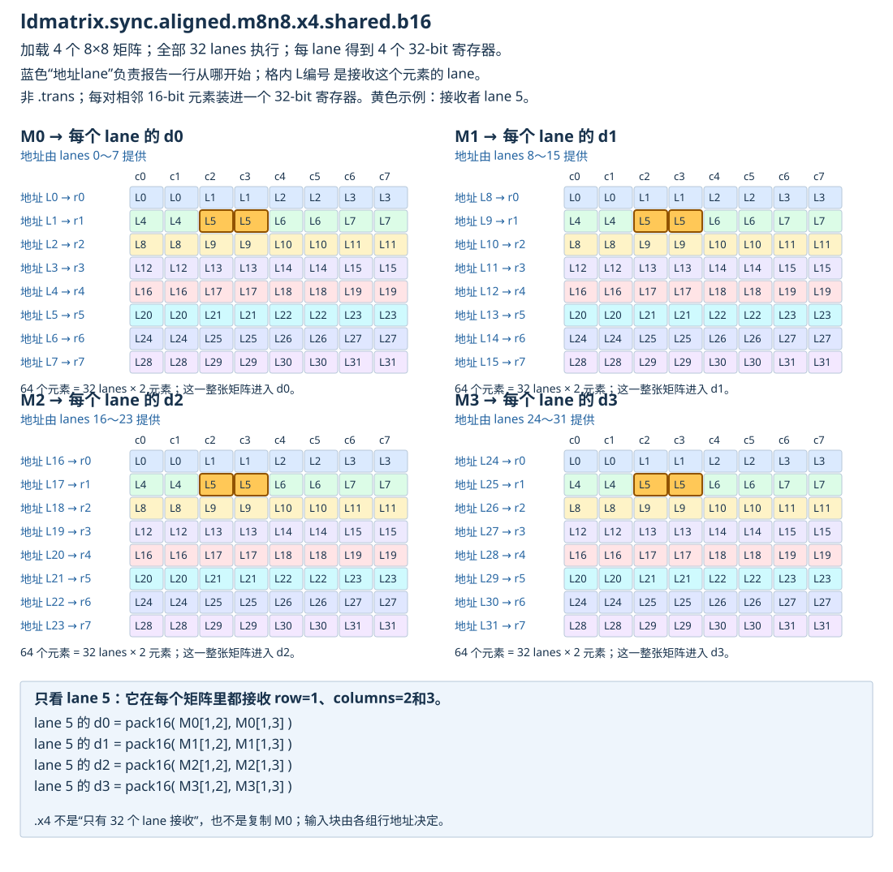

# Tensor Core 数据布局的演进：从 ldmatrix 到 block scaling

记录日期：2026-09-11

教材：[本地章节](http://localhost:8000/zh/chapter_layout_generations/index.html) · [章节源码](../modern-gpu-programming-for-mlsys/zh/chapter_layout_generations/index.md)

配套：[ldmatrix 三种形式的完整图解](http://localhost:8000/study/ldmatrix-guide.html) · [独立 HTML](ldmatrix-guide.html)

## 本轮问题与范围

1. ldmatrix.x1/.x2/.x4 的 lanes 如何提供地址、接收数据？分别画图。
2. XOR swizzle 如何同时兼顾普通 store 和 ldmatrix 的 bank conflict？
3. Hopper WGMMA 是否不再需要先用 ldmatrix 把输入搬到寄存器？
4. Descriptor 是什么？
5. Scale factors 是什么？
6. tcgen05.cp 做什么，如何工作？
7. scale_vec 的 word 内复制是什么？

ldmatrix 图仅讨论 **.m8n8.b16、没有 .trans** 的形式，目标为本章 Ampere 路径。示例寄存器 d0、d1 等是每个线程各自的目的寄存器，不是整个 warp 只分配一份。低精度/scale 讨论沿用本书 sm_100a 的相关路径，不把不同 GPU 支持的格式随意混用。

## 1. 先分清两个角色：报地址的人，和拿到数据的人

可以把一次 ldmatrix 看成：少数 lanes 各递交一张“某行从哪里开始”的地址单，硬件读取这些行，再按固定规则把数据分给整个 warp。

对一个 8×8 的 FP16 矩阵：

- 8 行，所以需要 8 个行起始地址。
- 每行 8 个 FP16，占16 B。
- 整个矩阵64个FP16，占128 B。
- 32个接收lanes，每lane拿2个FP16，装进1个32-bit寄存器。

**8 个行地址不意味着只有 8 个接收者。**

例如 lane 1 提供逻辑 row 1 的起点，但 row 1 的数据会分给 lanes 4、5、6、7。lane 1 自己收到的却是 row 0 的 columns 2、3。

这些行不必在SMEM中连续；提供的地址可以指向经过swizzle的正确行段。每个8元素行段需要满足16B自然对齐，内部仍是连续16B。

## 2. .x1：加载一个矩阵，32个lane各拿一个寄存器



```text
地址提供：
lanes 0..7 → M0 的 rows 0..7 起始地址

数据接收：
全部 lanes 0..31 → 每人得到 d0
```

图中的 L编号是接收数据的lane：

```text
       c0  c1  c2  c3  c4  c5  c6  c7
row0   L0  L0  L1  L1  L2  L2  L3  L3
row1   L4  L4  L5  L5  L6  L6  L7  L7
row2   L8  L8  L9  L9 L10 L10 L11 L11
row3  L12 L12 L13 L13 L14 L14 L15 L15
row4  L16 L16 L17 L17 L18 L18 L19 L19
row5  L20 L20 L21 L21 L22 L22 L23 L23
row6  L24 L24 L25 L25 L26 L26 L27 L27
row7  L28 L28 L29 L29 L30 L30 L31 L31
```

对于接收lane l：

```text
g=l//4
t=l%4
d0 = pack16(M0[g,2t], M0[g,2t+1])
```

pack16 表示两个16-bit元素装进一个32-bit寄存器，不是数值相加。

## 3. .x2：两个矩阵，仍是32个lane，每人拿两个寄存器



```text
地址提供：
lanes  0..7  → M0 的8行
lanes  8..15 → M1 的8行

数据接收：
全部 lanes 0..31：
  d0 来自 M0
  d1 来自 M1
```

两个矩阵分别套用同一张lane映射表。**不是前16个lane拿M0、后16个lane拿M1。**

例如lane5：

```text
d0 = pack16(M0[1,2], M0[1,3])
d1 = pack16(M1[1,2], M1[1,3])
```

总量：2×8×8×2 B=256 B；32 lanes×2 registers×4 B=256 B。

## 4. .x4：四个矩阵，32个lane每人拿四个寄存器



```text
地址提供：
lanes  0..7  → M0 的8行
lanes  8..15 → M1 的8行
lanes 16..23 → M2 的8行
lanes 24..31 → M3 的8行

数据接收：
每个 lane 都得到 [d0,d1,d2,d3]
分别来自 [M0,M1,M2,M3]
```

lane5得到：

```text
d0 = pack16(M0[1,2], M0[1,3])
d1 = pack16(M1[1,2], M1[1,3])
d2 = pack16(M2[1,2], M2[1,3])
d3 = pack16(M3[1,2], M3[1,3])
```

总量：4×128 B=512 B；32 lanes×4 registers×4 B=512 B。

| 形式 | 地址提供lanes | 接收lanes | 每lane的32-bit结果寄存器 | 总读取字节 |
| --- | --- | --- | ---: | ---: |
| x1 | 0..7 | 0..31 | 1 | 128 |
| x2 | 0..15 | 0..31 | 2 | 256 |
| x4 | 0..31 | 0..31 | 4 | 512 |

三种形式都必须由完整warp按指令规则协同执行；不能让仅提供地址的lanes执行，其他lanes跳过。x2/x4表示加载多个矩阵，不是自动复制M0；输入地址决定具体加载什么数据。

### 4.1 与 mma.m16n8k16 的 A fragment 连起来

A是16×16，可拆为四个8×8子块，按如下顺序交给x4：

```text
A的16×16逻辑区域
┌──────────┬──────────┐
│ M0 左上  │ M2 右上  │
├──────────┼──────────┤
│ M1 左下  │ M3 右下  │
└──────────┴──────────┘
```

这样lane5得到A坐标：

```text
d0：(1,2),(1,3)
d1：(9,2),(9,3)
d2：(1,10),(1,11)
d3：(9,10),(9,11)
```

正好对应书中的A fragment。块的顺序由你提供的地址决定，ldmatrix不会猜“哪个块应当是A的右上角”。

### 4.2 .trans 与同步的边界

.trans改变读取后的矩阵解释/fragment映射，不能直接照搬上面的非trans图。ldmatrix是数据搬运，不做矩阵乘法。

.sync表示warp协同执行该指令，不替你保证其他producer线程先前向SMEM写入的数据都已准备好；跨warp生产消费仍需恰当同步。

来源：[PTX ldmatrix](https://docs.nvidia.com/cuda/parallel-thread-execution/index.html#warp-level-matrix-instructions-ldmatrix)。

## 5. 为什么同一个 swizzle 可以兼顾普通 store 和 ldmatrix？

**因为它为两种具体访问设计了不同但都不重复的bank分布，而不是“做XOR就对任何访问都无冲突”。** 下面给出一个可逐个算的例子。

假设一个8×64 FP16的SMEM tile，每行128 B，起点按此atom对齐。每4B word装两个FP16，每16B sector有4个words。

设r为行号，w=0..31为逻辑word列：

```text
q=w//4              # sector号
u=w%4               # sector内word号
physical_word=4*(q XOR r)+u
byte_address=128*r+4*physical_word
bank=physical_word  # 本例中取模后正好如此
```

### 5.1 Producer：一个warp用普通32-bit stores写一整行

让lane t写逻辑word w=t，各lane先从global读取自己的连续两个FP16，再把这两个元素作为一个32-bit word写到上述swizzled地址。

固定row=1，各lane命中的banks是：

```text
lane 0..7  → banks 4,5,6,7,0,1,2,3
lane 8..15 → banks 12,13,14,15,8,9,10,11
...
```

完整32个结果是0..31的一个排列，没有重复。因此该32-bit store访问模式无bank conflict。

**相邻lane的目的地址不必始终单调递增。** 重要的是整组地址仍覆盖这一行完整128 B，sector内部连续，banks各不相同。Global侧的连续读取也可保留。

图示写一行：

```text
逻辑sector：0 1 2 3 4 5 6 7
row1物理：  1 0 3 2 5 4 7 6
每个sector内4个words保持原顺序
```

### 5.2 Consumer：ldmatrix.x1跨8行，各取一个16B行段

选逻辑sector q=0，即每行前8个FP16。让地址lane r提供：

```text
p_r=128*r+16*(0 XOR r)
```

这八个起点不是简单的128*r，但各自的16B仍连续、对齐。ldmatrix按这些起点读取：

| 矩阵逻辑行r | 行地址由谁提供 | 这16B落到的banks | 接收这行的lanes |
| --- | --- | --- | --- |
| 0 | lane0 | 0..3 | lanes0..3 |
| 1 | lane1 | 4..7 | lanes4..7 |
| 2 | lane2 | 8..11 | lanes8..11 |
| 3 | lane3 | 12..15 | lanes12..15 |
| 4 | lane4 | 16..19 | lanes16..19 |
| 5 | lane5 | 20..23 | lanes20..23 |
| 6 | lane6 | 24..27 | lanes24..27 |
| 7 | lane7 | 28..31 | lanes28..31 |

整个128B读取覆盖32个banks各一次，消除了原来每行起点落回同一组banks的冲突。

无swizzle时，八行的行段都落在banks0..3中的不同地址上；这是需要分批的来源。

### 5.3 为什么读出来还是正确矩阵？

对逻辑row1、word0，producer写到：

```text
128*1+16*(0 XOR 1)+0 = 144
```

ldmatrix读取row1时提供的起点也为144，后续16B连续读取该行的8个FP16。写者与读者使用同一映射，数据身份不会错。

Ampere这条ldmatrix没有“SWIZZLE_128B”descriptor字段；kernel把XOR编码进各行起始地址。由于这里移动的是整个16B sector，不破坏ldmatrix需要的连续16B行段。

### 5.4 不要把这个结论推广过头

- 这里producer是32个lane各写4B的一整行。换成别的线程分工、访问宽度或不对齐地址，需要重新分析。
- ldmatrix实际读的是8个16B行段，不是一个warp各随意读取一个FP16列元素。
- x2/x4本身有256/512B数据，多于x1，不能把必要的额外服务量全部当成bank conflict。
- 一条指令可能拆成多个服务批次/wavefront；冲突应在相关批次里分析，不能只把全指令所有bank编号做一次去重。
- 不要把“无冲突”当成“读取延迟只有1个时钟周期”。

已用枚举检查所有r、q下上述store/consumer bank分布均是32个banks的排列，并确认两侧地址一致。这是模型校验，尚未做GPU测试。

## 6. WGMMA是否不需要先经过ldmatrix？

**对来自SMEM的输入，是的。**

```text
Ampere 常见路径
SMEM → ldmatrix → 各线程的A/B寄存器fragment → mma.sync → 寄存器accumulator

Hopper SS 路径
SMEM中的A ─┐
           ├→ wgmma → 寄存器accumulator
SMEM中的B ─┘
```

SS=Shared/Shared：A和B都来自SMEM，因此无需软件先为它们构造每线程register fragments。

RS=Register/Shared：A来自register fragment，B来自SMEM。此时A仍需要被准备成正确的register layout，不能说WGMMA完全不涉及输入寄存器。

“直接读SMEM”指程序可见的数据路径，不是在承诺Tensor Core电路内部没有缓存、缓冲或暂存。累加结果仍在寄存器，SMEM输入仍需事先准备和同步，异步WGMMA完成后才能消费结果。

来源：[PTX WGMMA](https://docs.nvidia.com/cuda/parallel-thread-execution/index.html#asynchronous-warpgroup-level-matrix-instructions)。

## 7. Descriptor：一张压缩的“如何找到数据”说明单

假设告诉搬运者“去柜子取一块矩阵”。只给一个起点还不够，还要说明下一个数据组在哪、内部是否做过swizzle。

Descriptor就是把这些说明打包成硬件能解码的字段。

**WGMMA的SMEM matrix descriptor是一个64-bit值，存放在寄存器里；它不包含矩阵本身。**

```text
寄存器中：64-bit descriptor（地址与布局说明）
                         │
                         ▼
SMEM中：真正的矩阵元素，通常远大于8 bytes
```

书中WGMMA descriptor包括：

| 字段 | 通俗含义 |
| --- | --- |
| start address | 从哪开始找 |
| leading/stride dimension offsets | 按硬件布局规则跨到下一组数据时怎么走 |
| swizzle mode | 按哪种重排规则解释数据 |
| base offset | 起点相对swizzle重复模式的位置 |

不要简单把ldo/sdo等同于普通二维数组的row_stride/col_stride；它们的含义由major mode和swizzle格式决定。

### 7.1 一个具体的寻址例子

采用K-major、128B swizzle，K方向恰好一atom宽，M方向有两个连续8-row groups。假设SMEM起点为2048B：

```text
SMEM偏移2048：第一个8×128B atom，rows0..7
SMEM偏移3072：第二个8×128B atom，rows8..15
```

descriptor告诉WGMMA：从2048开始，跨到下一8-row group使用1024B偏移，atom内部按128B swizzle解释。

PTX的这些地址/offset字段以16B为单位编码，所以2048B编码为128，1024B编码为64。本例K-major swizzled形式的ldo按规定使用编码1；这不表示一般矩阵相邻逻辑元素距离1B。

这只是字段解释例子，不是完整可编译的descriptor构造代码。

### 7.2 改descriptor不会自动改变数据

如果producer按普通布局写入，descriptor却宣称数据已做128B swizzle，硬件会按错误地址取数据。

类似地，TMA descriptor服务于搬运，WGMMA matrix descriptor服务于矩阵读取，Blackwell还有instruction descriptor；**descriptor是泛称，不是所有指令共享同一种结构。** 它们必须对共享数据的实际布局达成一致。

来源：[PTX WGMMA Matrix Descriptor Format](https://docs.nvidia.com/cuda/parallel-thread-execution/index.html#asynchronous-warpgroup-level-matrix-shared-memory-layout-matrix-descriptor)。

## 8. Scale Factors：给一组低精度数字配一个“刻度”

低精度数字可表示的范围和精度有限，可以存一个缩小后的数，再配一个scale恢复其量级：

```text
实际近似值 = 低精度值 × scale
```

例如某block的部分低精度值为：

```text
q = [0.5, 1, 1.5, 2]
scale = 4
恢复值 = [2, 4, 6, 8]
```

例子只展示block内4个元素，不表示硬件block大小为4。量化时通常还会有舍入/饱和，因此恢复值一般只是原数据的近似。

本书NVFP4示例沿K每16个元素共享一个局部scale；MXFP8常见为每32个元素。NVFP4完整量化方案可能还有其他缩放层级，本节聚焦MMA读取的局部scale factors。

对于矩阵：

```text
SFA[m,sfk]：A第m行、第sfk个K块的刻度
SFB[n,sfk]：B第n列、第sfk个K块的刻度
```

某个K-block对输出D[m,n]的贡献相当于：

```text
SFA[m,sfk] * SFB[n,sfk] * sum_k(A_low[m,k]*B_low[k,n])
```

假设只展示某block的两项，A_low=[1,2]、B_low=[0.5,1]、SFA=2、SFB=4：

```text
低精度点积 = 1*0.5+2*1 = 2.5
恢复后的贡献 = 2.5*2*4 = 20
```

这些乘法由block-scaled MMA语义纳入计算，并不要求程序先在SMEM中展开一份完整高精度A/B。

不同K-block的scales可能不同，不能总在完整GEMM结束后统一乘一个常数代替。

## 9. tcgen05.cp：把SMEM中的块送入TMEM

名字中的cp表示copy。这条指令执行SMEM→TMEM的专用异步数据搬运，不执行矩阵乘法，也不自动计算量化scale。

对本书scale数据路径：

```text
GMEM中的SFA/SFB
       │ TMA load
       ▼
SMEM中的SFA/SFB（准备成匹配的来源布局）
       │ tcgen05.cp
       ▼
TMEM中的SFA/SFB
       │ tcgen05.mma读取scale
       ▼
Tensor Core计算
```

它的主要输入可理解成：

```text
目的地：TMEM地址
来源说明：SMEM matrix descriptor
搬运形状：例如32 lanes × 128 bits
多播方式：例如warpx4
CTA协作范围：cta_group::1或::2
```

一个选定线程发出指令，硬件按规定形状、来源descriptor和目的TMEM坐标完成搬运；无需软件先把整块payload经各线程register fragments中转。地址/descriptor本身仍保存在寄存器里。

### 9.1 本书32x128b.warpx4的数量关系

```text
基础块：32 local lanes × 128 bits = 512 B
warpx4：把基础块复制到四个32-lane windows
有效目的数据：4×512 B = 2048 B
```

它复制的是一整份基础tile，不是把每一个word内部自动变成相同四个bytes。源SMEM中的排列必须符合指令所解释的布局，cp不会根据一个普通SFA数组名称自动猜出逻辑行列并任意重排。

### 9.2 把新章节的uint8 TCol记号与前章对上

本章写：

```text
S[(4,32,4):(4@TCol,1@TLane,1@TCol)] + R[4:32@TLane]
```

这里buffer元素是uint8 scale，因此TIRx的TCol步幅以8-bit buffer element为单位；**不等于每步都跨一个32-bit硬件cell**。

```text
TCol元素偏移 = 4*Mgroup+sfk
硬件column = TCol元素偏移//4
word内byte = TCol元素偏移%4
```

例如SFA[64,2]：Mgroup=2，TCol元素偏移=10；硬件column=2，byte=2。与前章(硬件TCol=2,byte=2)一致。

这也说明所有layout步幅都要结合dtype和所用抽象层读，不能只凭@轴名猜物理字节数。

### 9.3 异步与“原理”的边界

发出cp不代表已完成。需要保证来源SMEM数据已准备好并对异步访问路径可见，同时满足后续TMEM消费者的顺序/完成协议；可涉及tcgen05.commit、mbarrier和相应fences。不能简单加一个普通CTA barrier就替代所有异步完成机制。

这里解释的是PTX规定的外部行为，不声称知道内部电路流水线的全部实现。部分cp形式还支持特定压缩格式展开，但本书这里主要使用复制和多播功能。

来源：[PTX tcgen05.cp](https://docs.nvidia.com/cuda/parallel-thread-execution/index.html#tcgen05-instructions-tcgen05-cp)。

## 10. scale_vec：一次MMA需要几个scale？Word里的哪些bytes被使用？

先固定讨论本书的1X/2X/4X形式与1-byte scales。**这表示当前MMA的scale矩阵每行/列需要几个scale，不是整个kernel只能有这些scale。** 格式、K、kind之间有支持约束，并非任意切换。

一个32-bit TMEM word有4个byte槽：

```text
byte编号    0       1       2       3
          [     ][     ][     ][     ]
```

| 形式 | 此处每行/列需要的scale数 | SFA_ID/SFB_ID如何选择 |
| --- | ---: | --- |
| 1X | 1 | ID=0/1/2/3，选一个byte |
| 2X | 2 | ID=0选bytes0、1；ID=2选bytes2、3 |
| 4X | 4 | ID=0，使用全部四个bytes |

本书常见NVFP4、K=64、4X对应每16个K元素一个scale，共四个scales。不能把1X/2X/4X简单理解成乘法次数、重复执行次数或TMEM窗口数。

### 10.1 教材“Word内复制”图具体在画什么？

教材选择以下重复填法：

```text
1X： [SF0][SF0][SF0][SF0]
       ↑ID0  ↑ID1  ↑ID2  ↑ID3

2X： [SF0][SF1][SF0][SF1]
       └─ID0─┘   └─ID2─┘

4X： [SF0][SF1][SF2][SF3]
       └───────ID0───────┘
```

1X下，如果四个槽都提前存了同样SF0，则选哪个ID结果都一样；2X下，两对相同，选ID0或2结果也相同。

**这里不是把scale值相加或乘4，也不是说MMA重复计算四遍。**

### 10.2 对教材表述的关键澄清：相同副本不是普遍硬件要求

官方PTX说明的是“ID选择哪一个byte或对齐byte对”，并未要求所有未选中的槽一定重复相同值。

因此，教材“为了填满word，较短向量会重复”应理解为图中的一种数据填法，不能推广成scale_vec指令必须自动复制。

例如以scale的数值写出一个word（实际保存的是各scale格式的8-bit编码）：

```text
[1, 2, 4, 8]
```

- 1X、ID=2：本次选scale4。
- 2X、ID=0：选[1,2]；ID=2：选[4,8]。
- 4X、ID=0：选全部[1,2,4,8]。

这里是在各自受支持模式下说明byte选择，不意味着任何固定MMA kind都能随意切到三种形式。

来源：[PTX Scale Factor A ID](https://docs.nvidia.com/cuda/parallel-thread-execution/index.html#tcgen05-mma-scale-factor-a)、[Scale Factor B ID](https://docs.nvidia.com/cuda/parallel-thread-execution/index.html#tcgen05-mma-scale-factor-b)。

### 10.3 把三种“重复/共用”彻底分开

| 现象 | 发生在哪 | 含义 |
| --- | --- | --- |
| 一个scale供多个K元素使用 | 数学上的K-block | 一组低精度数共用一个刻度 |
| Word内重复填法 | 一个4B word内部 | 为选中的1B/2B向量安排多个相同候选副本；不是普遍必需 |
| warpx4多播 | 四个TMEM lane windows | 把基础tile复制到不同TLane位置 |

三者不能互相替代。特别是cp的warpx4不负责自动实现上面word内的1X/2X重复填法。

## 11. 三代路径的一页对照

```text
Ampere：SMEM --ldmatrix--> A/B寄存器 --mma.sync--> C/D寄存器
Hopper：SMEM A/B --descriptor + wgmma--> C/D寄存器  （SS形式）
Blackwell：SMEM A/B --descriptor + tcgen05.mma--> C/D TMEM
          SFA/SFB SMEM --tcgen05.cp--> TMEM --供MMA使用
          C/D TMEM --tcgen05.ld--> epilogue寄存器
```

读kernel时，依次确认：数据在哪；谁提供地址/descriptor；指令把数据分给谁；下一阶段看到的layout是否匹配；异步操作是否已满足完成和顺序要求。

## 12. 追问：“ldmatrix跨行读取”是不是指读取整列？

记录日期：2026-09-12

原问题：图里的swizzle似乎消除了整列读取的bank conflict，整行本来就无冲突；为什么教材说ldmatrix会跨行读取？

**这个判断的方向正确，但需要把“跨行”与“读取一列”区分开。这里的ldmatrix.x1.m8n8.b16一次读取8行、每行连续8个16-bit元素，即每行16B，共128B。它取的是一个跨8行的矩形小块。**

### 12.1 三种读取区域并不相同

在一个8×64的FP16父tile中，取左上角8×8子块：

```text
               columns 0..7             columns 8..63
row0         [● ● ● ● ● ● ● ●]       [................]
row1         [● ● ● ● ● ● ● ●]       [................]
row2         [● ● ● ● ● ● ● ●]       [................]
row3         [● ● ● ● ● ● ● ●]       [................]
row4         [● ● ● ● ● ● ● ●]       [................]
row5         [● ● ● ● ● ● ● ●]       [................]
row6         [● ● ● ● ● ● ● ●]       [................]
row7         [● ● ● ● ● ● ● ●]       [................]
```

- 整行读取：从一行拿64个FP16，共128B。
- 一列读取：从8行各拿一个FP16，共16B。
- 本例ldmatrix.x1：从8行各拿8个FP16，共128B。

所以“跨行”表示同一次矩阵加载涉及不同的逻辑行，不表示把矩阵按列存，也不表示使用了.trans。

### 12.2 每个行段单独无冲突，为什么合起来有冲突？

父tile普通row-major，每行128B，取每行开头16B。假设基址按相应边界对齐：

| 逻辑行 | 被读取的字节偏移（含首尾） | 占用banks |
| --- | --- | --- |
| row0 | 0..15 | 0,1,2,3 |
| row1 | 128..143 | 0,1,2,3 |
| row2 | 256..271 | 0,1,2,3 |
| … | … | … |
| row7 | 896..911 | 0,1,2,3 |

bank=(byte_address//4)%32。128B行距刚好绕完32个banks，每到下一行又回到同一组banks。

单独读任意一个16B行段，四个words使用四个不同banks。但这次矩阵读取的八个行段需要同一组banks反复服务不同地址；在本例服务模型中，每个bank有8份请求。

图把它画成“列式冲突”，是在展示这个跨行重复落到相同bank的规律。实际ldmatrix例子是每行一个16B块组成的宽列带，而不是单个元素宽的列。

### 12.3 Swizzle如何同时兼顾这两种访问？

SWIZZLE_128B保持每个16B sector内部连续，只调整sector在各行的位置。对逻辑sector0：

```text
row0 → 物理sector0 → banks 0..3
row1 → 物理sector1 → banks 4..7
row2 → 物理sector2 → banks 8..11
...
row7 → 物理sector7 → banks28..31
```

因此ldmatrix本次读取的32个4B words分散到全部32个banks。kernel提供给ldmatrix的行起点也必须使用相同swizzle后的地址。

整行读取方面，假设一个warp各lane读取一个4B word（两个FP16），这一行原来就覆盖32个banks；swizzle只是交换sector位置，仍然各bank一次。因此用户对图的判断成立：**图中的行访问本来高效，swizzle主要改善图中的跨行访问，同时保留这类行访问的效率。**

不能扩大成任何行访问、任意宽度、任何对齐都必定无冲突，仍需看具体指令服务批次。

### 12.4 跨行本身并不必然产生冲突

若这8×8 FP16矩阵独立紧密存储，行距只有16B：

```text
row0地址 0..15    → banks 0..3
row1地址16..31    → banks 4..7
...
row7地址112..127  → banks28..31
```

那么同样的ldmatrix.x1跨8行读取，原始布局就已经覆盖全部32个banks，不需要用上述swizzle解决这次访问。

所以关键条件是“访问哪些地址、这些地址映射到哪些banks”，而不是只凭“跨行”三个字认定冲突。

教材这句话可以更准确地读作：**普通行式store与一次ldmatrix矩形块加载有不同的访问组织；对于128B行距的本例，需要安排SMEM布局，让跨8行的16B行段也分散到不同banks。**

来源：[PTX ldmatrix的8个行地址与每行16B读取](https://docs.nvidia.com/cuda/parallel-thread-execution/index.html#warp-level-matrix-instructions-ldmatrix)。本节图和bank编号是地址推导，没有新增GPU实测。

## 校验记录

- 已核对官方PTX的ldmatrix地址表、目的寄存器说明、WGMMA descriptor字段、tcgen05.cp及scale ID选择规则。
- 已生成x1/x2/x4三张SVG并通过XML解析；枚举核对每个矩阵的64个元素分给32个lanes，每lane两个元素。
- 已核对store和ldmatrix示例的bank排列及生产者/消费者地址一致性。
- 图中黄色标出lane5，蓝色文字表示地址提供者；这是布局图，不是硬件执行时序图。
- 本轮没有编译或运行GPU kernel，也没有进行浏览器视觉回归测试。
