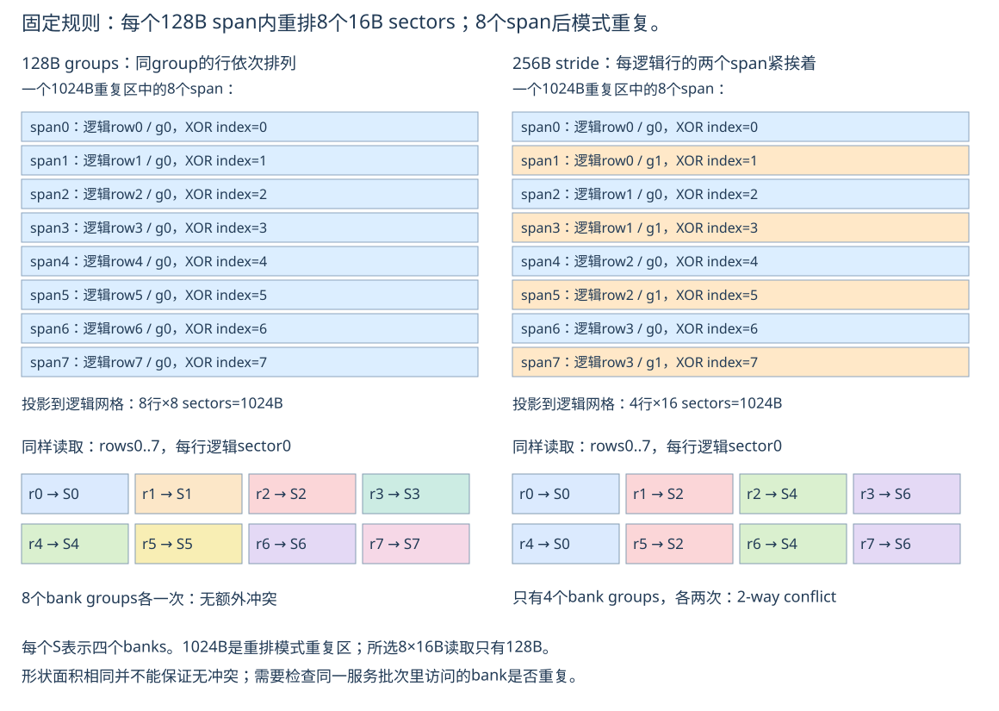
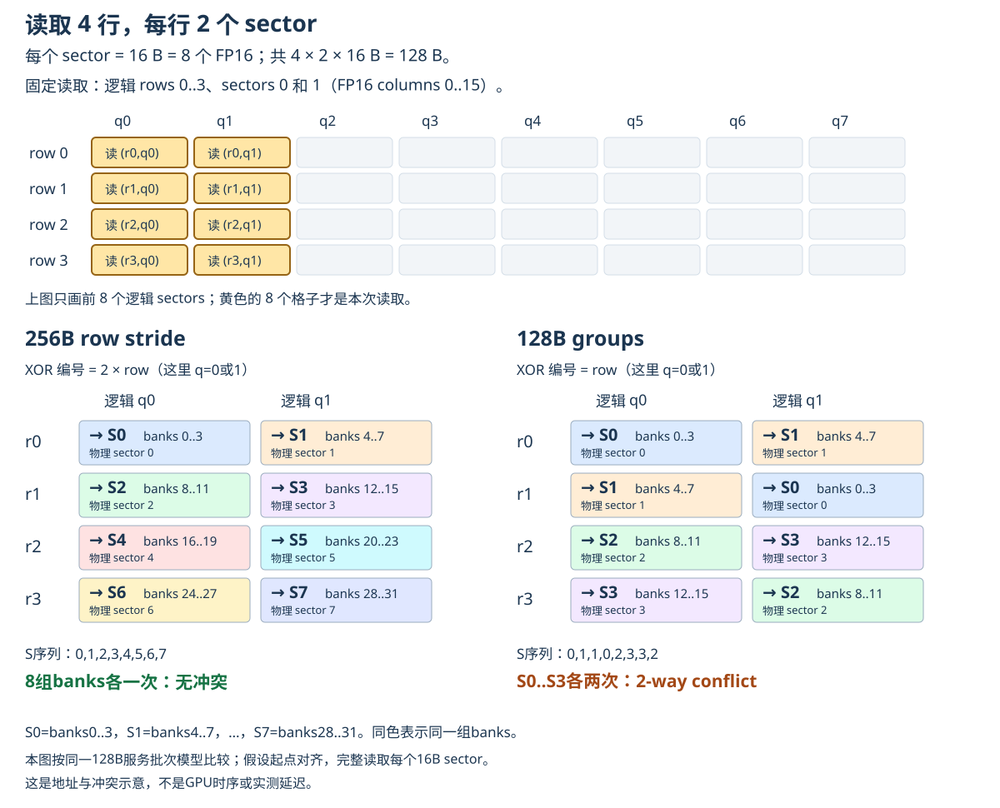

# 异步数据搬运：128B Swizzle 与 Row Layout

记录日期：2026-09-12

教材：[异步数据搬运：TMA](http://localhost:8000/zh/chapter_tma/index.html) · [交互图](http://localhost:8000/zh/demo_zh/tiling_constraint.html?v=row-layout-20260805)

## 先回答：到底是硬件指令影响，还是layout影响？

追问记录：2026-09-12。

**总体上两者共同决定，但本章交互图是在保持swizzle规则和读取请求不变的情况下改变layout，因此图中的冲突差异来自layout。**

可以把整个过程分成三步：

```text
① Layout：某个逻辑元素应放到哪个SMEM地址？
② 128B swizzle：依据这个地址所在的span，重排其内部sector。
③ 消费者读取：本批同时请求哪些地址？这些地址是否重复使用同一bank？
```

这只是解释上的分解。最终的swizzled layout包括前两步；TMA可以在写入时直接形成最终布局，并不要求真的先写一遍再重排一遍。

把硬件比作有32个服务窗口的系统：layout决定每份资料在哪个窗口；消费者指令决定哪些资料要在同一批取。多个不同地址同时挤到一个窗口，才构成bank conflict。

### 这张图到底固定什么、改变什么？

| 项目 | 两种模式之间是否变化 |
| --- | --- |
| 32个banks及地址到bank的规则 | 不变 |
| 128B swizzle规则 | 不变 |
| 选择连续8行，每行同一个16B sector | 不变 |
| 这些逻辑元素在SMEM中的排布 | 改变：256B row stride或128B groups |
| 选中元素的物理地址与bank分布 | 随layout改变 |

例如只看每行左半的sector0：

```text
256B stride：相邻逻辑行隔两个128B spans
→ 本次八行使用S0,S2,S4,S6,S0,S2,S4,S6
→ 四组各重复两次

128B groups：相邻逻辑行隔一个128B span
→ 本次八行使用S0,S1,S2,S3,S4,S5,S6,S7
→ 八组各一次
```

所以这里不是硬件突然换了swizzle算法，而是相同算法遇到了不同地址。教材公式从row变成2*row，是layout导致相邻行地址跨度改变后的结果。

### 指令什么时候也会影响？

如果保持layout不变，但把读取从“8行各1个sector”改成“4行各2个sector”，请求的地址集合变了，冲突也可能改变。这就是上一轮4×16 FP16与8×8 FP16对照的含义；它是另一个实验，不是当前交互图的切换动作。

实际指令的每线程访问宽度和wavefront分组也影响哪些请求会相互冲突。因此不能孤立地说某个layout在所有访问下都无冲突。

更准确的因果关系是：**layout确定数据地址，消费者访问模式/指令确定同批请求；两者共同决定bank conflict。本图专门展示前者的影响。**

TMA在这里是producer：负责把数据按设定规则写进SMEM。图示重点是后续consumer读取该数据时的bank分布，不是在说TMA本身必须切换成另一种硬件指令才能消除冲突。

## 本轮问题

128-byte swizzle与row layout是什么关系？为什么看起来256B row stride对应4×16，128B groups对应8×8？是否可以把128B swizzle理解成固定面积，只取决于长宽？

**答案：你观察到了“同一字节重复区可以对应不同逻辑形状”这一点。但必须区分1024B的重排重复区、128B的示例读取量，以及一次读取是否冲突。面积相等不能保证无bank conflict。**



## 1. 先明确图中的单位

当前交互图每一个cell是16B sector，不是一个FP16元素。它代表：

```text
8个FP16，或者4个FP32，或者16个FP8
```

因此，“4×16”和“8×8”有两种可能含义：

| 数的是 | 4×16的数据量 | 8×8的数据量 |
| --- | ---: | ---: |
| 图中的16B格子 | 1024B | 1024B |
| FP16元素 | 128B | 128B |

这两个1024B与两个128B不能混为一谈。

我检查了当前交互图脚本：它始终选择连续8行、每行一个sector，即8×16B=128B。切换row layout不会把选择自动改成4行×2sectors；dtype也只改变元素数标签。

所以图当前比较的是**相同的8行窄列读取**在两种物理布局下的表现：groups无冲突，256B stride是2-way conflict。

## 2. 固定的到底是什么？

这里讨论标准16B重排粒度的128B swizzle，并先假设shared基址位于1024B模式边界，不涉及其他原子粒度的swizzle形式。

| 概念 | 字节大小 | 含义 |
| --- | ---: | --- |
| 一个sector | 16B | 内部字节顺序保持，作为重排单元 |
| 一个swizzle span | 128B=8sectors | sector在这个范围内交换位置 |
| 一个模式重复区 | 1024B=8spans | span所使用的XOR index每8个循环一次 |
| 本例一次选中读取 | 128B=8sectors | 只是本次访问的字节量，不是整个atom |

不要把“128B swizzle”理解成“任意128B面积的读取都无冲突”。它规定的是特定地址重排规则。

来源：[CUDA TMA Swizzle](https://docs.nvidia.com/cuda/archive/12.8.1/cuda-c-programming-guide/index.html#tma-swizzle)、[Swizzle模式属性表](https://docs.nvidia.com/cuda/archive/12.8.1/cuda-c-programming-guide/index.html#the-swizzle-modes)。

## 3. 硬件关心的是地址中的span编号，不知道哪一行是你的逻辑行

把swizzle前的SMEM字节位置记为a，先拆成：

```text
span_id = a//128                 # 第几个128B段
q = (a//16)%8                   # 该段内第几个16B sector
u = a%16                        # sector内字节
XOR index = span_id%8
physical_sector = q XOR (span_id%8)
```

物理地址可以表示为：

```text
a_sw = span_id*128 + 16*physical_sector + u
```

该公式是对本章对齐示例的表达；不同基址会引入模式偏移，不能无条件拿相对行号代替实际地址相位。

因为每个128B span正好覆盖32个banks，在本例中physical_sector也就是bank group编号S0..S7，每个S覆盖4个相邻banks。

**“q XOR row”只是row stride为128B时的简写。真正用来XOR的是由物理地址决定的span编号。**

## 4. 256B row stride：一行跨两个span

逻辑sector grid每行16格，即256B。设c为逻辑sector列号：

```text
g=c//8       # 一行中的左span0或右span1
q=c%8        # span内部sector列
```

保持普通row-major，SMEM的span排列是：

```text
span0：row0左半(g0)
span1：row0右半(g1)
span2：row1左半(g0)
span3：row1右半(g1)
span4：row2左半(g0)
span5：row2右半(g1)
...
```

对应：

```text
a = 256*r + 128*g + 16*q + u
span_id = 2*r+g
bank_group = q XOR ((2*r+g)%8)
```

固定逻辑column0，即g=0、q=0，读取rows0..7：

```text
逻辑row：   0 1 2 3 4 5 6 7
XOR index： 0 2 4 6 0 2 4 6
bank group：0 2 4 6 0 2 4 6
```

每行前进两个span，所以只访问偶数相位；走四行后开始重复。S0、S2、S4、S6各要处理两份不同地址数据，形成2-way conflict。

选右半的column8时，g=1、q=0，序列变成1,3,5,7,1,3,5,7，仍然有冲突。

## 5. 128B groups：把同一group的逻辑行排在一起

现在不是简单换变量名，而是改变SMEM目的地的物理排列：先存所有行的左半，再存所有行的右半。每group有16行：

```text
span0 ：g0,row0
span1 ：g0,row1
span2 ：g0,row2
...
span15：g0,row15
span16：g1,row0
span17：g1,row1
...
```

对于该16行例子，group占16×128B=2048B：

```text
a = 2048*g + 128*r + 16*q + u
span_id = 16*g+r
bank_group = q XOR (r%8)
```

固定column0，读取rows0..7：

```text
逻辑row：   0 1 2 3 4 5 6 7
XOR index： 0 1 2 3 4 5 6 7
bank group：0 1 2 3 4 5 6 7
```

全部8组banks各出现一次，图示访问无冲突。

这里g×16项消失，是因为本例每group16行，16是8的倍数；不要无条件套到任意group间距。

GMEM原矩阵不用先物理重排：TMA的源tensor map可以用3D坐标和相应strides描述来源，目的地按匹配的group布局组织。只有改名字、没有实际匹配的目标地址排布，不会改变bank conflict。

## 6. 为什么1024B可以看成4×16或8×8格？

一个重复区由8个128B spans组成。

- 每逻辑行128B：8spans对应8行，每行8个16B格，即8×8格。
- 每逻辑行256B：8spans对应4行，每行16个16B格，即4×16格。

```text
同一个1024B模式重复区

128B groups视图：                 256B stride视图：
8行×8格                          4行×16格
[8格 ]                           [左8格][右8格]
[8格 ]                           [左8格][右8格]
[8格 ]                           [左8格][右8格]
[8格 ]                           [左8格][右8格]
[8格 ]
[8格 ]
[8格 ]
[8格 ]
```

所以如果你的“固定面积”指**这两种视图都覆盖1024B的重排重复区**，这一观察正确。

但它只说明“地址重排规则何时循环”，不是“这个矩形区域内任意一次读取都无冲突”。重复区内同一个bank可以对应多个不同地址；访问是否冲突取决于一次同时请求的是哪些地址。

也不能把4×16格解释成一个新的256B swizzle span：每一行仍分成两个独立128B spans，各自按其相位重排。

## 7. 如果你说的是4×16、8×8个FP16：也能成立，但必须明确访问方式

FP16每元素2B，二者都读128B：

```text
4×16 FP16 = 4行×2 sectors
8×8  FP16 = 8行×1 sector
```

假设从row0开始，列起点也对齐，4×16读取每行逻辑sectors0和1；每个sector完整读取16B，并按同一128B服务批次模型分析。

### 7.0 4行×2 sectors的完整图

追问配图（2026-09-12）：[浏览器查看](http://localhost:8000/study/tma-read-4x2.html)。



黄色区域表示固定读取rows0..3、逻辑sectors0和1。每格16B，因此总量128B；用FP16元素计就是4×16。两种layout读取的逻辑数据完全相同，改变的是物理地址及bank归属。

在256B stride下，四行分别使用S0/S1、S2/S3、S4/S5、S6/S7，八组各一次；在128B groups下，分别为S0/S1、S1/S0、S2/S3、S3/S2，四组各两次。

图中下半部分仍按逻辑行列列出请求，格内标注它会去哪个物理sector和bank group；不是把逻辑sector号直接当成bank编号。

### 7.1 256B stride适合这个4×2 sectors例子

```text
row0：q0 XOR 0 → S0；q1 XOR 0 → S1
row1：q0 XOR 2 → S2；q1 XOR 2 → S3
row2：q0 XOR 4 → S4；q1 XOR 4 → S5
row3：q0 XOR 6 → S6；q1 XOR 6 → S7
```

八个groups各一次，因此这个4×16 FP16读取模式无冲突。

### 7.2 128B groups适合8×1 sector；同样4×2反而重复

128B groups的8×1前面已得到S0..S7。

若改读4×2 sectors：

```text
row0：S0,S1
row1：S1,S0
row2：S2,S3
row3：S3,S2
```

只有四个groups，各重复两次，反而2-way conflict。

| SMEM row layout | 8×8 FP16：8行×1 sector | 4×16 FP16：4行×2 sectors |
| --- | --- | --- |
| 128B groups | 无冲突 | 2-way |
| 256B stride | 2-way | 无冲突 |

这张表针对上述具体对齐与选取位置。**读取面积完全相同，bank表现却不同**，正好说明面积不够判断性能。

例如把双sector读取跨到逻辑sector7、8，它们分属两个span，bank结果还会变化；实际kernel必须按真实起点、指令访问粒度和wavefront分组分析。

## 8. 对TMA合法性的限制另算

图中的256B row-stride排布用于说明地址效应，不能将最内层box维度直接设成256B再使用本节SWIZZLE_128B。

该TMA模式要求box最内层宽度不超过128B。教材使用(group,row,col)三维视图，把col维缩到64个FP16，也就是128B，再按groups组织目标。

因此，“某个手工布局的某种访问可以无冲突”和“这个布局能直接作为此TMA box使用”是两个判断。

## 9. 读交互图时的顺序

1. dtype设f16，记住每格8个FP16。
2. column选0、rows选0..7：这是8×8 FP16，共128B。
3. 256B stride模式：底部S0、S2、S4、S6各出现两次。
4. 128B groups模式：底部S0..S7各一次。
5. 不要把图中的1024B atom边界当成当前读取区域；黑框选中的八个16B格才是本次访问。

## 校验记录与来源

- 已检查当前`tiling_constraint.html`：读取始终是8行×1 sector，两个row layout分别使用(2r+g)%8和r%8。
- 已枚举验证两种layout的16×16 sector坐标，字节级重排计算与bank-group公式一致。
- 已验证上表四种layout/读取shape组合的冲突深度：1、2、2、1。
- 本页示意图通过SVG XML解析；未运行GPU kernel，图中服务批次不是实测时钟延迟。

资料：[教材章节](../modern-gpu-programming-for-mlsys/zh/chapter_tma/index.md)、[交互图实现](../modern-gpu-programming-for-mlsys/zh/_extra/demo_zh/tiling_constraint.html)、[CUDA TMA Swizzle](https://docs.nvidia.com/cuda/archive/12.8.1/cuda-c-programming-guide/index.html#tma-swizzle)。

## 10. 追问：4行×2span是否对应256B stride，128B是否固定？

记录日期：2026-09-12。

**需要把sector、span、整行stride和指令访问总量分开。此前例子为4行×2个sector，不是4行×2个span。**

| 单位或量 | 本节数值 | 指什么 |
| --- | ---: | --- |
| sector | 16B | 本节swizzle重排的一块数据 |
| 128B swizzle span | 128B=8 sectors | 这种模式的段内重排宽度 |
| 256B row stride | 256B=2 spans | 相邻完整逻辑行起点的距离 |
| 128B group内row stride | 128B=1 span | 同group相邻行起点的距离 |
| 每个bank的一份word | 4B | 本节bank映射与服务模型的粒度，不是bank总容量 |

原来的两种读取方式：

```text
4行×2 sectors = 4行×32B = 128B
8行×1 sector  = 8行×16B = 128B
```

而真正的4行×2 spans、8行×1 span都是1024B，是另外大8倍的数据量。

### layout的2 spans/1 span和读取的2 sectors/1 sector不是同一含义

256B stride下，整行有2 spans，但本例每行只读取开头2 sectors，即32B；剩下224B不在本次读取中。下一逻辑行的起点仍相距256B。

128B groups下，组内整行有1 span，但本例每行只读取1 sector，即16B；剩下112B不在本次读取中。

在前面具体的对齐、选取位置和同批服务模型下，可以得到以下匹配：

| 数据布局 | 本例无冲突的128B读取形状 |
| --- | --- |
| 256B row stride | 4行×2 sectors（每行32B） |
| 128B groups | 8行×1 sector（每行16B） |

这不是按指令读取的矩形长宽自动推出stride的通用公式。stride属于存储布局，访问形状说明本次选择的数据，二者都要通过实际地址映射到bank后判断。

### 128B在这里有两个不同身份

1. 32个banks各处理一个4B word，合计128B：这是当前简化分析中的一份理想服务量。更宽的指令请求需要分成多个内部服务批次，冲突还会增加服务量/批次。
2. SWIZZLE_128B的128B：这是所选swizzle模式的重排宽度；还有64B、32B等其他模式。

二者数值相同，便于构造示例，但不是同一个定义。不要把128B理解成整个硬件指令最多读取的数据量。例如非trans的ldmatrix.m8n8.b16.x1/x2/x4分别读取128B、256B、512B。

bank也不是每个只有4B存储容量；4B指这里的word与bank服务粒度。

### “硬件数据位置形状”也需要明确

4行×2sector是我们选出来说明bank conflict的逻辑访问模式，不是说所有硬件都自带一个4行×2sector指令。

具体指令确实有约束，例如ldmatrix.m8n8.b16.x1读8个16B行段，同时允许程序提供各行地址；普通load/store则由各lane的地址与访问宽度共同决定逻辑访问区域。先明确具体指令及线程分工，再据此选layout。

正确读法：**根据消费者的真实访问模式设计layout，使同一服务批次中的不同word尽量分散到不同banks；128B是本例的理想服务量与所选swizzle宽度，不是任意指令固定的总读取量。**

### 10.1 再解释：“每行读两个sector不能推出两个span的stride”

每行读两个sector，确定的只有：每行读取2×16B=32B。

它没有确定下一逻辑行从哪里开始。以下两种存放方式都可以每行读取前32B：

```text
布局A，行距128B：
row0读 [0..31]
row1读 [128..159]
row2读 [256..287]
row3读 [384..415]

布局B，行距256B：
row0读 [0..31]
row1读 [256..287]
row2读 [512..543]
row3读 [768..799]
```

以上是施加本节swizzle之前的位置。两者每行读取量完全相同，地址跨度不同。

在本节对齐、sector0和1的访问条件下，应用相同128B swizzle后：布局A命中S0/S1、S1/S0、S2/S3、S3/S2；布局B命中S0/S1、S2/S3、S4/S5、S6/S7。因此这个例子中B更适合该读取方式。

这里是先给出两种候选布局，再通过bank映射判断哪个更合适；不是把“读两个sector”换算为“stride必须是两个span”。

用户可以先记住本章具体组合：**4行×2sector的这次读取配256B stride可无冲突。** 无须立刻掌握所有其他可能布局；只需避免把这个算出来的结果当成通用的单位换算公式。
正确的推理顺序是：

  我每行要读32 B
      ↓
  选择一种存放方式，比如行距256 B
      ↓
  算一下各地址对应的banks
      ↓
  发现没有重复，所以这个组合可行

  不是：

  读2个sector → stride就必须是2个span

  你目前可以先记住：本章这个“4行×2sector”的访问，配256B stride可以无冲突。 我强调“不是通用关
  系”，只是说这是分析得到的结果，不是“2sector＝2span”的单位换算。