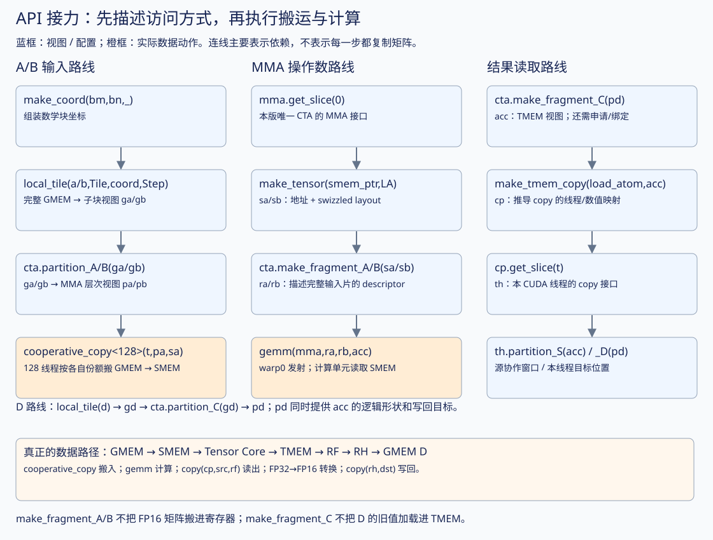
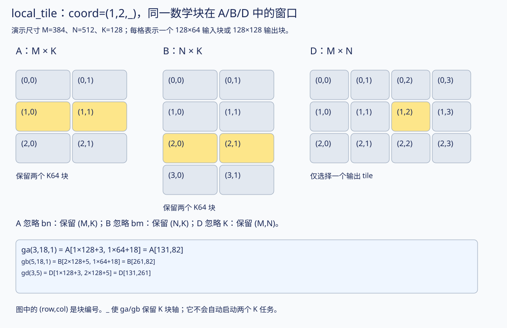
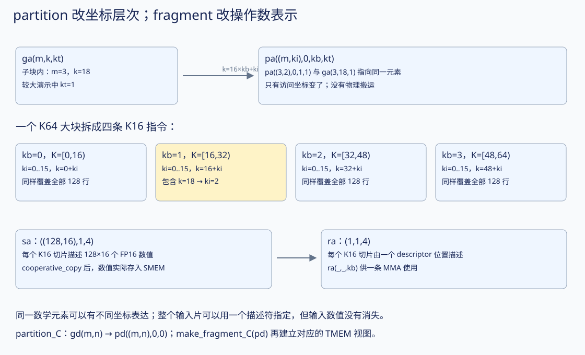
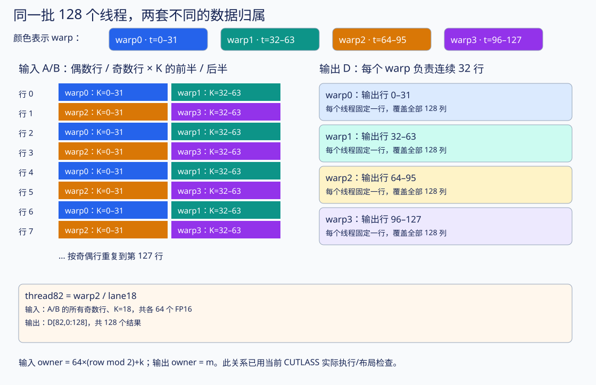
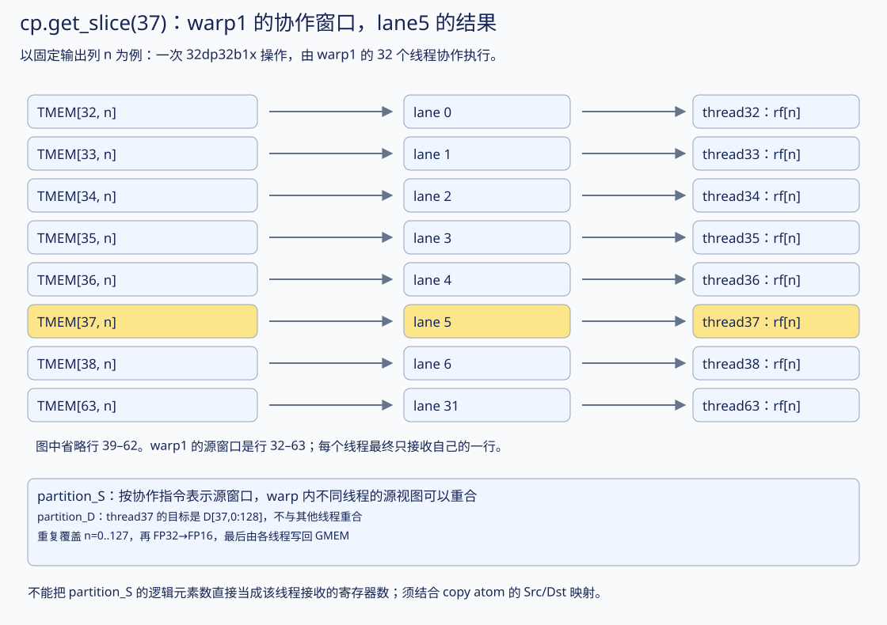

# CuTe API 图解：坐标、分片、fragment 与线程编排

以 [v01_single_tile.cu](../kernels/v01_single_tile.cu) 为准，接续[第一个 kernel 的计算过程](01-single-tile-walkthrough.md)。[交互图册](01-cute-api-atlas.html#lab)可以选 CTA tile 和线程号，同时查看输入搬运、TMEM 写回的不同分工。

先记一句话：**先选数学上的数据块，再组织硬件需要的访问形式，最后由参与线程执行 copy 和 MMA。** 下面这些函数并非都在“给线程分数据”。

## 1. 一张图串起全部 API



|API|它回答的问题|本版结果|调用时是否搬矩阵元素？|
|---|---|---|---|
|`make_coord(bm,bn,_)`|要描述哪个输出块位置，哪一轴暂不固定？|坐标对象 `(bm,bn,_)`|否|
|`local_tile`|从完整矩阵选哪一块？|GMEM 子块 `ga/gb/gd`|否|
|`mma.get_slice(0)`|取哪个参与者在该 MMA 中的份额？|本版唯一 CTA 的 MMA 接口|否|
|`cta.partition_A/B/C`|这个 CTA 的数据怎样按 MMA 的坐标层次组织？|`pa/pb/pd`|否|
|`cta.make_fragment_A/B`|这个 MMA 用什么表示输入？|本版是 SMEM descriptor 视图 `ra/rb`|不搬 A/B 元素|
|`cta.make_fragment_C`|这个 MMA 的累加器放哪里、按什么布局？|本版是 TMEM 视图 `acc`|不搬，也不自动申请 TMEM|
|`cooperative_copy<128>`|128 个线程怎样合作把源数据复制到目标？|GMEM A/B → SMEM A/B|**是**|
|`make_tmem_copy`|选定的 TMEM load 指令怎样覆盖 acc？|线程/数值映射对象 `cp`|否|
|`cp.get_slice(t)`|取哪个线程在该 copy 中的份额？|线程 t 的 copy 接口 `th`|否|
|`th.partition_S/D`|该 copy 参与者使用什么源窗口、接收哪些目标元素？|`src/dst` 视图|否|
|`copy(cp,src,rf)`|按这个计划执行 TMEM load|TMEM → FP32 寄存器|**是**|
|`copy(rh,dst)`|把已转换的 FP16 结果写入目标|寄存器 → GMEM D|**是**|

`gemm(mma,ra,rb,acc)` 才是发出计算的地方。前三类操作主要在建立视图；视图中可以含运行时地址和坐标，不能因此说它们全部没有运行时开销，但它们不等于矩阵数据已搬运或已计算。

## 2. make_coord：只组装“块坐标”

```cpp
auto coord = make_coord(bm, bn, _);
```

可以近似理解为创建一个三元组。它没有访问 A，也没有启动 CTA。

```text
数学轴：     M      N      K
coord：     bm     bn      _
含义：   第几行块 第几列块 保留 K 块轴
```

`bm/bn` 是**块编号**，不是矩阵元素的行列号。一个块有 128 行，因此 bm=1 表示起始行 128，而不是起始行 1。

`_` 表示后续切片保留该轴，不是“当前线程号”、不是“未知整数”，也不意味着 GPU 会自动并行执行该轴。

v01 中 bm=bn=0；这是唯一输出块。为看清选块过程，下一图使用一个更大的**布局演示**：M=384、N=512、K=128，tile 仍为 `(128,128,64)`。它仅用于演示 API 的坐标运算，不是声称 v01 kernel 支持这些运行参数。

## 3. local_tile：一份 (M,N,K) 坐标，投影到三张矩阵



令 `coord=make_coord(1,2,_)`：

```cpp
auto ga = local_tile(a, Tile{}, coord, Step<_1,X,_1>{});
auto gb = local_tile(b, Tile{}, coord, Step<X,_1,_1>{});
auto gd = local_tile(d, Tile{}, coord, Step<_1,_1,X>{});
```

|矩阵|需要的轴|不需要的轴|选出的视图|
|---|---|---|---|
|A，存储为 `(M,K)`|M、K|N|A[128:256, 0:128]，再按 K64 分块|
|B，存储为 `(N,K)`|N、K|M|B[256:384, 0:128]，再按 K64 分块|
|D，存储为 `(M,N)`|M、N|K|D[128:256, 256:384]|

`Step<_1,X,_1>` 在这个调用中保留 M/K、略去 N。这里的 `_1` 不是 A 的实际 stride；实际 stride 仍来自 a 的 layout。

K=128 有两个 K64 块，所以：

```text
ga.shape = (128,64,2)
gb.shape = (128,64,2)
gd.shape = (128,128)
```

每个维度的意思如下：

```text
ga(local_m, local_k, kt)
= A[bm×128 + local_m, kt×64 + local_k]

gb(local_n, local_k, kt)
= B[bn×128 + local_n, kt×64 + local_k]

gd(local_m, local_n)
= D[bm×128 + local_m, bn×128 + local_n]
```

例子：`ga(3,18,1)` 对应 `A[131,82]`；`gb(5,18,1)` 对应 `B[261,82]`；`gd(3,5)` 对应 `D[131,261]`。这些映射已经用 CuTe identity tensor 实际验证。

回到 v01，bm=bn=kt=0，ga/gb 的最后一维大小为 1。API 没变，只是范围缩小了。

## 4. mma.get_slice 与 partition_A/B/C：取 CTA 份额，再整理坐标

```cpp
auto cta = mma.get_slice(_0{});
auto pa = cta.partition_A(ga);
auto pb = cta.partition_B(gb);
auto pd = cta.partition_C(gd);
```

这个 `mma` 是 Blackwell 的单 CTA MMA，traits 的参与者布局 `ThrID` 大小为 1。**因此 slice=0 代表唯一 CTA 的份额，不是 CUDA thread0。** 128 个 CUDA 线程执行这几行时，都能得到同样的 CTA 级视图。

`get_slice` 的一般含义是“取当前操作对象的某个参与者切片”。参与者的粒度由操作对象决定。不能把这里的结论推广为“所有架构的 `mma.get_slice` 都取 CTA”；其他 MMA 原语可能按线程描述参与者。



`partition_A` 按本 MMA 的 K16 粒度拆开 K64：

```text
ga：(128,64,KT)
            │ 拆分 k = 16×kb + ki
            ▼
pa：((128,16), 1, 4, KT)
      m   ki  mr kb  kt
```

这里是 4 个顶层维度，第 0 维是嵌套的 `(m,ki)`。`mr` 表示 M 方向额外重复块，本版只有一个 M128，因此 mr=0。

对应公式：

```text
pa((m,ki),0,kb,kt) = ga(m,16×kb+ki,kt)
pb((n,ki),0,kb,kt) = gb(n,16×kb+ki,kt)
pd((m,n),0,0)     = gd(m,n)
```

所以前面的 `A[131,82]`：

```text
完整矩阵：A[131,82]
选块之后：ga(3,18,1)
MMA 分层：pa((3,2),0,1,1)
                     ↑ ↑
                   K16 K64 块编号
```

它们还是同一地址上的同一个元素。**partition_A 并没有让数据在物理内存中重新排列，也没有指定哪个 CUDA 线程去加载它。** 在本单 CTA 配置下，它把整个输入 tile 改用 MMA 对应的坐标层次访问。

`pa(_,_,_,kt)` 固定最后的 K64 大块编号，留下 `((128,16),1,4)`，正好与一个输入 SMEM tile 的 shape 对应。

## 5. make_fragment：让数据能作为指定 MMA 的操作数

```cpp
auto sa = make_tensor(make_smem_ptr(s.a.begin()), LA{});
auto ra = cta.make_fragment_A(sa);
auto rb = cta.make_fragment_B(sb);
auto acc = cta.make_fragment_C(pd);
```

**fragment 不等于寄存器数组。** 应看选定的 MMA 原语需要什么表示：

|本版对象|逻辑 shape|表示的东西|底层矩阵数值实际在哪里？|
|---|---|---|---|
|`sa/sb`|`((128,16),1,4)`|8192 个 FP16 的 SMEM 视图|SMEM|
|`ra/rb`|`(1,1,4)`|四个 K16 位置的 descriptor 访问方式|A/B 数值仍在 SMEM|
|`pd`|`((128,128),1,1)`|目标输出的 GMEM 视图|GMEM|
|`acc`|`((128,128),1,1)`|对应逻辑输出的 FP32 累加器视图|TMEM，申请并绑定之后才能使用|

A fragment 的第一个维度从 `(128,16)` 变成 `1`，不是丢掉数据：**一个 descriptor 描述整片输入，不必把每个 FP16 数值都作为寄存器参数传给 MMA。** `ra(_,_,1)` 提供第二个 K16 区间的 descriptor。

可以这样区分：`sa` 能回答“第 m 行第 k 个输入数值存在哪里”；`ra` 能回答“这一条 MMA 应从哪里、按什么格式读取完整的 A 操作数”。

`acc` 的 shape 参照 `pd` 的逻辑输出，但不会因此把 D 的旧数值加载进 TMEM。实际存储通过：

```cpp
alloc.allocate(128, &s.tmem);  // 申请 128 列 TMEM
acc.data() = s.tmem;           // 为 acc 绑定地址
```

建立。第一次 MMA 使用 `ScaleOut::Zero`，忽略原来的 TMEM 内容。

## 6. cooperative_copy：这里才真正给输入搬运线程分工

```cpp
cooperative_copy<128>(threadIdx.x, pa(_,_,_,0), sa);
```

三个参数分别是当前线程号、源视图、目标视图。所有 128 个线程共同执行，CuTe 根据这两个视图构造分工，然后每个线程只完成自己的部分。源是 GMEM，目标是 swizzled SMEM。

**本版的实际默认参数是 `cooperative_copy<128,16>`：128 个线程，最大向量化宽度 16 bits，即一个 FP16。** 不是 128 bytes，也不是默认一线程一次 128-bit 向量。这是当前 CUTLASS v4.6.0 重载的明确行为；最终机器指令细节仍由编译器决定。

本机直接在 CPU 上执行了这个 `CUTE_HOST_DEVICE` API，用相同的 Tensor 类型和对齐存储逐线程观察写入。完整覆盖 8192 个输入，每个元素恰好一个搬运者。得到：

```text
给定线程 t ∈ [0,127]：
  local_k = t % 64
  row_parity = t / 64
  负责输入 A[2*r + row_parity, local_k]，r=0..63
  B 同理，把 A 的行轴 m 换成 B 的行轴 n。

反过来：A[m,k] 的搬运者 t = 64×(m%2) + k
```

每个线程固定一个 K 坐标，处理所有偶数行或所有奇数行，共 64 个 FP16。这个规律由本版类型、布局与默认向量化参数共同决定；更换它们后应重新推导或检查，不能直接套用。



|warp|线程号|A/B 输入搬运职责|D 输出写回职责|
|---|---|---|---|
|0|0–31|偶数行，K=0–31|行 0–31，全部 N 列|
|1|32–63|偶数行，K=32–63|行 32–63，全部 N 列|
|2|64–95|奇数行，K=0–31|行 64–95，全部 N 列|
|3|96–127|奇数行，K=32–63|行 96–127，全部 N 列|

例如 thread82：warp2、lane18。

```text
装 A：A[1,18], A[3,18], A[5,18], …, A[127,18]
装 B：B[1,18], B[3,18], B[5,18], …, B[127,18]
写 D：D[82,0], D[82,1], …, D[82,127]
```

**搬进来的输入不归搬运线程独占使用。** 写进 SMEM 后，Tensor Core 按 descriptor 使用整个 CTA 准备的 A/B。thread82 并非只计算自己搬入数据的乘积。

swizzle 还会改变目标的物理地址。若示意基地址按 1024 bytes 对齐，`A[3,18]` 的 GMEM 元素偏移是 210，SMEM 元素偏移是 202，搬运线程为 82。线程所有权用逻辑坐标描述，swizzle 描述物理存放地址，两者是不同层次。

## 7. make_tmem_copy：从“计算结果布局”推导“读取结果的线程布局”

```cpp
auto cp = make_tmem_copy(SM100_TMEM_LOAD_32dp32b1x{}, acc);
```

这行拿到两份信息：

1. `acc`：结果在 TMEM 中的逻辑布局。
2. `SM100_TMEM_LOAD_32dp32b1x`：基础读取操作的参与规则；一个 warp 协作访问 32 条 datapath，每条提供一个 32-bit 数。

CuTe 用它们构造 `cp`，描述如何覆盖结果、组织线程和数值。创建 cp 本身不执行 `tcgen05.ld`，也不创建新的 CUDA 线程。

本版 acc 是 128 行、128 列的 FP32；对应四个 warp 的读取方案。一次基础操作处理其中一个 warp 的 32 行、某一列，重复覆盖所有列。



## 8. cp.get_slice 与 partition_S/D：warp 协作源窗口和线程结果

```cpp
auto th  = cp.get_slice(threadIdx.x);
auto src = th.partition_S(acc);
auto dst = th.partition_D(pd);
```

这里 `get_slice(t)` 的 t 才是 CUDA 线程号，因为 **cp 的参与者是 copy 线程**。用“对象 + get_slice”一起读：

```text
mma.get_slice(0)   → 本版 CTA0 的 MMA 份额
cp.get_slice(37)   → thread37 的 TMEM copy 份额
```

`partition_S` 的 S=source；`partition_D` 的 D=destination。它们使用同一个 copy 映射，让逻辑输出坐标对应起来。

这里有一个容易忽略的细节：**源视图可以表示整个 warp 的协作窗口，并不等于当前线程独自接收的寄存器元素列表。** 本版实际打印结果：

```text
thread37 的 src.shape = ((32,1),128,1,1)
                        ↑      ↑
                     32 条行   128 列
thread37 的 dst.shape = (( 1,1),128,1,1)
                        ↑      ↑
                     该线程一行 128 列
```

thread32 与 thread37 的 source 坐标窗口都是行 32–63、列 0–127；但 destination 分别是行 32 和行 37。`src` 中 4096 个逻辑位置描述协作读取的区域，不表示每个线程有 4096 个 FP32 寄存器，也不表示每线程独立重复加载同一窗口。Copy atom 将 warp 级源位置映射到各 lane 接收的数值。

这也是为什么不能只看到 `partition_S` 的名字，就把它简单解释成“列出当前线程独享的所有源元素”。对协作指令，需要同时看 source layout、destination layout 和线程映射。

最终每个线程的目标 fragment 有 128 个元素：

```text
thread t：rf[j] 接收 acc[t,j]，j=0..127
          rh[j] = FP16(rf[j])
          dst[j] 对应 D[t,j]
```

thread37 位于 warp1/lane5。该 warp 的 TMEM 行窗口是 32–63，lane5 接收行 37。对某一列 n：

```text
TMEM[32,n] → lane0 → thread32 的 rf[n]
TMEM[33,n] → lane1 → thread33 的 rf[n]
...
TMEM[37,n] → lane5 → thread37 的 rf[n]
...
TMEM[63,n] → lane31 → thread63 的 rf[n]
```

后续真正的数据动作是：

```cpp
copy(cp,src,rf);                            // warp 协作的 TMEM → REG
cutlass::arch::fence_view_async_tmem_load(); // 等本线程 TMEM load 完成
// rf → rh：数值从 FP32 转成 FP16
copy(rh,dst);                              // 当前线程 REG → GMEM
```

虽然线程号没有变化，同一个线程在输入 copy 和输出 copy 中负责的坐标完全可以不同。CuTe 的分工是附着在**具体操作和布局**上的，不是给每个线程永久分配一片矩阵。

## 9. 把“线程编排”分成三件事

|层次|本版由什么控制？|例子|
|---|---|---|
|启动多少线程、多少 CTA|CUDA launch 参数|`<<<dim3(1,1),128,...>>>`|
|各角色执行哪些语句|源码中的条件分支|`if(warp0)`，`if(threadIdx.x==0)`|
|执行一次 copy/MMA 时，各参与者对应什么数据|CuTe 的具体操作 traits、layout 与 slice|输入奇偶行分工；输出每线程一行|

`make_coord` 不会把 CTA 指定到某个 SM，`get_slice` 不会命令 warp scheduler 下一刻执行哪个 warp，`partition` 也不会创建线程。

本版线程仍由 GPU 硬件调度。CuTe 描述工作与数据的对应关系；分支指定哪些现有线程参与操作。同步操作保证数据依赖，不保证整个 kernel 中每个 warp 以固定周期交替运行。

|阶段|哪些线程参与？|需要特别区分的含义|
|---|---|---|
|构造坐标/视图|所有 128 个线程执行对应代码|相同 CTA 级视图可以被很多线程同时持有|
|申请/释放 TMEM|warp0 的 32 个线程|该 API 要求 warp 协作参与|
|初始化 mma_bar|只有 thread0|一次初始化，不是每线程初始化一遍|
|装 A/B|全部 128 个线程|每线程按输入 copy 分工搬运|
|可见性 fence + CTA 同步|全部 128 个线程|准备好输入再提交计算|
|四次 MMA 封装调用|warp0|内部 `elect_one_sync()` 选一个线程实际发射每条 MMA|
|等待 MMA 完成|全部 128 个线程|count=1 表示所需完成通知，不是等待线程数|
|读取 TMEM、转换、写 D|全部 128 个线程，按四个 warp 协作读取|本版最终每线程写一行|
|释放前 CTA 同步|全部 128 个线程|确认所有线程不再使用 TMEM 后回收|

可以同时对照[原时序图](v01-memory-timeline.svg)。它表示先后依赖，方框宽度不代表真实耗时。

## 10. 用 A[3,18] 串一次，别把各层编号混起来

以下回到真实 v01 的 bm=bn=kt=0：

```text
1. make_coord(0,0,_)：唯一输出块的坐标。
2. local_tile：ga(3,18,0) 指向 A[3,18]。
3. mma.get_slice(0)：取唯一 CTA 的 MMA 份额。
4. partition_A：pa((3,2),0,1,0) 仍指向 A[3,18]。
5. cooperative_copy：thread82 把这个值搬进 sa 的对应逻辑位置。
6. 采用图示对齐条件时：目标为 s.a 的物理元素 202。
7. ra(_,_,1)：第二个 K16 descriptor 包括这个输入位置。
8. warp0 提交 MMA，由 Tensor Core 用它更新整块 acc 中的相关结果。
9. 例如 acc[3,5] 完成全部 K 累加后，由 thread3 的 TMEM copy 接收。
10. thread3 转成 FP16，写到 GMEM D[3,5]。
```

`A[3,18]` 会与所有 n 对应的 B[n,18] 配对，影响 D 第 3 行的所有列；这里仅选择 D[3,5] 展示一条结果路径。thread82、CTA0、kb1、TLane3、TCol5 是不同角色的编号。

## 证据与适用范围

输入搬运分工不是示意猜测：使用 CUTLASS v4.6.0 原版 `cooperative_copy<128>` 在 CPU 上逐线程执行，检查所有输入位置恰好写一次、写入值正确、每线程 64 个 FP16。输出映射和较大 local_tile 示例用 identity tensor 验证。CPU 诊断只检查布局、数据归属与普通复制，不执行 GPU MMA/TMEM 指令，也不测性能。

- [完整输入 owner 表](../results/v01-api-mapping.json)；[诊断输出](../results/v01-api-inspection.txt)。
- [CUTLASS cooperative_copy 原实现](https://github.com/NVIDIA/cutlass/blob/v4.6.0/include/cute/algorithm/cooperative_copy.hpp)。
- [TiledMMA / ThrMMA 的 slice、partition、fragment](https://github.com/NVIDIA/cutlass/blob/v4.6.0/include/cute/atom/mma_atom.hpp)。
- [TMEM copy traits 与 make_tmem_copy](https://github.com/NVIDIA/cutlass/blob/v4.6.0/include/cute/atom/copy_traits_sm100.hpp)。

改变 GPU 原语、输入 layout、copy atom 或向量化参数，线程分工可能变化。本文数字和图示首先服务这份 v01 代码。
