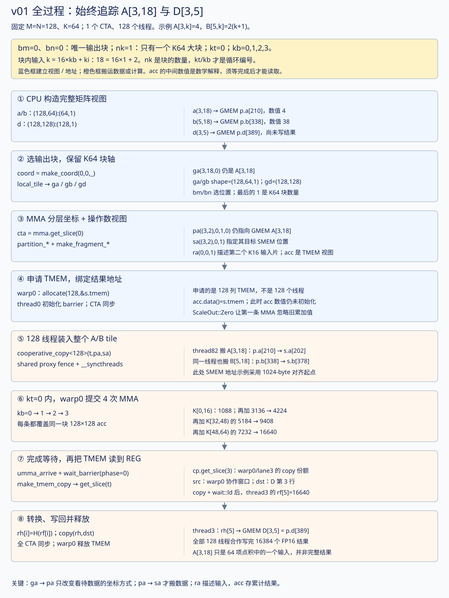
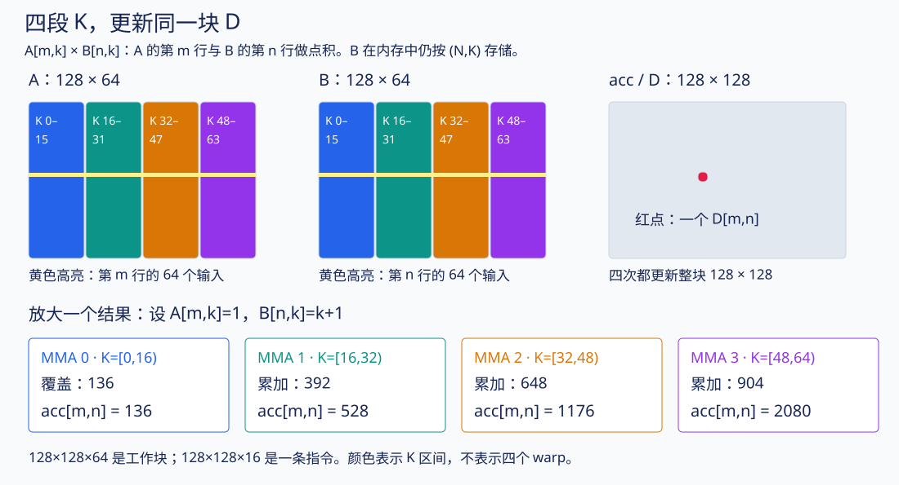
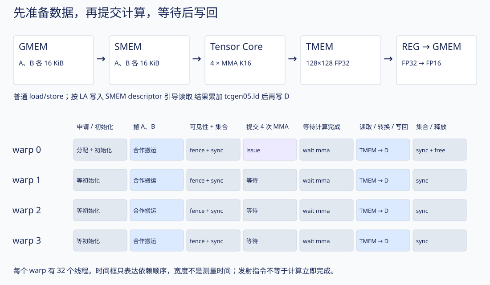

# 第一个 kernel：从一行点积读懂 CuTe 和 Blackwell

对应源码：[v01_single_tile.cu](../kernels/v01_single_tile.cu)。本文的行号对应当前 104 行版本。建议先读本文，再用[原逐行表](v01_single_tile.md)查单个语句。[交互计算图](01-single-tile-walkthrough.html#lab)可以选择输出坐标、推进四次 MMA，并观察 shared memory 的地址重排。

配套新增：[CuTe API 与线程编排图册](01-cute-api-atlas.md) · [交互选择 CTA / 线程](01-cute-api-atlas.html#lab)。

这份代码难读，是因为同一个函数同时表达了数学分块、内存布局、硬件指令和异步同步。先把它们分开：**数学决定要算哪些乘加，layout 决定数据放哪里，copy/gemm 才执行搬运和计算，barrier 决定何时可以使用结果。**

## 0. 把整份 v01 串起来：同一输入、同一输出、同一组编号

这一节固定追踪 **A[3,18] 怎样参与 D[3,5] 的计算**，不切换到其他大小的 kernel。[完整阶段交互](01-single-tile-walkthrough.html#full-trace)可以从 CPU 启动一直推进到写回、释放；下面的静态图也能直接阅读。

为能给出具体数值，沿用本页交互示例的输入规则：`A[m,k]=1+(m%4)`，`B[n,k]=(1+(n%4))×(k+1)`。因此 A 的第 3 行全是 4，B 的第 5 行是 `2,4,6,…,128`。这只是教学输入，不是之前性能测试的随机数据。



### 0.1 先给每种数字贴上用途，别混成“第几块”

|名字|本版值|究竟表示什么？|
|---|---|---|
|M、N、K|128、128、64|完整问题的尺寸，来自 `p.m/p.n/p.k`|
|`Tile`|`(128,128,64)`|本 CTA 准备的工作块尺寸|
|单条 MMA 的 M/N/K|128、128、16|一条指令处理的乘加范围|
|`bm`|0|输出 tile 的行编号；元素起始行为 `bm×128`|
|`bn`|0|输出 tile 的列编号；元素起始列为 `bn×128`|
|`nk`|1|要处理的 K64 大块**数量**；v01 的代码直接取常量 1|
|`kt`|只取 0|外层循环的 K64 大块**编号**，满足 `0<=kt<nk`|
|`kb`|0、1、2、3|当前 K64 大块内，四条 K16 指令的编号|
|`ki`|0…15|一条 K16 指令里面的 K 坐标；本文用它拆下标，源码没定义此变量|

`nk` 中的 n 表示数量，不是矩阵的 N 轴。`bn` 则是输出 N 方向的 tile 编号。**nk=1 不等于只发一条 MMA；它表示一个大块，大块内部仍有四条 MMA。**

用普通循环表达真正发生的事：

```cpp
bm = 0; bn = 0;                    // 输出块位置
nk = 1;                            // K64 块数量
for (kt = 0; kt < nk; ++kt) {       // 本版只有 kt=0
    搬入整个 A[:,0:64] 和 B[:,0:64];
    等所有输入准备好;
    for (kb = 0; kb < 4; ++kb) {    // 四次 K16 计算
        使用 k = 64*kt + 16*kb + [0:16);
        更新同一个 128×128 的 acc;
    }
    等这批 MMA 完成;
}
把整个 acc 写回 D;
```

这个式子能将“整体 K 坐标”与两层循环连接起来：

```text
k_global = 64×kt + 16×kb + ki
18       = 64×0  + 16×1  + 2
```

所以 A[3,18] 在 **kt=0、kb=1** 时参与 MMA。它并不是第 18 条指令，也不属于第 18 个 CTA。

### 0.2 同一个元素怎样穿过不同视图？

图中的每条箭头要区分两种意义：**换视图时数据没动；copy 时数值才从源存储搬到目标存储。** 下表的大小均为实际 v01 的逻辑 shape；下划线整数 `_128` 等为便于阅读写成普通数字。

|阶段/对象|逻辑 shape|固定观察点|此时的含义|
|---|---|---|---|
|`a`|`(128,64)`|`a(3,18)`|GMEM 完整矩阵视图，元素偏移 210|
|`ga`|`(128,64,1)`|`ga(3,18,0)`|选块后还是同一 GMEM 元素；第三维是 kt|
|`pa`|`((128,16),1,4,1)`|`pa((3,2),0,1,0)`|按 MMA 分层坐标访问同一 GMEM 元素|
|`sa`|`((128,16),1,4)`|`sa((3,2),0,1)`|目标 SMEM 视图；copy 后保存相同数值 4|
|`ra`|`(1,1,4)`|`ra(0,0,1)`|指向第二个 K16 输入片的 descriptor，不是单个 A[3,18] 的数值|
|`gd`|`(128,128)`|`gd(3,5)`|GMEM 的输出位置，元素偏移 389|
|`pd`|`((128,128),1,1)`|`pd((3,5),0,0)`|上述输出的 MMA 分层视图；仍在 GMEM|
|`acc`|`((128,128),1,1)`|`acc((3,5),0,0)`|同一逻辑结果在 TMEM 中的累加位置|
|thread3 的 `src`|`((32,1),128,1,1)`|包含 TMEM 的 `(3,5)`|warp0 的协作读取窗口，源视图可在 warp 内重合|
|thread3 的 `dst`|`((1,1),128,1,1)`|展平后的第 5 个位置|GMEM 的 D[3,5]；该线程还负责同一行其他列|
|thread3 的 `rf/rh`|与该 `dst` 相同|`rf(5)` / `rh(5)`|FP32 / FP16 线程私有结果 fragment|

前几种 GMEM 视图虽然 shape 不同，计算出的相对**元素偏移**相同：

```text
a(m,k)               ：64*m + k

ga(m,k,kt)           ：64*m + k + 64*kt

pa((m,ki),0,kb,kt)   ：64*m + ki + 16*kb + 64*kt

代入观察点：
a(3,18) = ga(3,18,0) = pa((3,2),0,1,0) → 元素 210
```

这里公式只描述本版固定 row stride=64 的具体视图。若换成更大 K，完整矩阵的行 stride 随之变化；不能沿用这个 64 当作任意问题的 GMEM 行跨度。

SMEM 的 `sa` 还应用字节地址 swizzle，因而它指向另外一块存储里的元素 202。`pd` 则使用输出 GMEM 行 stride=128；`acc` 的 TLane/TCol 编码属于 TMEM 地址空间。**相同 shape 不保证相同布局，更不代表同一物理存储。**

### 0.3 把搬入、计算、写回接起来

1. **搬入输入。** thread82 负责 A/B 的奇数行、K=18，所以它搬入 A[3,18]=4，也搬入 B[5,18]=38。其他线程完成其他位置；整个 A/B tile 装好后执行 fence 和 CTA 同步。
2. **提交计算。** warp0 使用四对 `ra/rb` descriptor 提交 MMA。A[3,18] 的这一个乘积 `4×38=152`，只是第二个 K16 区间对 D[3,5] 的 16 项贡献之一。
3. **等计算结束。** `umma_arrive` 关联此前 MMA，`wait_barrier(...,0)` 等待完成。下面的累计值是数学解释，不能把“发出了指令”当成“可以立刻读 acc”。
4. **读出并写回。** thread3 在 warp0 的 TMEM copy 中接收第 3 行结果。TMEM load 完成等待之后，它将 `rf(5)` 转成 FP16，写到 `D[3,5]`。搬输入的 thread82 与写这个输出的 thread3 并非同一个线程。

|kt|kb|K 区间|D[3,5] 的本段贡献|累加后的数学值|
|---|---|---|---|---|
|0|0|[0,16)|`8×(1+…+16)=1088`|1088，第一条忽略旧 acc|
|0|1|[16,32)|`8×(17+…+32)=3136`|4224|
|0|2|[32,48)|`8×(33+…+48)=5184`|9408|
|0|3|[48,64)|`8×(49+…+64)=7232`|16640|

最后 `D[3,5]=16640`，写入 `p.d[3×128+5] = p.d[389]`。这一个数不代表整个 kernel 的输出：四条 MMA 同时覆盖 128×128 个逻辑结果，每个位置都有自己的完整 64 项点积。

### 0.4 swizzle 放大图：逻辑身份、搬运者、物理地址三层分开

**先澄清图的读法：不是“GMEM 是逻辑、SMEM 是物理”。两种内存都有逻辑视图和实际存放位置。** 原图把上排标为“GMEM / 逻辑 K 顺序”，容易造成这个误解；现已将两排分别标成“GMEM 地址顺序”和“SMEM 地址顺序”，都从左到右按各自缓冲区的地址递增排列。

逻辑坐标回答“这是矩阵的哪个元素”，布局回答“这个元素放在该缓冲区的什么位置”：

```text
                    同一个逻辑元素 A[3,18]
                      /                \
             GMEM 的 row-major      SMEM 的 swizzle
                    /                    \
         p.a[210]，行内槽位 18      s.a[202]，行内槽位 10
```

GMEM 中本版采用 row-major，所以逻辑 k=0、1、2… 的顺序恰好与这一行的地址递增顺序一致；SMEM 中采用 swizzle，所以同样的逻辑 k 次序不再等于地址递增顺序。**这个差别来自本版选择的两种 layout，不是 GMEM/SMEM 各自固有的“逻辑/物理”属性。** GMEM 也可以存重排后的数据，SMEM 也可以用普通行主序。

|共同的逻辑身份|所选布局|对应缓冲区内的元素偏移|相对第 3 行行首的槽位|
|---|---|---|---|
|A[3,18]|GMEM row-major|210|18|
|A[3,18]|SMEM swizzle（图示对齐起点）|202|10|

本文的“物理槽位”是指数据在相应内存缓冲区中的实际排列位置，用元素/字节偏移来说明；不是在推导 CUDA 全局指针经过地址翻译后的 DRAM 物理地址。copy 前后保持的是逻辑身份和数值，并不要求保持相对地址偏移。

![A[3,18] 由 thread82 搬到 SMEM 元素202，逻辑sector和物理sector的完整拆解](v01-swizzle-ownership.svg)

先把 `A[3,18]` 看作一个带标签的数据盒：标签是 **“m=3、k=18，数值为 4”**。

**第一层：谁负责搬这个盒子？** 当前输入 copy 的映射只需它的逻辑坐标：

```text
t = 64×(m%2) + k
  = 64×1 + 18
  = 82                        → warp2 / lane18
```

**第二层：从哪里拿？** A 在 GMEM 中按行排列，一行 64 个 FP16：

```text
行首元素偏移 = 3×64 = 192
元素偏移     = 192+18 = 210
字节偏移     = 210×2 = 420     → 读取 p.a[210]
```

**第三层：放到哪里？** 目标 SMEM 用 SW128 排列。以下示意假设 SMEM 数组基地址为 1024-byte 对齐；每个 sector 为 16 bytes，装 8 个 FP16：

```text
逻辑 sector q = 18/8 = 2
sector 内 u   = 18%8 = 2
本行 swizzle  = m%8 = 3
物理 sector p = q XOR 3 = 2 XOR 3 = 1

目标元素偏移 = 3×64 + p×8 + u
             = 192  + 1×8 + 2
             = 202             → 写入 s.a[202]
```

在第 3 行，完整排列是：

```text
逻辑 sector q：       0  1  2  3  4  5  6  7
该 q 对应物理 p：     3  2  1  0  7  6  5  4

按 SMEM 物理槽位看：
物理槽位 p：          0  1  2  3  4  5  6  7
里面装的逻辑 sector： 3  2  1  0  7  6  5  4
                         ↑
               物理槽位 1 装逻辑 sector 2
```

这行 XOR 恰好是自身的逆映射，因此上面两种方向写出的数字顺序相同，但两行分别在回答“给定逻辑 q 去哪里”和“给定物理 p 装什么”，别把问题混起来。

逻辑 sector 2 内原本装 k=16…23，它在 SMEM 的物理 sector 1 内仍保持内部次序：

```text
逻辑 k：             16  17  18  19  20  21  22  23
GMEM 元素偏移：     208 209 210 211 212 213 214 215
SMEM 元素偏移：     200 201 202 203 204 205 206 207
                            ↑
                    同一个 A[3,18]，数值 4
```

也可以在字节单位下验算：

```text
420 = 0x1A4
行相关 XOR 掩码 = 3×16 = 48 = 0x030
0x1A4 XOR 0x030 = 0x194 = 404 bytes
404 / sizeof(FP16) = 404/2 = 202 个元素
```

这里的 420/404 是对应排列中的**字节偏移**，210/202 是**元素偏移**，不是完整指针。真实 GMEM 和 SMEM 属于不同存储空间，基地址也不同；不能把两个偏移之差解释为从某个真实指针“移动了 16 字节”。

最容易犯的错误是：看到 `202-192=10`，就认为逻辑 k 变成了 10，再算线程 `64+10=74`。**10 只是它在物理行内所占的元素槽位；逻辑标签仍是 k=18，因此搬运者仍是 thread82。** 它没有变成 A[3,10]。

thread82 知道源、目标两份 view，因此能从 `p.a[210]` 拿到数值，再按目标 view 写到 `s.a[202]`。MMA 随后使用与 `sa` 布局一致的 descriptor，把这个槽位解释为 A[3,18]。源行主序、目标 swizzle、MMA descriptor 三者在逻辑坐标上对应起来。

若换成无 swizzle 的普通目标 row-major 布局，目标位置会是元素 210；但更换 layout 也可能让 `cooperative_copy` 的分工启发式重新选映射，不能断言任意换布局后 thread82 都不变。本文要区分的是**当前这一套 copy 映射中的逻辑所有权**与**当前目标 layout 中的物理地址**。

1024-byte 对齐只是让这个相对地址示意不用携带额外的基地址位；实际硬件 swizzle 作用于字节地址。源码 `alignas(128)` 不等于对任意地址保证 1024-byte 对齐。其他起点应将相关基地址位一起纳入运算。

## 1. 先把 CuTe 遮住：它到底算什么？

本版只接受 M=128、N=128、K=64：

```text
A：128 行 × 64 列，FP16，按行连续存放
B：128 行 × 64 列，FP16，按行连续存放
D：128 行 × 128 列，FP16，按行连续存放

D[m,n] = sum(k=0..63) A[m,k] × B[n,k]
```

注意是 `D = A × Bᵀ`。源码中的 B 以 `(N,K)` 存储。因此取 A 的第 m 行与 B 的第 n 行做点积，得到 D 的第 m 行、第 n 列。没有另外启动一个转置 kernel；“Bᵀ”表达数学关系。



先缩成容易手算的 2×4 和 3×4：

```text
A = [ 1  2 | 3  4 ]        B = [ 1  0 | 1  0 ]
    [ 5  6 | 7  8 ]            [ 0  1 | 0  1 ]
                               [ 1  1 | 1  1 ]

D = A × Bᵀ = [  4   6  10 ]
              [ 12  14  26 ]

例如 D[1,2] = 5×1 + 6×1 + 7×1 + 8×1 = 26。
```

竖线把 K 分两段。第一段算出的**也是一个完整的 2×3 输出形状**，只是数值尚未累加完整：

```text
K=0..1 的贡献        K=2..3 的贡献        相加
[ 1  2   3 ]        [ 3  4   7 ]        [  4   6  10 ]
[ 5  6  11 ]    +   [ 7  8  15 ]    =   [ 12  14  26 ]
```

真实 kernel 原理相同：把 K=64 分成四段，每段 16。**四次 MMA 一直更新同一个 128×128 的结果块，并非每次算结果的四分之一行。** 小矩阵仅解释数学，硬件指令仍使用真实的 128×128×16 形状。

## 2. 用普通伪代码概括这 104 行

下面是执行顺序示意，不能直接编译。`issue_mma` 表示异步 Tensor Core 操作，不是由某线程执行三重标量循环。

```cpp
// 一个 CTA：128 个线程 = 4 个 warp。
// SMEM：A、B 各一块；TMEM：一个 FP32 累加矩阵。
申请 128 列 TMEM;
初始化 MMA 完成通知对象;
全 CTA 同步;

128 个线程合作：A 从 GMEM 搬到 swizzled SMEM;
128 个线程合作：B 从 GMEM 搬到 swizzled SMEM;
让这些 SMEM 写入对异步 MMA 可见;
全 CTA 同步，确保 A、B 已经全部准备好;

warp0 发出：
    acc  = A[:,  0:16] × B[:,  0:16]ᵀ;  // 忽略 TMEM 旧值
    acc += A[:, 16:32] × B[:, 16:32]ᵀ;
    acc += A[:, 32:48] × B[:, 32:48]ᵀ;
    acc += A[:, 48:64] × B[:, 48:64]ᵀ;
    把上述 MMA 的完成通知关联到 mma_bar;

所有线程等待 MMA 完成;
每个线程：把自己负责的结果从 TMEM 读进 FP32 寄存器;
每个线程：等待自己的 TMEM load 完成;
每个线程：转成 FP16，再写到 GMEM 的正确输出坐标;
全 CTA 同步;
释放 TMEM;
```

这就是本版全部算法。它没有 TMA、双缓冲、跨 CTA 合作，也没有 K 方向的多个 64 元素大块。

## 3. 先认识名字：地址视图和实际存储

CuTe Tensor 可以理解为“访问数据的句柄”：**存储引擎/指针 + layout**。大部分 `make_tensor` 只是创建视图；使用 `make_tensor<float>(shape)` 这种拥有数据的形式，才会创建这里的线程私有临时存储。

|名字|这里具体是什么|创建它时搬矩阵数据吗？|
|---|---|---|
|`a / b / d`|完整 GMEM 矩阵的指针和行主序布局|不搬|
|`ga / gb / gd`|当前 CTA 选中的 GMEM 子块视图|不搬|
|`pa / pb / pd`|按 MMA 需要的坐标层次组织的 GMEM 视图|不搬|
|`s.a / s.b`|实际的 shared memory 数组|预留空间，还没装入 A/B|
|`sa / sb`|同一批 shared memory 配上 swizzled layout|不搬|
|`ra / rb`|给 MMA 使用的 SMEM descriptor fragment|创建描述信息；不把 A/B 元素搬进寄存器|
|`acc`|TMEM 累加器视图|创建视图时尚未完成 TMEM 分配|
|`s.tmem`|一个保存 TMEM 基地址的 32-bit 字段|它不是累加矩阵本身|
|`src / dst`|某个线程负责的 TMEM 源、GMEM 目标视图|不搬|
|`rf / rh`|该线程的 FP32 / FP16 临时 fragment|用于接收实际数据，目标是寄存器存储|

命名中的 `r` 容易误导：`ra/rb` 内部存的是描述符值；`rf/rh` 内部才是矩阵数值。寄存器里存一张“地址说明”与寄存器里装一组 FP16 数，是两件事。



## 4. CPU 端怎么准备输入？先读第 83–104 行

### 4.1 shape 和 stride：先看一个地址就明白

第 84–85 行：

```cpp
auto a = make_tensor(make_gmem_ptr(p.a),
                     make_layout(make_shape(p.m, p.k),
                                 make_stride(p.k, _1{})));
```

代入本版参数：

```text
指针：p.a
shape：(128,64)
stride：(64,1)，单位是元素

a(m,k) 的元素偏移 = m×64 + k
A[3,18] 的元素偏移 = 3×64+18 = 210
FP16 占 2 字节，所以相对于 p.a 的字节偏移 = 420
```

`make_gmem_ptr` 给指针附上“位于 global memory”的类型信息，帮助 CuTe 选择适用操作。它不执行 `cudaMalloc`，也不读取 A。真正的输入分配和填充在 `runner_graph.cuh`。

B 的 shape/stride 也是 `(128,64):(64,1)`。D 是 `(128,128):(128,1)`，因此 `D[3,5]` 位于第 `3×128+5=389` 个 FP16 元素。

### 4.2 C++ 语法最小词典

|写法|读法|本版例子|
|---|---|---|
|`using T = ...`|给一种类型取短名字|`Mma` 是类型名|
|`decltype(expr)`|取得表达式结果的类型；这里不执行表达式|推导 CuTe 很长的布局类型|
|`auto x = expr`|让编译器推导变量类型|避免手写 Tensor 的模板参数|
|`_128`、`_1`|CuTe 编译期整数类型|编译器知道数值，可推导布局、展开循环|
|`_1{}`|构造一个值为 1 的编译期整数对象|stride 的连续轴|
|`Mma{}`、`LA{}`|构造这种类型的对象|不等于分配 Tensor Core 或矩阵|
|`_`|切片中的“保留这一维”标记|`pa(_,_,_,0)` 只固定最后一维|
|`X`|投影中省略这一轴|A 不使用 N 轴|

`_`、`_1` 和 `X` 是三种用途不同的写法。

### 4.3 launch 实际启动多少线程？

第 27、48、97 行保留了代码生成模板的常量表达式。**阅读 v01 时直接化简成：**

```cpp
int bm = 0, bn = 0;       // 1 >= 3 为 false
int nk = 1;              // 1 == 1 为 true
fn<<<dim3(1,1), 128, sizeof(BasicStorage)>>>(a,b,d);
```

一个 CTA，128 个线程，4 个 warp。第三个 launch 参数是动态 shared memory 字节数。整个 CTA 共用一份 `BasicStorage`，不是每个线程各一份。

`cudaFuncSetAttribute` 是 CPU 端配置；`configured` 避免重复配置；`basic<decltype(a), ...>` 选定对应 Tensor 类型的 kernel 实例；末尾的 `launch` 是测试程序调用的统一入口。`VERSION=1` 告诉测试程序检查本版的输入约束。

## 5. 第 10–21 行：先约定指令形状和存储方式

### 5.1 Mma 是“使用哪种矩阵指令”的配置

```cpp
SM100_MMA_F16BF16_SS<H,H,float,128,128,
                     UMMA::Major::K,UMMA::Major::K>
```

逐个读：输入 A 是 `H=half_t`，输入 B 也是 `H`；累加数值是 `float`；一次指令输出的 M、N 分别为 128、128；A、B 都采用 K-major 的 shared-memory 描述方式；`SS` 表示两个操作数的矩阵数据来自 shared memory。

这里没有写出 16，是因为该 FP16 原语的 CuTe traits 使用 `K = 256 bits / 16 bits = 16`。所以一条指令的乘加规模为 `(128,128,16)`。

`make_tiled_mma` 把这个原语包装成 CuTe 的分块操作对象，让它提供 `partition_A/B/C`、`make_fragment_A/B/C` 等配套映射。本版没有额外把很多 atom 拼成更大的 M/N 输出。

`Tile = Shape<_128,_128,_64>` 则表达**这次 kernel 准备的工作块** `(M,N,K)=(128,128,64)`。所以两个 K 同时存在：大块 K=64，指令 K=16。`Tile` 和 `Mma` 是不同层次。

### 5.2 为什么 ShapeA 变成 ((128,16),1,4)？

原来的 A 坐标只有 `(m,k)`。为了调用 K=16 的 MMA，把 k 拆开：

```text
k_inner = k % 16       // 这一条 MMA 内的 K 坐标
kb      = k / 16       // 第几条 MMA，0、1、2、3

(m,k)  →  ((m,k_inner), m_repeat, kb)
本版 m_repeat 恒为 0，因为只有一块 M=128。

shape  →  ((128,16),1,4)
元素数 →  128×16×1×4 = 8192 = 128×64
```

`((128,16),1,4)` 有 **3 个顶层维度**，第 0 维里面又包含两个子维度。不要把它看成 `(128,16,1,4)` 然后用相同的 `size<i>` 解释。

例如 `A[3,18]` 对应 `((3,2),0,1)`：第 1 个 K16 块，块内第 2 个 K 元素。这里暂时只是换一种坐标描述，数值仍然是同一个 A 元素。

### 5.3 LA、atom 和 swizzle：搬进 SMEM 时改地址

```cpp
using LA = decltype(UMMA::tile_to_mma_shape(
    UMMA::Layout_K_SW128_Atom<H>{}, ShapeA{}));
```

`Layout_K_SW128_Atom<H>` 提供硬件支持的一种基本 SMEM 排列。这里的 **layout atom 是可以重复铺开的基本排列单元**；它与上面的 **MMA atom（一次基础计算操作）** 用途不同。共同点只是“拿一个基本单元构造大对象”。

`tile_to_mma_shape` 将该排列适配到 `ShapeA=((128,16),1,4)`。`sa` 用它确定每个逻辑元素的实际 SMEM 位置，`ra` 的 descriptor 也从它生成。因此写入和 Tensor Core 读取遵守同一份地址约定。

本版 A/B 每行有 `64×2=128` 字节。先把数组基地址视为 1024-byte 对齐（例如 SMEM 地址 0），可以用下面的**等价相对地址公式**观察本版 swizzle；单位最后换回字节：

```text
sector = k / 8              // 每个 16-byte sector 装 8 个 FP16
within = k % 8
physical_sector = sector XOR (m % 8)
shared_element_offset = m×64 + physical_sector×8 + within
shared_byte_offset = 2 × shared_element_offset
```

硬件 swizzle 作用于字节地址。若实际基地址不是 1024-byte 对齐，还要把基地址的相关位纳入计算，不能只代入相对行号。本版结构体的 `alignas(128)` 本身不等于对任意基地址保证 1024-byte 对齐；图与诊断明确采用 1024-byte 对齐的起点来展示排列。

每行 8 个 sector，每个 sector 内的 8 个 FP16 保持原次序，只改变 sector 在这一行的摆放次序。这里说的是本版 128-byte 行跨度的具体公式，不能直接套到别的行跨度或所有 CuTe layout。

例如同一个逻辑元素 `A[3,18]`：

```text
GMEM 元素偏移：3×64+18 = 210
sector=2，within=2，2 XOR 3 = 1
SMEM 元素偏移：3×64+1×8+2 = 202

读取 p.a[210] 的值 → 写到 s.a[202]
Tensor Core 根据相同 swizzle 描述，把 s.a[202] 解释为 A[3,18]
```

**换的是存放地址，数学上没有把 A[3,18] 改成 A[3,10]。** `sa` 的逻辑坐标到物理地址映射会处理这件事。也不要把“使用 SW128”理解为任意访问模式都不会 bank conflict。

`ArrayEngine<H,cosize_v<LA>>` 是实际空间。`size` 数逻辑元素个数，`cosize` 求布局需要的地址容量，存在空洞时可能不同。本版二者都是 8192：A 16 KiB，B 16 KiB；加上 barrier、TMEM 地址字段和结构体对齐，`sizeof(BasicStorage)` 还会略大于 32 KiB。本版没有输出 SMEM buffer。

## 6. 第 24–38 行：把各层视图连接起来

### 6.1 buf 是共享的字节区，s 让它能按字段使用

```cpp
extern __shared__ char buf[];
auto &s = *reinterpret_cast<BasicStorage *>(buf);
```

把 launch 时给出的 shared memory 区域视作 `BasicStorage`。`s.a`、`s.b`、`s.mma_bar`、`s.tmem` 因而有各自的偏移。`alignas` 要求相应字段按指定字节边界对齐。

每个线程都会执行这两行，但它们得到的 `s` 指向同一个 CTA 的 shared memory。相反，`int bm`、`Mma mma`、后面的 `rf` 等是各线程自己的变量。

### 6.2 local_tile：从大矩阵选本 CTA 的窗口

所有矩阵乘法共用 `(M,N,K)` 三个数学轴，但 A 只用 `(M,K)`，B 只用 `(N,K)`，D 只用 `(M,N)`：

|视图|投影参数|保留轴|忽略轴|
|---|---|---|---|
|`ga`|`Step<_1,X,_1>`|M、K|N|
|`gb`|`Step<X,_1,_1>`|N、K|M|
|`gd`|`Step<_1,_1,X>`|M、N|K|

这里 `_1` 参与表达投影，并非声称矩阵每一维的物理 stride 都是 1。

`coord=(bm,bn,_)=(0,0,_)` 固定输出块位置，保留 K 块轴。于是：

```text
ga 的 shape：(128,64,1)
                  ↑ 最后这一维：总共有几个 K64 大块

gb 的 shape：(128,64,1)
gd 的 shape：(128,128)
```

最后的 `1` 不要省掉：CuTe 仍保留这个维度，以便后续版本处理多个 K64 大块。

### 6.3 partition：组织指令需要的坐标层次

```cpp
auto cta = mma.get_slice(_0{});
auto pa = cta.partition_A(ga), pb = cta.partition_B(gb);
auto pd = cta.partition_C(gd);
```

此处的 slice 取的是本 MMA 的 CTA 份额。本版只有一个 CTA 参与，编号就是 0。**这里不是“给 thread 0 分数据”。** 不能凭 `get_slice` 这个名字就认定它的参数一定是线程号；要看所属对象。

本版 `pa`：

```text
shape = ((128,16),1,4,1)
          内部块   │ │ └─ kt：第几个 K64 大块，只有 0
                   │ └── kb：大块内第几个 K16 小块，0..3
                   └──── M 方向重复次数，本版为 1

pa(_,_,_,0)：固定 kt=0，保留前三个顶层维度
             得到 ((128,16),1,4)，能与 sa 对应
```

`pa` 仍然指向 GMEM。`partition_A` 不会提前加载它；`cooperative_copy` 才会加载。

### 6.4 fragment：是什么，取决于所选硬件原语

```cpp
auto sa = make_tensor(make_smem_ptr(s.a.begin()), LA{});
auto sb = make_tensor(make_smem_ptr(s.b.begin()), LA{});
auto ra = cta.make_fragment_A(sa), rb = cta.make_fragment_B(sb);
auto acc = cta.make_fragment_C(pd);
```

`sa/sb` 是 SMEM 的访问方式。`ra/rb` 把这种访问方式转成该 MMA 接受的描述符：告诉硬件从哪块 shared memory 开始、采用什么布局，以及本次 K16 切片在哪里。

描述符像“存储地址及格式说明”，自身不包含 8192 个 FP16 元素。因而虽然 `ra` 的名字含 r，也不表示这里已经做了 `ldmatrix`。**本版没有用 `ldmatrix`，Tensor Core 直接消费 SMEM 中的 A/B。**

诊断中 `ra` 的逻辑 shape 为 `(1,1,4)`：每个 K16 切片只需要一个 descriptor 位置，第三维仍有四个切片。它不再像 `sa` 那样把 128×16 个输入数值展开为第一个 mode；描述符会指向那一整片数据。这也解释了 `ra(_,_,kb)` 为什么能选中一次 MMA 的完整 A 操作数。

`acc` 给出结果的 TMEM 布局，但此时还缺少真正申请到的 TMEM 基地址。可以类比“已经知道二维数组的形状和访问规则，还没绑定底层存储地址”。

## 7. 第 39–54 行：分配结果空间，合作装入输入

### 7.1 allocate(128) 申请的是列，不是字节或线程

本版 TMEM 累加器占 128 条 lane × 128 列，每个单元是一个 FP32：

```text
128 × 128 × 4 bytes = 65536 bytes = 64 KiB
```

TMEM 是独立于 shared memory 的硬件存储。SMEM 里的 `s.tmem` 只有 4 字节，用来存基地址；不能把它当作一块 64 KiB 的 SMEM 数组。

`if (warp0) alloc.allocate(...)` 要求 warp0 全部 32 个线程参与这项协作操作。`threadIdx.x==0` 则只让一个线程初始化 `mma_bar`。后面的 `__syncthreads()` 保证其他线程再读取初始化后的信息。

`acc.data() = s.tmem` 是绑定 TMEM 地址，不是把结果矩阵赋值为某个整数。

### 7.2 所有线程怎样把 A/B 放进 SMEM？

```cpp
cooperative_copy<128>(threadIdx.x, pa(_,_,_,0), sa);
cooperative_copy<128>(threadIdx.x, pb(_,_,_,0), sb);
```

模板参数 `128` 是合作线程数，不能读成“每次搬 128 字节”。CUTLASS v4.6.0 的这个重载默认 `MaxVecBits=16`（一个 FP16），即本版使用 `cooperative_copy<128,16>`。更大的向量化宽度需要显式选择，并满足对齐等条件。

整个 CTA 对 A 搬 8192 个 FP16，对 B 再搬 8192 个 FP16。均匀分工的工作量是每线程每矩阵 64 个 FP16，但**具体哪些元素归哪个线程由 CuTe 的 copy 算法和布局决定**；不能因此断言“thread t 一定搬第 t 行”。后文的输出分工也不能直接套到这里。

补充实际验证：本版 thread t 搬 `A/B[2*r+t/64, t%64]`，r=0..63。例如 thread82 搬奇数行的第 18 个 K 元素；输出时它却写 D 的第 82 行。详细 owner 图见[API 图册](01-cute-api-atlas.md)。

搬运路径为普通 GMEM load → 线程暂存 → SMEM store。源视图使用行主序地址，目标视图使用上面的 swizzle 地址。例如从 GMEM 元素 210 读取 `A[3,18]`，存到 SMEM 元素 202；B 也遵守自己的相同规则。

### 7.3 为什么 fence 和 syncthreads 两个都要？

Tensor Core 的异步访问与普通线程的 shared stores 不只涉及线程先后关系，还涉及不同访问代理间的可见性。

|语句|这里保证什么|不能拿它替代什么|
|---|---|---|
|`fence_view_async_shared()`|让普通 SMEM stores 对异步访问方满足所需可见性/顺序|不负责集合全部 128 个线程|
|`__syncthreads()`|等 CTA 中所有线程到达；到下一步时所有人的搬运已结束|不单独表达这项跨代理 fence，也不等待未来发出的 MMA|

可以分成两个问题：**我的写入能否被 Tensor Core 正确观察到？所有人的写入是否都已完成？** 两个问题都解决，才能提交计算。

## 8. 第 47–64 行：四次 MMA 如何得到同一块 D？

`mma.accumulate_=Zero` 在第一条指令之前设置。`Zero` 的效果是忽略 TMEM 旧累加值；它不代表把 A 或 B 乘零，也不要求先运行一个清零循环。

`kt` 和 `kb` 要分开读：

|变量|本版取值|含义|
|---|---|---|
|`kt`|只有 0|第几个 K64 大块，外层循环只跑一次|
|`kb`|0、1、2、3|这 64 个 K 元素内部的四个 K16 指令切片|

`ra(_,_,kb)` 选定描述符的第 kb 个 K16 切片。源码 `size<2>(ra)` 取第 2 个顶层维度，实际为 4。

|kb|A/B 采用的 K 区间|本次模式|同一个 acc 更新后的意义|
|---|---|---|---|
|0|[0,16)|Zero|前 16 项之和|
|1|[16,32)|One|前 32 项之和|
|2|[32,48)|One|前 48 项之和|
|3|[48,64)|One|全部 64 项之和|

例如构造 `A[3,k]=1`、`B[5,k]=k+1`，只追踪 `D[3,5]`：

```text
MMA 0：1+2+...+16     = 136       acc[3,5] = 136
MMA 1：17+...+32      = 392       acc[3,5] = 528
MMA 2：33+...+48      = 648       acc[3,5] = 1176
MMA 3：49+...+64      = 904       acc[3,5] = 2080
```

同时，其他 16383 个输出位置也各自完成对应的点积段。一个 MMA 不是只算这一个 `D[3,5]`，示例只是把它放大观察。

`CUTE_UNROLL` 请求编译器展开小循环，不表示四条指令同时完成。`gemm` 在这里提交 Tensor Core 操作；它不是 cuBLAS 调用，也没有在这个位置重新启动一个 kernel。

warp0 的 32 个线程都进入这段代码，但 CUTLASS 的此原语内部通过 `elect_one_sync()` 选出一个线程执行底层 `tcgen05.mma` 发射。因此每个 kb 是一条 MMA，不是 32 条重复计算。同样，不能直接把整个 warp0 分支随意改成仅 thread0 调用，因为其中不同 API 有各自的参与约定。

### 8.1 发出指令后为什么还不能直接读 acc？

异步提交只代表硬件收到工作，不代表工作已经结束。`umma_arrive(&s.mma_bar)` 将此前 MMA 的完成与这个 barrier 关联；随后所有线程在 `wait_barrier(s.mma_bar,0)` 等待。

初始化中的 count=1 是本轮所需的完成通知计数，**不是等待线程数**。四条 MMA 后面跟一组完成通知，足以等待此前关联工作结束；不需要因为有 128 个等待线程就把它设成 128。

`kt&1` 是循环复用 barrier 的 phase。本版 kt=0，只等 phase 0 的这一轮。暂时无需把后续流水线的多阶段 phase 协议塞进这个版本。

## 9. 第 65–80 行：结果怎样从 TMEM 回到 D？

这一段就是 epilogue：计算之后的处理和写回。本版只做 FP32→FP16 转换与 GMEM store，没有 bias 或激活。

```cpp
auto cp = make_tmem_copy(SM100_TMEM_LOAD_32dp32b1x{}, acc);
auto th = cp.get_slice(threadIdx.x);
auto src = th.partition_S(acc);
auto dst = th.partition_D(pd);
```

`cp` 是“这类 TMEM 读取操作如何覆盖 acc”的 copy 配置；`th` 才是当前 CUDA 线程的份额。这里的 `get_slice(threadIdx.x)` 与前面的 `mma.get_slice(_0{})` 所属对象不同，含义也不同。

`32dp32b1x` 的一次 warp 协作操作读取 32 条 datapath，每条给出一个 32-bit 数。warp 的每个线程拿到一个 FP32；要覆盖整个输出，CuTe 还要按布局重复调用这个基础操作。名称中的 `1x` 不代表整个 `copy(cp,src,rf)` 只读一次就结束。

在当前 kernel 和这个 copy atom 下，实际 CuTe 映射为 **thread t 负责 D 的第 t 行，共 128 个结果**。这不是从线程数猜出来的：布局诊断穷举核对了全部 16384 个输出坐标。

|线程|warp / lane|最终负责的逻辑结果|
|---|---|---|
|0|warp0 / lane0|D[0,0:128]|
|1|warp0 / lane1|D[1,0:128]|
|31|warp0 / lane31|D[31,0:128]|
|32|warp1 / lane0|D[32,0:128]|
|64|warp2 / lane0|D[64,0:128]|
|127|warp3 / lane31|D[127,0:128]|

例如 `D[3,5]` 由 thread3 读出并写回。thread3 的第 5 个逻辑寄存器元素承接它；它还要处理 D 的第 3 行其他 127 列。

TMEM 的 `acc` 布局打印为 `((128,128),1,1):((65536,1),0,0)`。其中 65536 是 TMEM 编码里 lane 轴的步长（高位编码），不是 GMEM 中“一行占 65536 个 float”。本版逻辑 `(m,n)` 对应相对 TLane=m、TCol=n；实际访问还要加已申请的 TMEM 基地址。

每个 warp 的一次基础 load 取本 warp 对应的 32 行、某一列；CuTe 重复覆盖 128 列。因此**计算任务由 warp0 提交，读取结果时则四个 warp 各负责 32 行**，不能把写回的行归属误当成每个 warp 独立执行了一份矩阵计算。

```cpp
auto rf = make_tensor<float>(shape(dst));
auto rh = make_tensor<H>(shape(dst));
copy(cp, src, rf);                           // 真正 TMEM → REG
cutlass::arch::fence_view_async_tmem_load();  // 等读取完成
for (int i=0; i<size(rh); ++i)
    rh(i) = H(rf(i));                        // FP32 → FP16
copy(rh, dst);                               // 真正 REG → GMEM
```

注意本版 `partition_S` 表示 warp 协作读取窗口：同一 warp 的线程可以持有重合的源视图，具体收到的寄存器数值再由 copy atom 映射到各 lane；`src` 的逻辑元素数不是每线程寄存器数。完整形状见[API 图册第 8 节](01-cute-api-atlas.md)。

`src` 和 `dst` 以同一份 copy 映射分片，保证从 TMEM 拿到的逻辑 `(m,n)` 写回正确的 `D[m,n]`。它们的物理地址空间和 stride 可以不同。

`make_tensor<float>(shape(dst))` 在源码层面创建线程私有 fragment，CuTe 目标存储为寄存器；实际寄存器分配与是否溢出仍由编译结果决定，不能仅凭 `make_tensor` 就断言任何规模都不会 spill。

`fence_view_async_tmem_load()` 在此发出 `tcgen05.wait::ld`，等待本线程的 TMEM 读取完成，才能使用 `rf`。它与前面的等待 MMA 完成是两种不同的等待：一个等“算完”，一个等“把算好的结果读进寄存器”。

最后 `__syncthreads()` 让 warp0 确认其他线程已经完成这段读取/写回流程，再释放 TMEM。`release_allocation_lock()` 归还分配许可，`free(s.tmem,128)` 才释放申请的 128 列；不应把释放提前到其他 warp 仍会访问 TMEM 的位置。

## 10. 用六个问题检查自己是否读懂

1. **为什么 K=64，只提交四条 MMA？** 本原语每条处理 K=16，每条都覆盖 M=N=128，所以 64/16=4。
2. **四个 warp 是否分别算 D 的四个象限？** 不是。warp0 提交覆盖整块 D 的 MMA；四个 warp 合作装入 A/B 并读取、写回结果。写回分工见上面的真实映射。
3. **`partition_A` 会不会把 A 搬到 shared memory？** 不会。它改变访问视图；`cooperative_copy` 才执行搬运。
4. **`ra` 是不是 Ampere `ldmatrix` 得到的 FP16 fragment？** 不是。本版是 SS 原语，`ra` 保存 SMEM descriptor；矩阵数据仍在 SMEM。
5. **`allocate(128)` 和 launch 的 128 是不是同一个意思？** 不是。前者是 TMEM 列数，后者是 CTA 线程数。
6. **如果每次 kb 都设置 Zero 会怎样？** 每条都覆盖旧累加，最后只剩 K=[48,64) 的贡献。

建议第一次阅读按 **第 1 节数学 → 第 2 节执行顺序 → 第 3 节变量 → 第 8 节累加 → 第 9 节写回 → 第 4–7 节布局构造** 的顺序。这样再遇到长模板表达式，就知道它在为哪一步服务。

## 核对依据与边界

本讲义直接核对本机 CUTLASS v4.6.0 的原语、traits 和当前 kernel；另外编译运行了一个只在 CPU 上打印 CuTe 布局的临时诊断程序，确认 shape、swizzle 地址和输出线程映射。原始输出保留在 [v01-layout-inspection.txt](../results/v01-layout-inspection.txt)。这项诊断不启动 GPU，不构成新的性能测试。交互动画表示数学和数据路径，不是 GPU 周期级仿真。

- [NVIDIA 官方 Blackwell 单 CTA MMA 教程](https://github.com/NVIDIA/cutlass/blob/v4.6.0/examples/cute/tutorial/blackwell/01_mma_sm100.cu)
- [MMA traits：K=16、descriptor fragment、TMEM fragment](https://github.com/NVIDIA/cutlass/blob/v4.6.0/include/cute/atom/mma_traits_sm100.hpp)
- [MMA 指令封装：内部选线程发射](https://github.com/NVIDIA/cutlass/blob/v4.6.0/include/cute/arch/mma_sm100_umma.hpp)
- [TMEM copy traits 与线程映射构造](https://github.com/NVIDIA/cutlass/blob/v4.6.0/include/cute/atom/copy_traits_sm100.hpp)
