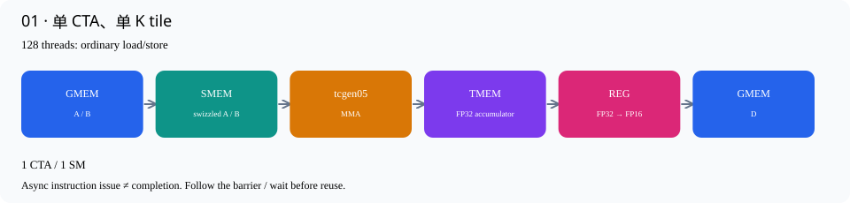

# 01 · 单 CTA、单 K tile

源码：[v01_single_tile.cu](../kernels/v01_single_tile.cu) · [交互逐行讲解](v01_single_tile.html)

先读：[从一行点积读懂本版：详细图解](01-single-tile-walkthrough.md) · [交互计算图](01-single-tile-walkthrough.html#lab)

先只算 D 的一个 128×128 方块，输入 A、B 都是 128×64。每个输出元素做64次乘加。整个 kernel 只有一个 CTA、128个线程。

把数据想成一批待加工原料：global memory 是远处仓库，SMEM 是 SM 内的工作台，Tensor Core 是加工单元，TMEM 是它存放累加结果的位置，寄存器则是每个线程手里的小篮子。CuTe 的 Tensor/layout 描述“东西在哪里”，copy 才真的搬东西。

一条 MMA 指令覆盖128×128×16，所以 K=64 要发4条指令。第一次设置 ScaleOut::Zero，不读取原来未初始化的 TMEM；后3次设置 One，保留并累加已有结果。`tmem.allocate(128)` 中的128是硬件列数；每列128个32-bit lane，容量128×128×4=64 KiB。

执行顺序：128个线程合作加载 A/B → shared-memory proxy fence 和 CTA 同步 → warp0 发4条 MMA → 所有线程等待完成 barrier → 从 TMEM 取结果、转换FP16、写回。只有后一步依赖前一步结果时，才需要对应的完成等待。

## 数据路径



## 编译运行

```bash
./build.sh v01_single_tile
./build/v01_single_tile 128 128 64
```

## 逐行讲解

每个有效源码行都有对应解释；纯空行不编号说明。类型/参数换行继续属于同一个CuTe表达式。

|行|原始代码|解释|
|---|---|---|
|1|`// CUDA C++ / CuTe — 原书第 1 步。`|说明性注释，不生成机器指令。对应的中文机制解释见本节开头和下面的实际语句。|
|2|`// Generated by scripts/materialize.py; edit include/ development templates,`|说明性注释，不生成机器指令。对应的中文机制解释见本节开头和下面的实际语句。|
|3|`// then regenerate.`|说明性注释，不生成机器指令。对应的中文机制解释见本节开头和下面的实际语句。|
|4|`#include "common.cuh"`|引入CUDA/CuTe、错误检查或C++标准库声明；这不是运行时加载Python包。|
|5|`// API reference: NVIDIA CUTLASS`|说明性注释，不生成机器指令。对应的中文机制解释见本节开头和下面的实际语句。|
|6|`// examples/cute/tutorial/blackwell/01_mma_sm100.cu. The three book steps share`|说明性注释，不生成机器指令。对应的中文机制解释见本节开头和下面的实际语句。|
|7|`// storage and epilogue, but expose progressively more loops.`|说明性注释，不生成机器指令。对应的中文机制解释见本节开头和下面的实际语句。|
|8|`namespace study {`|建立本项目命名空间，或简写CuTe名字；不改变数据布局或GPU调度。|
|9|`using namespace cute;`|建立本项目命名空间，或简写CuTe名字；不改变数据布局或GPU调度。|
|10|`using Mma = decltype(make_tiled_mma(`|把底层MMA atom包装为CuTe TiledMMA，让后续分片、descriptor和gemm调用使用一致的映射。|
|11|`SM100_MMA_F16BF16_SS<H, H, float, 128, 128, UMMA::Major::K,`|选择单CTA的FP16/BF16 SMEM×SMEM MMA原语，FP32累加；后续M/N和Major参数给出指令形状。|
|12|`UMMA::Major::K>{}));`|本行继续上方表达式的参数/类型：选择单CTA的FP16/BF16 SMEM×SMEM MMA原语，FP32累加；后续M/N和Major参数给出指令形状。|
|13|`using Tile = Shape<_128, _128, _64>;`|定义编译期MMA tile形状(M,N,K)，此处K=64由4条K16 MMA组成。|
|14|`using ShapeA = decltype(partition_shape_A(Mma{}, Shape<_128, _64>{}));`|在编译期推导MMA分片后的操作数shape。例如单CTA A的128×64变为((128,16),1,4)。|
|15|`using LA =`|定义静态layout或shape类型：输入layout服务MMA，LD服务128×64的输出TMA分块。|
|16|`decltype(UMMA::tile_to_mma_shape(UMMA::Layout_K_SW128_Atom<H>{}, ShapeA{}));`|以128-byte swizzle atom为基础，铺成MMA要求的shared-memory布局；使用partition_shape得到的形状而非随意手写descriptor。|
|17|`struct BasicStorage {`|定义本 CTA 的 shared-memory 存储：只有 A、B 输入数组、MMA barrier 和 TMEM 基地址字段。本版没有输出 SMEM buffer。|
|18|`alignas(128) ArrayEngine<H, cosize_v<LA>> a, b;`|预留真正的shared-memory数组。cosize_v按layout的地址范围计算容量，alignas保证TMA/descriptor要求的对齐。|
|19|`alignas(16) uint64_t mma_bar;`|预留64-bit mbarrier对象；数组下标表示stage或consumer，不是GPU地址轴。|
|20|`alignas(16) uint32_t tmem;`|在SMEM中保存TMEM基地址。它只是一个32-bit地址值，不是整个TMEM存储数组。|
|21|`};`|结束当前代码块或类型声明；作用域对应上方最近的函数、循环或条件分支。|
|22|`template <class TA, class TB, class TD>`|声明C++模板参数；CuTe的Tensor/layout类型在编译时决定，运行时不做Python解释。|
|23|`__global__ void basic(TA a, TB b, TD d) {`|定义真正运行在GPU上的CUDA kernel。每个CTA获得独立SMEM，各线程按照后面的warp条件分工。|
|24|`extern __shared__ char buf[];`|声明动态shared memory，由host launch第三个参数决定字节数。这里不是每个线程各分配一份。|
|25|`auto &s = *reinterpret_cast<BasicStorage *>(buf);`|把动态shared字节区解释为已定义Storage结构；各字段的偏移和对齐由C++编译器确定。|
|26|`Mma mma;`|构造本线程的轻量MMA描述对象，包含累加模式等状态；不是在每个线程里分配一个Tensor Core。|
|27|`int bm = 1 >= 3 ? blockIdx.x : 0, bn = 1 >= 3 ? blockIdx.y : 0;`|这是生成器留下的常量表达式：1>=3 为假，因此 bm=bn=0；本版只处理左上角唯一的输出 tile。|
|28|`auto coord = make_coord(bm, bn, _);`|把输出tile坐标和保留的K轴组合起来；下划线表示这一轴暂不固定。|
|29|`auto ga = local_tile(a, Tile{}, coord, Step<_1, X, _1>{});`|从 GMEM A 选择 M=128、K=64 的窗口；Step 保留 M/K，忽略 N。ga 的 shape 为 (128,64,1)，最后一维是 K64 大块数。|
|30|`auto gb = local_tile(b, Tile{}, coord, Step<X, _1, _1>{});`|从 GMEM B 选择 N=128、K=64 的窗口；Step 保留 N/K，忽略 M。B 按 (N,K) 存储，因此数学输出是 A×Bᵀ。|
|31|`auto gd = local_tile(d, Tile{}, coord, Step<_1, _1, X>{});`|从 GMEM D 选择 (128,128) 输出窗口；Step 保留 M/N，忽略 K。本版只有一个 CTA 拥有整块输出。|
|32|`auto cta = mma.get_slice(_0{});`|取得当前CTA在MMA中的份额。Blackwell的这个slice参数是peer CTA编号，不是CUDA threadIdx。|
|33|`auto pa = cta.partition_A(ga), pb = cta.partition_B(gb);`|仅重组 GMEM 访问视图，pa/pb 为 ((128,16),1,4,1)：指令内元素、M/N重复、K16块数、K64块数；不搬数据。|
|34|`auto pd = cta.partition_C(gd);`|将 D 组织为 ((128,128),1,1) 的 GMEM 视图，供 TMEM 布局推导和最终写回使用；此时未给 CUDA 线程分输出。|
|35|`auto sa = make_tensor(make_smem_ptr(s.a.begin()), LA{});`|把shared buffer地址和swizzled layout组合成CuTe Tensor视图；布局决定逻辑坐标如何落到物理SMEM。|
|36|`auto sb = make_tensor(make_smem_ptr(s.b.begin()), LA{});`|把shared buffer地址和swizzled layout组合成CuTe Tensor视图；布局决定逻辑坐标如何落到物理SMEM。|
|37|`auto ra = cta.make_fragment_A(sa), rb = cta.make_fragment_B(sb);`|把SMEM tensor转换成MMA操作数descriptor fragment；这里不执行SMEM→寄存器的数据复制。|
|38|`auto acc = cta.make_fragment_C(pd);`|创建TMEM accumulator的布局视图；此时还没有申请硬件TMEM，或者要在下一行绑定已申请地址。|
|39|`TMEM::Allocator1Sm alloc;`|创建TMEM分配器接口对象；真正申请发生在allocate调用。|
|40|`bool warp0 = threadIdx.x / 32 == 0;`|threadIdx.x 为 0..31 的线程属于 warp0。整个 warp 参与 TMEM 分配与 MMA 封装调用，MMA 内部再选一个线程实际发射。|
|41|`if (warp0)`|本warp承担TMEM分配/释放或串行版本的MMA发射；其他warps继续等待或负责结果搬运。|
|42|`alloc.allocate(128, &s.tmem);`|由一个完整warp协作申请TMEM列数，并把基地址写到SMEM里的tmem字段；全CTA/cluster同步后其他线程才能使用。|
|43|`if (threadIdx.x == 0)`|仅一个线程初始化shared barrier，避免重复初始化破坏其状态。|
|44|`initialize_barrier(s.mma_bar, 1);`|初始化MMA完成barrier；计数1指一个完成通知，不表示只有一个线程可以等待。|
|45|`__syncthreads();`|整个CTA的执行同步。所有需要参与的线程都必须到达；它本身不会等待尚未提交到barrier的异步MMA/TMA。|
|46|`acc.data() = s.tmem;`|将申请到的 TMEM 基地址绑定给 acc；这是地址绑定，不是把 128×128 个累加数值赋为 s.tmem。|
|47|`mma.accumulate_ = UMMA::ScaleOut::Zero;`|让后续第一条MMA忽略原TMEM值，相当于以0开始本输出tile的累加；无需另发清零kernel。|
|48|`int nk = 1 == 1 ? 1 : size<3>(pa);`|计算K tile轮数：第1版固定1次，其余版本K/64次。K必须能被64整除。|
|49|`for (int kt = 0; kt < nk; ++kt) {`|本版 nk=1，所以外层 kt 只有 0；内部 kb 才遍历四个 K16 切片。|
|50|`cooperative_copy<128>(threadIdx.x, pa(_, _, _, kt), sa);`|128个线程合作执行普通global load与shared store；CuTe按布局推导分配和可用的向量宽度。这不是TMA。|
|51|`cooperative_copy<128>(threadIdx.x, pb(_, _, _, kt), sb);`|128个线程合作执行普通global load与shared store；CuTe按布局推导分配和可用的向量宽度。这不是TMA。|
|52|`// Ordinary SMEM stores must become visible to the asynchronous MMA proxy.`|说明性注释，不生成机器指令。对应的中文机制解释见本节开头和下面的实际语句。|
|53|`cutlass::arch::fence_view_async_shared();`|使普通shared stores对异步MMA/TMA代理可见；它不替代线程之间的执行同步。|
|54|`__syncthreads();`|整个CTA的执行同步。所有需要参与的线程都必须到达；它本身不会等待尚未提交到barrier的异步MMA/TMA。|
|55|`if (warp0) {`|本warp承担TMEM分配/释放或串行版本的MMA发射；其他warps继续等待或负责结果搬运。|
|56|`CUTE_UNROLL`|要求编译器展开静态短循环，减少循环控制；不表示这些MMA或load变成同时发射。|
|57|`for (int kb = 0; kb < size<2>(ra); ++kb) {`|ra 的第 2 个顶层维度为 4；kb=0..3 依次覆盖 K=[0,16)、[16,32)、[32,48)、[48,64)。每次都更新整块 128×128 的 acc。|
|58|`gemm(mma, ra(_, _, kb), rb(_, _, kb), acc);`|发一条K16的tcgen05 MMA，A/B参数是SMEM descriptor，结果累加到TMEM。调用异步；CuTe内部处理单线程发射。|
|59|`mma.accumulate_ = UMMA::ScaleOut::One;`|从下一条MMA开始保留已有TMEM结果并继续累加，不能在每个K tile开头重新清零。|
|60|`}`|结束当前代码块或类型声明；作用域对应上方最近的函数、循环或条件分支。|
|61|`cutlass::arch::umma_arrive(&s.mma_bar);`|将本warp此前MMA的完成通知绑定到mma_bar，供整个CTA等待。调用内部选出一个发射线程。|
|62|`}`|结束当前代码块或类型声明；作用域对应上方最近的函数、循环或条件分支。|
|63|`wait_barrier(s.mma_bar, kt & 1);`|本版 kt=0，所有 128 个线程等待 MMA barrier 的 phase 0 完成；之后才能从 TMEM 读取累计结果。|
|64|`}`|结束当前代码块或类型声明；作用域对应上方最近的函数、循环或条件分支。|
|65|`auto cp = make_tmem_copy(SM100_TMEM_LOAD_32dp32b1x{}, acc);`|构造 TMEM load 配置。基础操作是每 warp 从 32 条 datapath 各取一个 FP32；CuTe 重复该操作覆盖整个 acc。|
|66|`auto th = cp.get_slice(threadIdx.x);`|取得当前CUDA线程在TMEM copy中的份额。这里的slice参数才是线程号。|
|67|`auto src = th.partition_S(acc);`|按copy的线程映射取源分片；TMEM copy中它指当前线程要读的TMEM位置，不是另分配一块TMEM。|
|68|`auto dst = th.partition_D(pd);`|得到本线程的 GMEM 输出份额。本版真实映射是 thread t 写 D[t,0:128]；这项行归属只适用于当前输出 copy。|
|69|`auto rf = make_tensor<float>(shape(dst));`|按当前线程目标分片的形状创建FP32寄存器fragment，暂存从TMEM读出的结果。|
|70|`auto rh = make_tensor<H>(shape(dst));`|创建对应形状的FP16寄存器fragment，承接转换后的结果。寄存器是线程私有的。|
|71|`copy(cp, src, rf);`|真正执行TMEM→寄存器的load；cp规定本线程读取哪些lane/column，rf接收FP32结果。|
|72|`cutlass::arch::fence_view_async_tmem_load();`|发出tcgen05.wait::ld，等待本线程已发出的TMEM读取完成，再使用寄存器并允许回收TMEM。|
|73|`CUTE_UNROLL`|要求编译器展开静态短循环，减少循环控制；不表示这些MMA或load变成同时发射。|
|74|`for (int i = 0; i < size(rh); ++i)`|当前线程有 128 个输出元素，因此 i=0..127，逐个执行 FP32→FP16 转换。|
|75|`rh(i) = H(rf(i));`|逐元素从FP32转换为FP16；这一步发生最终舍入，Tensor Core的内部累加精度仍是FP32。|
|76|`copy(rh, dst);`|将该线程的 128 个 FP16 输出写到 GMEM 的 dst；本版不经过输出 shared-memory buffer。|
|77|`__syncthreads();`|等所有线程完成结果读取和写回流程，warp0 才能释放 TMEM，避免其他 warp 仍在读取时提前回收。|
|78|`if (warp0) {`|本warp承担TMEM分配/释放或串行版本的MMA发射；其他warps继续等待或负责结果搬运。|
|79|`alloc.release_allocation_lock();`|归还TMEM分配许可，让后续工作能够申请；这不等于已经释放当前TMEM内容。|
|80|`alloc.free(s.tmem, 128);`|释放先前申请的TMEM列。调用前必须确保所有相关线程和远端CTA已经不再访问它。|
|81|`}`|结束当前代码块或类型声明；作用域对应上方最近的函数、循环或条件分支。|
|82|`}`|结束当前代码块或类型声明；作用域对应上方最近的函数、循环或条件分支。|
|83|`void launch_basic(Problem p) {`|host侧入口，准备描述对象、配置kernel并发射；GPU运算在__global__函数内。|
|84|`auto a = make_tensor(make_gmem_ptr(p.a), make_layout(make_shape(p.m, p.k),`|把cudaMalloc得到的全局地址和形状/stride组合成CuTe Tensor；这个host侧对象描述内存，不复制矩阵。|
|85|`make_stride(p.k, _1{})));`|描述row-major布局：外层行移动K或N个元素，内层连续维度stride=1。stride单位是元素，不是字节。|
|86|`auto b = make_tensor(make_gmem_ptr(p.b), make_layout(make_shape(p.n, p.k),`|把cudaMalloc得到的全局地址和形状/stride组合成CuTe Tensor；这个host侧对象描述内存，不复制矩阵。|
|87|`make_stride(p.k, _1{})));`|描述row-major布局：外层行移动K或N个元素，内层连续维度stride=1。stride单位是元素，不是字节。|
|88|`auto d = make_tensor(make_gmem_ptr(p.d), make_layout(make_shape(p.m, p.n),`|把cudaMalloc得到的全局地址和形状/stride组合成CuTe Tensor；这个host侧对象描述内存，不复制矩阵。|
|89|`make_stride(p.n, _1{})));`|描述row-major布局：外层行移动K或N个元素，内层连续维度stride=1。stride单位是元素，不是字节。|
|90|`auto fn = basic<decltype(a), decltype(b), decltype(d)>;`|选择当前Tensor/descriptor类型对应的模板实例，取得真正的kernel入口地址。|
|91|`static bool configured = false;`|host端记住kernel属性是否已设置；不会在每个Graph节点里反复配置。|
|92|`if (!configured) {`|仅首次host调用进入配置分支；此处不是GPU线程分支。|
|93|`CUDA_OK(cudaFuncSetAttribute(`|允许该kernel使用指定大小的动态SMEM；配置发生在host侧且只做一次，避免污染每次发射的host成本。|
|94|`fn, cudaFuncAttributeMaxDynamicSharedMemorySize, sizeof(BasicStorage)));`|允许该kernel使用指定大小的动态SMEM；配置发生在host侧且只做一次，避免污染每次发射的host成本。|
|95|`configured = true;`|标记属性已配置，后续launch复用。|
|96|`}`|结束当前代码块或类型声明；作用域对应上方最近的函数、循环或条件分支。|
|97|`fn<<<dim3(1 >= 3 ? p.m / 128 : 1, 1 >= 3 ? p.n / 128 : 1), 128,`|常量条件均为假，因此启动 grid=(1,1)、128个线程，并为整个 CTA 分配 sizeof(BasicStorage) 字节动态 SMEM。|
|98|`sizeof(BasicStorage)>>>(a, b, d);`|本行继续上方表达式的参数/类型：真正发射CUDA kernel：依次指定grid、每CTA线程数、动态SMEM大小。矩阵分片的Tensor与descriptor作为参数传入。|
|99|`}`|结束当前代码块或类型声明；作用域对应上方最近的函数、循环或条件分支。|
|100|`} // namespace study`|结束当前代码块或类型声明；作用域对应上方最近的函数、循环或条件分支。|
|102|`void launch(Problem p) { study::launch_basic(p); }`|host侧入口，准备描述对象、配置kernel并发射；GPU运算在__global__函数内。|
|103|`constexpr int VERSION = 1;`|测试程序用这个编译期版本号检查允许的输入形状，并标记输出JSON。|
|104|`#include "runner_graph.cuh"`|引入共享C++测试入口：随机输入、CPU/完整cuBLAS参考、cuBLASLt选择与Graph计时。对应独立测试文档有逐行说明。|

## 实测

```json
{
  "version": 1,
  "m": 128,
  "n": 128,
  "k": 64,
  "correct": true,
  "checked": 16384,
  "max_abs": 0.00386238098,
  "median_ms": 0.0264352001,
  "p10_ms": 0.0263792016,
  "p90_ms": 0.0264687985,
  "tflops": 0.0793317996,
  "cublas_ms": 0.00153919996,
  "cublasLt_ms": 0.00155679998,
  "speedup_vs_lt": 0.0588911735,
  "lt_candidates": 8,
  "lt_choice": 1,
  "cublas_version": 130100,
  "cache_policy": "warm_replay",
  "gpu": "NVIDIA B300 SXM6 AC",
  "sms": 148
}
```

公共测试程序详见 [测试与基准](testing.md)。
