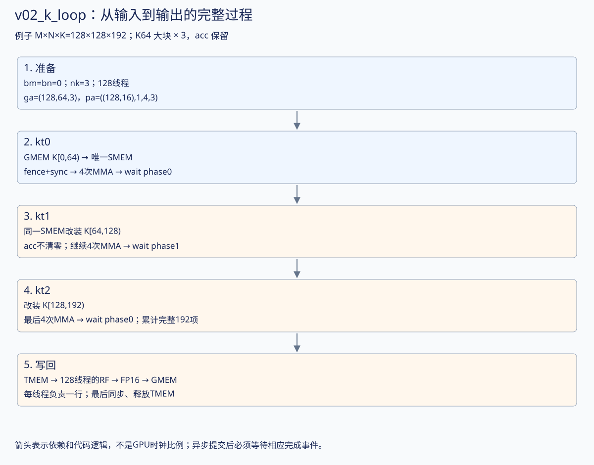
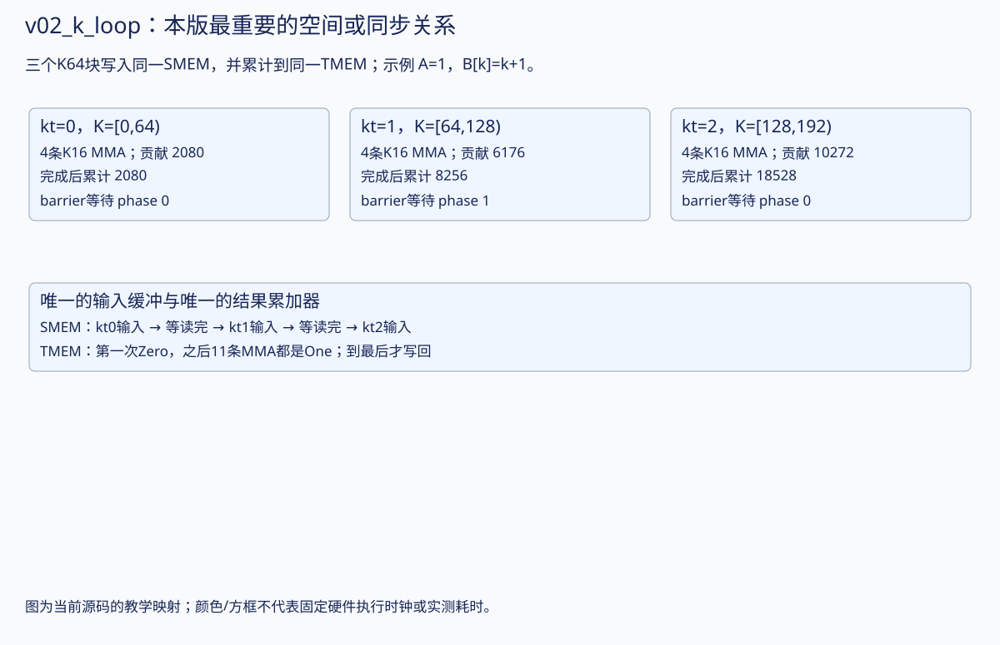
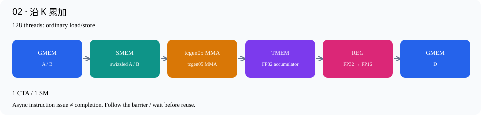

# 02 · 沿 K 累加

源码：[v02_k_loop.cu](../kernels/v02_k_loop.cu) · [交互逐行讲解](v02_k_loop.html)

输出仍只有一个128×128 tile，唯一核心扩展是允许 K>64。若 K=4096，外层 kt 跑64轮；每轮再发4条 K16 MMA，总共256条 MMA。

注意清零发生在整个 K-loop 之前，而不是每个 kt 的开头。若每轮都清零，得到的只有最后64个 K 元素的贡献。MMA 完成 barrier 会循环使用；第 kt 轮等待的 phase 是 kt&1，即0、1、0、1……。这不是“第几块共享内存”，而是同一 barrier 第几轮完成的奇偶标记。

每轮都先加载，再算，再等，资源不能重叠。这个版本用来建立正确的累加和回收关系；一个 CTA 无法充分利用整张 GPU，不能把此版本的吞吐与完整4096³ cuBLAS比较。

## 从上一版走到本版：完整图解

先读：[上一版](v01_single_tile.html) · [下一版](v03_multi_cta.html)。本版重点：**K64 大块 × 3，acc 保留**。下方保留完整逐行代码，先用图和具体例子建立整体过程，再对照行号。

|量|本版的具体含义|
|---|---|
|合作输出任务|128×128；每consumer的MMA输出128×128|
|CTA组大小 / 线程|1 CTA；每CTA 128线程|
|输入stage / consumer|1 stage；1个MMA consumer（v07起为独立MMA角色）|
|每CTA输入/输出SMEM数据|输入32KiB；输出缓冲0KiB；barrier、字段及对齐另计|
|每CTA TMEM|128列，即128×128个32-bit单元|
|教学例子的M×N×K|128×128×192；不改变下方已有实测尺寸与数据|




### 1. 从 v01 只改一个问题：K 超过 64 时怎么办？

取合法小例子 M=N=128、K=192。只有一个 CTA，bm=bn=0；但 nk=K/64=3，kt=0、1、2。每个 kt 内 kb=0…3，所以共发 **12 条 K16 MMA**，始终更新同一块 128×128 的 acc。

```text
全局 K = 64×kt + 16×kb + ki
kt=0：K[0,64)    → 四条 MMA
kt=1：K[64,128)  → 四条 MMA，接着累加
kt=2：K[128,192) → 四条 MMA，最后才写 D
```

若 A[3,k]=1、B[5,k]=k+1，D[3,5] 三轮的大块贡献为 2080、6176、10272，累计为 2080、8256、18528。这里只为解释数学选定示例数据；基准测试使用随机输入。

### 2. 追踪 A[3,82]，与 v01 的 A[3,18] 比较

完整矩阵的行 stride 变成 192，**不要继续用 GMEM 行 stride=64**。

|视图|实际 shape|观察点|
|---|---|---|
|a|`(128,192)`|a(3,82)，GMEM 元素偏移 3×192+82=658|
|ga|`(128,64,3)`|ga(3,18,1)|
|pa|`((128,16),1,4,3)`|pa((3,2),0,1,1)|
|sa|`((128,16),1,4)`|sa((3,2),0,1)，本轮装入 K[64,128)|
|ra|`(1,1,4)`|ra(0,0,1)，当前缓冲中的第二片 K16|
|acc / pd|`((128,128),1,1)`|acc/pd((3,5),0,0)，逻辑输出不变|

ga/pa 是 GMEM 视图；sa 是固定大小的 SMEM 缓冲。下一轮改变了源的 kt，但目标仍是同一份 sa。ra 描述 SMEM 中当前这批数据，不需要拥有 nk 个 descriptor 槽。示意 SMEM 基地址为 1024-byte 对齐时，局部 (3,18) 仍放在目标元素202；源地址已变为658。

### 3. 沿真实执行顺序看一次循环

```text
初始化 TMEM、barrier；accumulate=Zero（只在整个 K 循环前设置）
kt=0：128线程装 A/B → fence+CTA同步 → 4次MMA → 等 phase0
kt=1：同一块SMEM装下一批 → 同步 → 4次MMA → 等 phase1
kt=2：再次覆盖SMEM → 同步 → 4次MMA → 等 phase0
TMEM→REG → 等load完成 → 转FP16 → REG→GMEM → 同步并释放
```

phase 是同一 barrier 完成轮次的奇偶位，不是另一块内存，也不是“还要等几个线程”。第三次等待 phase0 是等待新的一轮，不是重新读取第一轮的状态。

SMEM 能被覆盖的依据是上一轮 MMA 已完成；TMEM 则一直保留同一输出的累计值。它们的复用时刻不同。

### 4. 线程和 layout：哪些继承，哪些变化？

仍是 128 线程、4 个 warp；普通 cooperative_copy 装输入，warp0 提交 MMA，所有线程等待，再合作写回。没有额外的 producer warp，也没有输入 stage 环。

当前 `cooperative_copy<128>` 默认 MaxVecBits=16，不能解释为128-bit向量。对本版这种布局，输入分工仍按局部 K64 窗口的坐标组织；源全局 k 还需加64×kt。输出仍每线程负责一个逻辑行。

真正改变的是源 GMEM 的完整 row stride、K 大块轴的长度和循环次数，SMEM/tmem tile 的形状没有随完整 K 扩大。

### 5. 容易出错的改法及复习答案

- 每个 kt 重新设 Zero：只剩最后一轮贡献，本例会得到10272而非18528。
- 不等 MMA 就重写 sa：Tensor Core 可能还在读取上一轮输入。
- 每轮写回并重新加载 D：本版不这样做，累加留在 TMEM 到最后。
- **为什么本版仍慢？** 单 CTA 无法让整张 GPU 充分并行，而且每轮都装完、算完、等完再进入下一轮。改变 K-loop 并未引入重叠。

阅读源码时把 `2>=3` 化为 false，`2==1` 化为 false。它们是生成器的常量条件，不是 GPU 上每次随机选择的分支。


### 本版机制放大图



### 如何核对这份讲解

对应本页链接的 `.cu` 源码；CuTe 单/双CTA分片和宽/窄load的坐标核对见 [layout诊断](../results/later-layout-inspection.txt)，可运行 `./scripts/check_later_layouts.sh` 复现。它在B300上用单个GPU线程检查CuTe identity tensor的坐标与分片形状，不执行MMA或TMEM数据读写。时间图只表达依赖；本轮完善文档不修改kernel，不把新增布局检查当作新的性能测量。已有正确性与性能数据仍见页面后半部分。


## 数据路径



## 编译运行

```bash
./build.sh v02_k_loop
./build/v02_k_loop 128 128 4096
```

## 逐行讲解

每个有效源码行都有对应解释；纯空行不编号说明。类型/参数换行继续属于同一个CuTe表达式。

|行|原始代码|解释|
|---|---|---|
|1|`// CUDA C++ / CuTe — 原书第 2 步。`|说明性注释，不生成机器指令。对应的中文机制解释见本节开头和下面的实际语句。|
|2|`// Generated by scripts/materialize.py; edit include/ development templates,`|说明性注释，不生成机器指令。对应的中文机制解释见本节开头和下面的实际语句。|
|3|`// then regenerate.`|说明性注释，不生成机器指令。对应的中文机制解释见本节开头和下面的实际语句。|
|4|`#include "common.cuh"`|引入CUDA/CuTe或项目公共声明；这里只包含头文件，没有执行数据搬运或计算。|
|5|`// API reference: NVIDIA CUTLASS`|说明性注释，不生成机器指令。对应的中文机制解释见本节开头和下面的实际语句。|
|6|`// examples/cute/tutorial/blackwell/01_mma_sm100.cu. The three book steps share`|说明性注释，不生成机器指令。对应的中文机制解释见本节开头和下面的实际语句。|
|7|`// storage and epilogue, but expose progressively more loops.`|说明性注释，不生成机器指令。对应的中文机制解释见本节开头和下面的实际语句。|
|8|`namespace study {`|建立本项目命名空间，或简写CuTe名字；不改变数据布局或GPU调度。|
|9|`using namespace cute;`|建立本项目命名空间，或简写CuTe名字；不改变数据布局或GPU调度。|
|10|`using Mma = decltype(make_tiled_mma(`|把底层MMA atom包装为CuTe TiledMMA，让后续分片、descriptor和gemm调用使用一致的映射。|
|11|`SM100_MMA_F16BF16_SS<H, H, float, 128, 128, UMMA::Major::K,`|选择单CTA的FP16/BF16 SMEM×SMEM MMA原语，FP32累加；后续M/N和Major参数给出指令形状。|
|12|`UMMA::Major::K>{}));`|本行继续上方表达式的参数/类型：选择单CTA的FP16/BF16 SMEM×SMEM MMA原语，FP32累加；后续M/N和Major参数给出指令形状。|
|13|`using Tile = Shape<_128, _128, _64>;`|定义编译期MMA tile形状(M,N,K)，此处K=64由4条K16 MMA组成。|
|14|`using ShapeA = decltype(partition_shape_A(Mma{}, Shape<_128, _64>{}));`|在编译期推导MMA分片后的操作数shape。例如单CTA A的128×64变为((128,16),1,4)。|
|15|`using LA =`|定义静态layout或shape类型：输入layout服务MMA，LD服务128×64的输出TMA分块。|
|16|`decltype(UMMA::tile_to_mma_shape(UMMA::Layout_K_SW128_Atom<H>{}, ShapeA{}));`|以128-byte swizzle atom为基础，铺成MMA要求的shared-memory布局；使用partition_shape得到的形状而非随意手写descriptor。|
|17|`struct BasicStorage {`|定义每CTA的shared-memory结构；按本结构体字段分配输入、同步元数据及适用版本中的输出缓冲。前三版没有输出SMEM buffer。|
|18|`alignas(128) ArrayEngine<H, cosize_v<LA>> a, b;`|预留真正的shared-memory数组。cosize_v按layout的地址范围计算容量，alignas保证TMA/descriptor要求的对齐。|
|19|`alignas(16) uint64_t mma_bar;`|预留64-bit mbarrier对象；数组下标表示stage或consumer，不是GPU地址轴。|
|20|`alignas(16) uint32_t tmem;`|在SMEM中保存TMEM基地址。它只是一个32-bit地址值，不是整个TMEM存储数组。|
|21|`};`|结束当前代码块或类型声明；作用域对应上方最近的函数、循环或条件分支。|
|22|`template <class TA, class TB, class TD>`|声明C++模板参数；CuTe的Tensor/layout类型在编译时决定，运行时不做Python解释。|
|23|`__global__ void basic(TA a, TB b, TD d) {`|定义真正运行在GPU上的CUDA kernel。每个CTA获得独立SMEM，各线程按照后面的warp条件分工。|
|24|`extern __shared__ char buf[];`|声明动态shared memory，由host launch第三个参数决定字节数。这里不是每个线程各分配一份。|
|25|`auto &s = *reinterpret_cast<BasicStorage *>(buf);`|把动态shared字节区解释为已定义Storage结构；各字段的偏移和对齐由C++编译器确定。|
|26|`Mma mma;`|构造本线程的轻量MMA描述对象，包含累加模式等状态；不是在每个线程里分配一个Tensor Core。|
|27|`int bm = 2 >= 3 ? blockIdx.x : 0, bn = 2 >= 3 ? blockIdx.y : 0;`|准备输出tile的二维索引；持久化版本随后用grouped_tile按8行M分组计算。|
|28|`auto coord = make_coord(bm, bn, _);`|把输出tile坐标和保留的K轴组合起来；下划线表示这一轴暂不固定。|
|29|`auto ga = local_tile(a, Tile{}, coord, Step<_1, X, _1>{});`|选取当前输出任务的A窗口：M方向由bm和consumer决定，保留K tile轴用于循环。|
|30|`auto gb = local_tile(b, Tile{}, coord, Step<X, _1, _1>{});`|选取当前输出任务的B窗口：N方向由bn决定，保留K tile轴。多个consumer共用bn，所以可以复用B。|
|31|`auto gd = local_tile(d, Tile{}, coord, Step<_1, _1, X>{});`|选取本任务的输出窗口；本CTA或本consumer只写它拥有的M/N坐标，避免输出竞争。|
|32|`auto cta = mma.get_slice(_0{});`|取得当前CTA在MMA中的份额。Blackwell的这个slice参数是peer CTA编号，不是CUDA threadIdx。|
|33|`auto pa = cta.partition_A(ga), pb = cta.partition_B(gb);`|按MMA的CTA分片规则重排输入tile的逻辑坐标。1-CTA时全部属于本CTA；2-CTA时只取本侧输入。|
|34|`auto pd = cta.partition_C(gd);`|按MMA映射取得本CTA输出的逻辑布局。双CTA的每侧只拥有128行，但都覆盖MMA的全部N列。|
|35|`auto sa = make_tensor(make_smem_ptr(s.a.begin()), LA{});`|把shared buffer地址和swizzled layout组合成CuTe Tensor视图；布局决定逻辑坐标如何落到物理SMEM。|
|36|`auto sb = make_tensor(make_smem_ptr(s.b.begin()), LA{});`|把shared buffer地址和swizzled layout组合成CuTe Tensor视图；布局决定逻辑坐标如何落到物理SMEM。|
|37|`auto ra = cta.make_fragment_A(sa), rb = cta.make_fragment_B(sb);`|把SMEM tensor转换成MMA操作数descriptor fragment；这里不执行SMEM→寄存器的数据复制。|
|38|`auto acc = cta.make_fragment_C(pd);`|创建TMEM accumulator的布局视图；此时还没有申请硬件TMEM，或者要在下一行绑定已申请地址。|
|39|`TMEM::Allocator1Sm alloc;`|创建TMEM分配器接口对象；真正申请发生在allocate调用。|
|40|`bool warp0 = threadIdx.x / 32 == 0;`|识别warp0。分配TMEM要求完整warp参与；TMA则还要进一步选一个线程。|
|41|`if (warp0)`|本warp承担TMEM分配/释放或串行版本的MMA发射；其他warps继续等待或负责结果搬运。|
|42|`alloc.allocate(128, &s.tmem);`|由一个完整warp协作申请TMEM列数，并把基地址写到SMEM里的tmem字段；全CTA/cluster同步后其他线程才能使用。|
|43|`if (threadIdx.x == 0)`|仅一个线程初始化shared barrier，避免重复初始化破坏其状态。|
|44|`initialize_barrier(s.mma_bar, 1);`|初始化MMA完成barrier；计数1指一个完成通知，不表示只有一个线程可以等待。|
|45|`__syncthreads();`|整个CTA的执行同步。所有需要参与的线程都必须到达；它本身不会等待尚未提交到barrier的异步MMA/TMA。|
|46|`acc.data() = s.tmem;`|为静态TMEM layout绑定真正的硬件基地址。第9版再加consumer×256列，使两个累加器互不覆盖。|
|47|`mma.accumulate_ = UMMA::ScaleOut::Zero;`|让后续第一条MMA忽略原TMEM值，相当于以0开始本输出tile的累加；无需另发清零kernel。|
|48|`int nk = 2 == 1 ? 1 : size<3>(pa);`|计算K tile轮数：第1版固定1次，其余版本K/64次。K必须能被64整除。|
|49|`for (int kt = 0; kt < nk; ++kt) {`|沿K以64为单位分块。每一轮负责一个完整A/B输入stage，stage可跨输出tile循环复用。|
|50|`cooperative_copy<128>(threadIdx.x, pa(_, _, _, kt), sa);`|128线程按源/目标layout分工执行普通global load与shared store；此重载默认MaxVecBits等于元素位宽，FP16即16bits。这不是TMA。|
|51|`cooperative_copy<128>(threadIdx.x, pb(_, _, _, kt), sb);`|128线程按源/目标layout分工执行普通global load与shared store；此重载默认MaxVecBits等于元素位宽，FP16即16bits。这不是TMA。|
|52|`// Ordinary SMEM stores must become visible to the asynchronous MMA proxy.`|说明性注释，不生成机器指令。对应的中文机制解释见本节开头和下面的实际语句。|
|53|`cutlass::arch::fence_view_async_shared();`|使普通shared stores对异步MMA/TMA代理可见；它不替代线程之间的执行同步。|
|54|`__syncthreads();`|整个CTA的执行同步。所有需要参与的线程都必须到达；它本身不会等待尚未提交到barrier的异步MMA/TMA。|
|55|`if (warp0) {`|本warp承担TMEM分配/释放或串行版本的MMA发射；其他warps继续等待或负责结果搬运。|
|56|`CUTE_UNROLL`|要求编译器展开静态短循环，减少循环控制；不表示这些MMA或load变成同时发射。|
|57|`for (int kb = 0; kb < size<2>(ra); ++kb) {`|一个BK64包含4个K16 MMA微块；此循环按descriptor的K偏移发出4条MMA。|
|58|`gemm(mma, ra(_, _, kb), rb(_, _, kb), acc);`|发一条K16的tcgen05 MMA，A/B参数是SMEM descriptor，结果累加到TMEM。调用异步；CuTe内部处理单线程发射。|
|59|`mma.accumulate_ = UMMA::ScaleOut::One;`|从下一条MMA开始保留已有TMEM结果并继续累加，不能在每个K tile开头重新清零。|
|60|`}`|结束当前代码块或类型声明；作用域对应上方最近的函数、循环或条件分支。|
|61|`cutlass::arch::umma_arrive(&s.mma_bar);`|将本warp此前MMA的完成通知绑定到mma_bar，供整个CTA等待。调用内部选出一个发射线程。|
|62|`}`|结束当前代码块或类型声明；作用域对应上方最近的函数、循环或条件分支。|
|63|`wait_barrier(s.mma_bar, kt & 1);`|等本轮异步MMA完成。没有这一步就重写输入SMEM，会在Tensor Core仍读取时覆盖数据。|
|64|`}`|结束当前代码块或类型声明；作用域对应上方最近的函数、循环或条件分支。|
|65|`auto cp = make_tmem_copy(SM100_TMEM_LOAD_32dp32b1x{}, acc);`|用选定tcgen05 load atom和accumulator布局构造线程级复制方案；随后get_slice才取出当前线程的份额。|
|66|`auto th = cp.get_slice(threadIdx.x);`|取得当前CUDA线程在TMEM copy中的份额。这里的slice参数才是线程号。|
|67|`auto src = th.partition_S(acc);`|取copy操作的源视图；TMEM协作指令中可表示warp共享的源窗口。其逻辑元素数不等于每线程寄存器数，需结合destination映射理解。|
|68|`auto dst = th.partition_D(pd);`|按同一个copy映射取目标分片，使每个源结果落到对应输出坐标；目标可能是SMEM或GMEM。|
|69|`auto rf = make_tensor<float>(shape(dst));`|按当前线程目标分片的形状创建FP32寄存器fragment，暂存从TMEM读出的结果。|
|70|`auto rh = make_tensor<H>(shape(dst));`|创建对应形状的FP16寄存器fragment，承接转换后的结果。寄存器是线程私有的。|
|71|`copy(cp, src, rf);`|真正执行TMEM→寄存器的load；cp规定本线程读取哪些lane/column，rf接收FP32结果。|
|72|`cutlass::arch::fence_view_async_tmem_load();`|发出tcgen05.wait::ld，等待本线程已发出的TMEM读取完成，再使用寄存器并允许回收TMEM。|
|73|`CUTE_UNROLL`|要求编译器展开静态短循环，减少循环控制；不表示这些MMA或load变成同时发射。|
|74|`for (int i = 0; i < size(rh); ++i)`|遍历固定数量的barrier或当前线程的寄存器元素；具体容量由本版stage数/fragment shape决定。|
|75|`rh(i) = H(rf(i));`|逐元素从FP32转换为FP16；这一步发生最终舍入，Tensor Core的内部累加精度仍是FP32。|
|76|`copy(rh, dst);`|真正执行FP16寄存器→目标存储。前三版dst是GMEM分片，TMA版本dst是swizzled输出SMEM分片。|
|77|`__syncthreads();`|整个CTA的执行同步。所有需要参与的线程都必须到达；它本身不会等待尚未提交到barrier的异步MMA/TMA。|
|78|`if (warp0) {`|本warp承担TMEM分配/释放或串行版本的MMA发射；其他warps继续等待或负责结果搬运。|
|79|`alloc.release_allocation_lock();`|归还TMEM分配许可，让后续工作能够申请；这不等于已经释放当前TMEM内容。|
|80|`alloc.free(s.tmem, 128);`|释放先前申请的TMEM列。调用前必须确保所有相关线程和远端CTA已经不再访问它。|
|81|`}`|结束当前代码块或类型声明；作用域对应上方最近的函数、循环或条件分支。|
|82|`}`|结束当前代码块或类型声明；作用域对应上方最近的函数、循环或条件分支。|
|83|`void launch_basic(Problem p) {`|host侧入口，准备描述对象、配置kernel并发射；GPU运算在__global__函数内。|
|84|`auto a = make_tensor(make_gmem_ptr(p.a), make_layout(make_shape(p.m, p.k),`|把cudaMalloc得到的全局地址和形状/stride组合成CuTe Tensor；这个host侧对象描述内存，不复制矩阵。|
|85|`make_stride(p.k, _1{})));`|描述row-major布局：外层行移动K或N个元素，内层连续维度stride=1。stride单位是元素，不是字节。|
|86|`auto b = make_tensor(make_gmem_ptr(p.b), make_layout(make_shape(p.n, p.k),`|把cudaMalloc得到的全局地址和形状/stride组合成CuTe Tensor；这个host侧对象描述内存，不复制矩阵。|
|87|`make_stride(p.k, _1{})));`|描述row-major布局：外层行移动K或N个元素，内层连续维度stride=1。stride单位是元素，不是字节。|
|88|`auto d = make_tensor(make_gmem_ptr(p.d), make_layout(make_shape(p.m, p.n),`|把cudaMalloc得到的全局地址和形状/stride组合成CuTe Tensor；这个host侧对象描述内存，不复制矩阵。|
|89|`make_stride(p.n, _1{})));`|描述row-major布局：外层行移动K或N个元素，内层连续维度stride=1。stride单位是元素，不是字节。|
|90|`auto fn = basic<decltype(a), decltype(b), decltype(d)>;`|选择当前Tensor/descriptor类型对应的模板实例，取得真正的kernel入口地址。|
|91|`static bool configured = false;`|host端记住kernel属性是否已设置；不会在每个Graph节点里反复配置。|
|92|`if (!configured) {`|仅首次host调用进入配置分支；此处不是GPU线程分支。|
|93|`CUDA_OK(cudaFuncSetAttribute(`|允许该kernel使用指定大小的动态SMEM；配置发生在host侧且只做一次，避免污染每次发射的host成本。|
|94|`fn, cudaFuncAttributeMaxDynamicSharedMemorySize, sizeof(BasicStorage)));`|允许该kernel使用指定大小的动态SMEM；配置发生在host侧且只做一次，避免污染每次发射的host成本。|
|95|`configured = true;`|标记属性已配置，后续launch复用。|
|96|`}`|结束当前代码块或类型声明；作用域对应上方最近的函数、循环或条件分支。|
|97|`fn<<<dim3(2 >= 3 ? p.m / 128 : 1, 2 >= 3 ? p.n / 128 : 1), 128,`|真正发射CUDA kernel：依次指定grid、每CTA线程数、动态SMEM大小。矩阵分片的Tensor与descriptor作为参数传入。|
|98|`sizeof(BasicStorage)>>>(a, b, d);`|本行继续上方表达式的参数/类型：真正发射CUDA kernel：依次指定grid、每CTA线程数、动态SMEM大小。矩阵分片的Tensor与descriptor作为参数传入。|
|99|`}`|结束当前代码块或类型声明；作用域对应上方最近的函数、循环或条件分支。|
|100|`} // namespace study`|结束当前代码块或类型声明；作用域对应上方最近的函数、循环或条件分支。|
|102|`void launch(Problem p) { study::launch_basic(p); }`|host侧入口，准备描述对象、配置kernel并发射；GPU运算在__global__函数内。|
|103|`constexpr int VERSION = 2;`|测试程序用这个编译期版本号检查允许的输入形状，并标记输出JSON。|
|104|`#include "runner_graph.cuh"`|引入CUDA/CuTe或项目公共声明；这里只包含头文件，没有执行数据搬运或计算。|

## 实测

```json
{
  "version": 2,
  "m": 128,
  "n": 128,
  "k": 4096,
  "correct": true,
  "checked": 16384,
  "max_abs": 0.0311737061,
  "median_ms": 1.28943682,
  "p10_ms": 1.28938401,
  "p90_ms": 1.28955042,
  "tflops": 0.104090194,
  "cublas_ms": 0.00557920011,
  "cublasLt_ms": 0.00438079983,
  "speedup_vs_lt": 0.00339745218,
  "lt_candidates": 8,
  "lt_choice": 2,
  "cublas_version": 130100,
  "cache_policy": "warm_replay",
  "gpu": "NVIDIA B300 SXM6 AC",
  "sms": 148
}
```

公共测试程序详见 [测试与基准](testing.md)。
