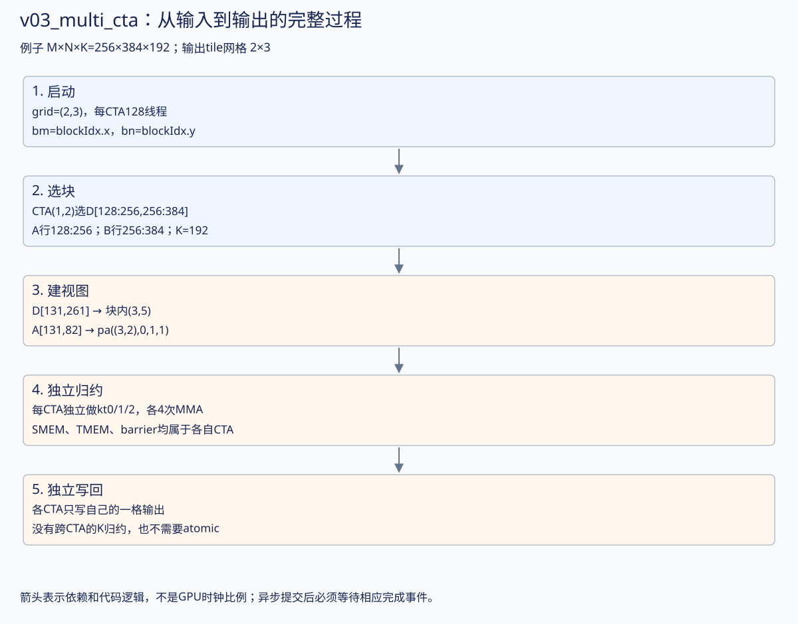
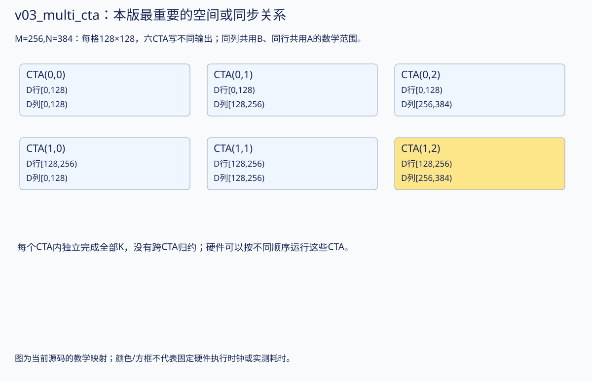
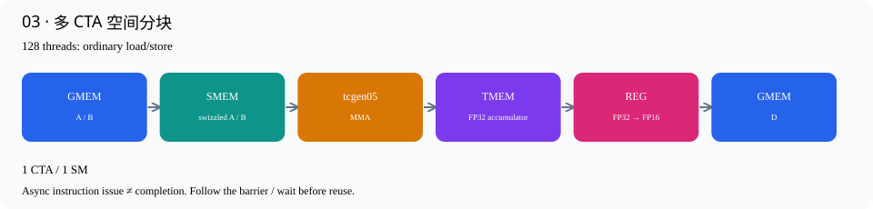

# 03 · 多 CTA 空间分块

源码：[v03_multi_cta.cu](../kernels/v03_multi_cta.cu) · [交互逐行讲解](v03_multi_cta.html)

现在 M、N 都能包含多个128×128输出 tile。grid=(M/128,N/128)。例如 M=N=4096，grid为32×32，共1024个CTA。

CTA(bm,bn)读取 A[bm*128:(bm+1)*128, :] 和 B[bn*128:(bn+1)*128, :]，写 D 对应方块。K-loop仍和第2版一致，每个CTA独立完成其输出的全部K累加，所以无需atomic，也无需CTA之间求和。

相同bm、不同bn的CTAs会读取相同A；相同bn、不同bm的CTAs会读取相同B。目前没有显式跨CTA共享这些输入，可能由硬件cache命中提供帮助。不要把软件tiling理解成自动在CTA之间共享SMEM。

这个版本第一次适合在4096³上与后续版本比较。相较第2版的单tile，加速同时含“问题规模变大”和“并行度增加”，因此文档不计算第2→3版的简单累计加速倍数。

## 从上一版走到本版：完整图解

先读：[上一版](v02_k_loop.html) · [下一版](v04_tma.html)。本版重点：**输出tile网格 2×3**。下方保留完整逐行代码，先用图和具体例子建立整体过程，再对照行号。

|量|本版的具体含义|
|---|---|
|合作输出任务|128×128；每consumer的MMA输出128×128|
|CTA组大小 / 线程|1 CTA；每CTA 128线程|
|输入stage / consumer|1 stage；1个MMA consumer（v07起为独立MMA角色）|
|每CTA输入/输出SMEM数据|输入32KiB；输出缓冲0KiB；barrier、字段及对齐另计|
|每CTA TMEM|128列，即128×128个32-bit单元|
|教学例子的M×N×K|256×384×192；不改变下方已有实测尺寸与数据|




### 1. 从“只有一个输出块”变成“很多独立输出块”

取 M=256、N=384、K=192。grid=(2,3)，共6个CTA；每个CTA128线程。`bm=blockIdx.x`，`bn=blockIdx.y`，而 kt/kb 仍像 v02 一样在每个 CTA 内循环。

```text
D 的 tile 网格（每格128×128）：
          bn0       bn1       bn2
bm0     CTA(0,0)  CTA(0,1)  CTA(0,2)
bm1     CTA(1,0)  CTA(1,1)  CTA(1,2)
```

**并行的是输出空间 M/N，归约 K 没被分给不同 CTA。** 每个CTA自己算完所属输出的全部192项，所以无需CTA之间求和，也无需atomic。

### 2. 固定 CTA(1,2)，追踪同一项乘积

它写 D[128:256,256:384]，需要 A[128:256,:] 和 B[256:384,:]。注意 B 存为(N,K)，对应输出的列范围。

```text
观察输出 D[131,261]：块内 (m,n)=(3,5)
kt=1,kb=1,ki=2 → global k=82

A[131,82] ↔ ga(3,18,1) ↔ pa((3,2),0,1,1)
B[261,82] ↔ gb(5,18,1) ↔ pb((5,2),0,1,1)
D[131,261] ↔ gd(3,5) ↔ pd((3,5),0,0)
```

A 的元素偏移是131×192+82=25234；D 的元素偏移是131×384+261=50565。GMEM 地址要用完整矩阵 stride；SMEM 输入使用局部 tile 的 layout，不把全局行号131直接代入局部行号3的位置。

### 3. 同一份代码，在六个 CTA 中各自执行

每个CTA独立申请TMEM、初始化自己的SMEM/barrier，沿K跑3轮、每轮4条MMA，最后只写自己那一格。ga/gb shape 为(128,64,3)，pa/pb为((128,16),1,4,3)，与v02的小块视图结构相同。

`mma.get_slice(0)` 仍是本次单CTA MMA的唯一参与者0，**不应改成 get_slice(blockIdx.x)**。bm选择矩阵中的窗口；slice选择该条MMA的参与者，这两个编号不在同一层。

threadIdx.x=3 在整个 grid 中并不唯一：每个 CTA 都有自己的 thread3。这里 CTA(1,2) 的 thread3 写 D 第131行的相应128列；CTA(0,2) 的 thread3 写 D 第3行的相应128列。

### 4. 复用的是哪份输入？

- 同一 bm、不同 bn：需要相同的 A 行范围，但配不同 B，因此产生同一输出行带的不同列块。
- 同一 bn、不同 bm：需要相同的 B 行范围，但配不同 A。
- 每个 CTA 的 SMEM 独立；代码没有跨CTA传送 A/B，也没有显式 cluster。重复 GMEM 读取可能命中缓存，不能说“这些CTA共用同一SMEM”。

硬件决定这些 CTA 何时运行、落到哪些 SM。grid=(2,3) 是逻辑工作网格，不是要求 GPU 的 SM 排成2×3。

### 5. 从这里开始怎样公平比较性能？

v02只算一个128×128输出，v03能覆盖完整4096×4096输出。不能直接拿两者耗时相除当作纯优化倍数。应先固定问题尺寸；后续v03→v09的4096³实测才更适合比较。

**复习：为什么 bm 相同的两个 CTA 不能写同一个 acc？** 它们输出的 bn 不同，且TMEM/SMEM各自独立；本版的每个CTA拥有一整块输出，没有部分结果合并协议。


### 本版机制放大图



### 如何核对这份讲解

对应本页链接的 `.cu` 源码；CuTe 单/双CTA分片和宽/窄load的坐标核对见 [layout诊断](../results/later-layout-inspection.txt)，可运行 `./scripts/check_later_layouts.sh` 复现。它在B300上用单个GPU线程检查CuTe identity tensor的坐标与分片形状，不执行MMA或TMEM数据读写。时间图只表达依赖；本轮完善文档不修改kernel，不把新增布局检查当作新的性能测量。已有正确性与性能数据仍见页面后半部分。


## 数据路径



## 编译运行

```bash
./build.sh v03_multi_cta
./build/v03_multi_cta 4096 4096 4096
```

## 逐行讲解

每个有效源码行都有对应解释；纯空行不编号说明。类型/参数换行继续属于同一个CuTe表达式。

|行|原始代码|解释|
|---|---|---|
|1|`// CUDA C++ / CuTe — 原书第 3 步。`|说明性注释，不生成机器指令。对应的中文机制解释见本节开头和下面的实际语句。|
|2|`// Generated by scripts/materialize.py; edit include/ development templates,`|说明性注释，不生成机器指令。对应的中文机制解释见本节开头和下面的实际语句。|
|3|`// then regenerate.`|说明性注释，不生成机器指令。对应的中文机制解释见本节开头和下面的实际语句。|
|4|`#include "common.cuh"`|引入CUDA/CuTe或项目公共声明；这里只包含头文件，没有执行数据搬运或计算。|
|5|`// API reference: NVIDIA CUTLASS`|说明性注释，不生成机器指令。对应的中文机制解释见本节开头和下面的实际语句。|
|6|`// examples/cute/tutorial/blackwell/01_mma_sm100.cu. The three book steps share`|说明性注释，不生成机器指令。对应的中文机制解释见本节开头和下面的实际语句。|
|7|`// storage and epilogue, but expose progressively more loops.`|说明性注释，不生成机器指令。对应的中文机制解释见本节开头和下面的实际语句。|
|8|`namespace study {`|建立本项目命名空间，或简写CuTe名字；不改变数据布局或GPU调度。|
|9|`using namespace cute;`|建立本项目命名空间，或简写CuTe名字；不改变数据布局或GPU调度。|
|10|`using Mma = decltype(make_tiled_mma(`|把底层MMA atom包装为CuTe TiledMMA，让后续分片、descriptor和gemm调用使用一致的映射。|
|11|`SM100_MMA_F16BF16_SS<H, H, float, 128, 128, UMMA::Major::K,`|选择单CTA的FP16/BF16 SMEM×SMEM MMA原语，FP32累加；后续M/N和Major参数给出指令形状。|
|12|`UMMA::Major::K>{}));`|本行继续上方表达式的参数/类型：选择单CTA的FP16/BF16 SMEM×SMEM MMA原语，FP32累加；后续M/N和Major参数给出指令形状。|
|13|`using Tile = Shape<_128, _128, _64>;`|定义编译期MMA tile形状(M,N,K)，此处K=64由4条K16 MMA组成。|
|14|`using ShapeA = decltype(partition_shape_A(Mma{}, Shape<_128, _64>{}));`|在编译期推导MMA分片后的操作数shape。例如单CTA A的128×64变为((128,16),1,4)。|
|15|`using LA =`|定义静态layout或shape类型：输入layout服务MMA，LD服务128×64的输出TMA分块。|
|16|`decltype(UMMA::tile_to_mma_shape(UMMA::Layout_K_SW128_Atom<H>{}, ShapeA{}));`|以128-byte swizzle atom为基础，铺成MMA要求的shared-memory布局；使用partition_shape得到的形状而非随意手写descriptor。|
|17|`struct BasicStorage {`|定义每CTA的shared-memory结构；按本结构体字段分配输入、同步元数据及适用版本中的输出缓冲。前三版没有输出SMEM buffer。|
|18|`alignas(128) ArrayEngine<H, cosize_v<LA>> a, b;`|预留真正的shared-memory数组。cosize_v按layout的地址范围计算容量，alignas保证TMA/descriptor要求的对齐。|
|19|`alignas(16) uint64_t mma_bar;`|预留64-bit mbarrier对象；数组下标表示stage或consumer，不是GPU地址轴。|
|20|`alignas(16) uint32_t tmem;`|在SMEM中保存TMEM基地址。它只是一个32-bit地址值，不是整个TMEM存储数组。|
|21|`};`|结束当前代码块或类型声明；作用域对应上方最近的函数、循环或条件分支。|
|22|`template <class TA, class TB, class TD>`|声明C++模板参数；CuTe的Tensor/layout类型在编译时决定，运行时不做Python解释。|
|23|`__global__ void basic(TA a, TB b, TD d) {`|定义真正运行在GPU上的CUDA kernel。每个CTA获得独立SMEM，各线程按照后面的warp条件分工。|
|24|`extern __shared__ char buf[];`|声明动态shared memory，由host launch第三个参数决定字节数。这里不是每个线程各分配一份。|
|25|`auto &s = *reinterpret_cast<BasicStorage *>(buf);`|把动态shared字节区解释为已定义Storage结构；各字段的偏移和对齐由C++编译器确定。|
|26|`Mma mma;`|构造本线程的轻量MMA描述对象，包含累加模式等状态；不是在每个线程里分配一个Tensor Core。|
|27|`int bm = 3 >= 3 ? blockIdx.x : 0, bn = 3 >= 3 ? blockIdx.y : 0;`|准备输出tile的二维索引；持久化版本随后用grouped_tile按8行M分组计算。|
|28|`auto coord = make_coord(bm, bn, _);`|把输出tile坐标和保留的K轴组合起来；下划线表示这一轴暂不固定。|
|29|`auto ga = local_tile(a, Tile{}, coord, Step<_1, X, _1>{});`|选取当前输出任务的A窗口：M方向由bm和consumer决定，保留K tile轴用于循环。|
|30|`auto gb = local_tile(b, Tile{}, coord, Step<X, _1, _1>{});`|选取当前输出任务的B窗口：N方向由bn决定，保留K tile轴。多个consumer共用bn，所以可以复用B。|
|31|`auto gd = local_tile(d, Tile{}, coord, Step<_1, _1, X>{});`|选取本任务的输出窗口；本CTA或本consumer只写它拥有的M/N坐标，避免输出竞争。|
|32|`auto cta = mma.get_slice(_0{});`|取得当前CTA在MMA中的份额。Blackwell的这个slice参数是peer CTA编号，不是CUDA threadIdx。|
|33|`auto pa = cta.partition_A(ga), pb = cta.partition_B(gb);`|按MMA的CTA分片规则重排输入tile的逻辑坐标。1-CTA时全部属于本CTA；2-CTA时只取本侧输入。|
|34|`auto pd = cta.partition_C(gd);`|按MMA映射取得本CTA输出的逻辑布局。双CTA的每侧只拥有128行，但都覆盖MMA的全部N列。|
|35|`auto sa = make_tensor(make_smem_ptr(s.a.begin()), LA{});`|把shared buffer地址和swizzled layout组合成CuTe Tensor视图；布局决定逻辑坐标如何落到物理SMEM。|
|36|`auto sb = make_tensor(make_smem_ptr(s.b.begin()), LA{});`|把shared buffer地址和swizzled layout组合成CuTe Tensor视图；布局决定逻辑坐标如何落到物理SMEM。|
|37|`auto ra = cta.make_fragment_A(sa), rb = cta.make_fragment_B(sb);`|把SMEM tensor转换成MMA操作数descriptor fragment；这里不执行SMEM→寄存器的数据复制。|
|38|`auto acc = cta.make_fragment_C(pd);`|创建TMEM accumulator的布局视图；此时还没有申请硬件TMEM，或者要在下一行绑定已申请地址。|
|39|`TMEM::Allocator1Sm alloc;`|创建TMEM分配器接口对象；真正申请发生在allocate调用。|
|40|`bool warp0 = threadIdx.x / 32 == 0;`|识别warp0。分配TMEM要求完整warp参与；TMA则还要进一步选一个线程。|
|41|`if (warp0)`|本warp承担TMEM分配/释放或串行版本的MMA发射；其他warps继续等待或负责结果搬运。|
|42|`alloc.allocate(128, &s.tmem);`|由一个完整warp协作申请TMEM列数，并把基地址写到SMEM里的tmem字段；全CTA/cluster同步后其他线程才能使用。|
|43|`if (threadIdx.x == 0)`|仅一个线程初始化shared barrier，避免重复初始化破坏其状态。|
|44|`initialize_barrier(s.mma_bar, 1);`|初始化MMA完成barrier；计数1指一个完成通知，不表示只有一个线程可以等待。|
|45|`__syncthreads();`|整个CTA的执行同步。所有需要参与的线程都必须到达；它本身不会等待尚未提交到barrier的异步MMA/TMA。|
|46|`acc.data() = s.tmem;`|为静态TMEM layout绑定真正的硬件基地址。第9版再加consumer×256列，使两个累加器互不覆盖。|
|47|`mma.accumulate_ = UMMA::ScaleOut::Zero;`|让后续第一条MMA忽略原TMEM值，相当于以0开始本输出tile的累加；无需另发清零kernel。|
|48|`int nk = 3 == 1 ? 1 : size<3>(pa);`|计算K tile轮数：第1版固定1次，其余版本K/64次。K必须能被64整除。|
|49|`for (int kt = 0; kt < nk; ++kt) {`|沿K以64为单位分块。每一轮负责一个完整A/B输入stage，stage可跨输出tile循环复用。|
|50|`cooperative_copy<128>(threadIdx.x, pa(_, _, _, kt), sa);`|128线程按源/目标layout分工执行普通global load与shared store；此重载默认MaxVecBits等于元素位宽，FP16即16bits。这不是TMA。|
|51|`cooperative_copy<128>(threadIdx.x, pb(_, _, _, kt), sb);`|128线程按源/目标layout分工执行普通global load与shared store；此重载默认MaxVecBits等于元素位宽，FP16即16bits。这不是TMA。|
|52|`// Ordinary SMEM stores must become visible to the asynchronous MMA proxy.`|说明性注释，不生成机器指令。对应的中文机制解释见本节开头和下面的实际语句。|
|53|`cutlass::arch::fence_view_async_shared();`|使普通shared stores对异步MMA/TMA代理可见；它不替代线程之间的执行同步。|
|54|`__syncthreads();`|整个CTA的执行同步。所有需要参与的线程都必须到达；它本身不会等待尚未提交到barrier的异步MMA/TMA。|
|55|`if (warp0) {`|本warp承担TMEM分配/释放或串行版本的MMA发射；其他warps继续等待或负责结果搬运。|
|56|`CUTE_UNROLL`|要求编译器展开静态短循环，减少循环控制；不表示这些MMA或load变成同时发射。|
|57|`for (int kb = 0; kb < size<2>(ra); ++kb) {`|一个BK64包含4个K16 MMA微块；此循环按descriptor的K偏移发出4条MMA。|
|58|`gemm(mma, ra(_, _, kb), rb(_, _, kb), acc);`|发一条K16的tcgen05 MMA，A/B参数是SMEM descriptor，结果累加到TMEM。调用异步；CuTe内部处理单线程发射。|
|59|`mma.accumulate_ = UMMA::ScaleOut::One;`|从下一条MMA开始保留已有TMEM结果并继续累加，不能在每个K tile开头重新清零。|
|60|`}`|结束当前代码块或类型声明；作用域对应上方最近的函数、循环或条件分支。|
|61|`cutlass::arch::umma_arrive(&s.mma_bar);`|将本warp此前MMA的完成通知绑定到mma_bar，供整个CTA等待。调用内部选出一个发射线程。|
|62|`}`|结束当前代码块或类型声明；作用域对应上方最近的函数、循环或条件分支。|
|63|`wait_barrier(s.mma_bar, kt & 1);`|等本轮异步MMA完成。没有这一步就重写输入SMEM，会在Tensor Core仍读取时覆盖数据。|
|64|`}`|结束当前代码块或类型声明；作用域对应上方最近的函数、循环或条件分支。|
|65|`auto cp = make_tmem_copy(SM100_TMEM_LOAD_32dp32b1x{}, acc);`|用选定tcgen05 load atom和accumulator布局构造线程级复制方案；随后get_slice才取出当前线程的份额。|
|66|`auto th = cp.get_slice(threadIdx.x);`|取得当前CUDA线程在TMEM copy中的份额。这里的slice参数才是线程号。|
|67|`auto src = th.partition_S(acc);`|取copy操作的源视图；TMEM协作指令中可表示warp共享的源窗口。其逻辑元素数不等于每线程寄存器数，需结合destination映射理解。|
|68|`auto dst = th.partition_D(pd);`|按同一个copy映射取目标分片，使每个源结果落到对应输出坐标；目标可能是SMEM或GMEM。|
|69|`auto rf = make_tensor<float>(shape(dst));`|按当前线程目标分片的形状创建FP32寄存器fragment，暂存从TMEM读出的结果。|
|70|`auto rh = make_tensor<H>(shape(dst));`|创建对应形状的FP16寄存器fragment，承接转换后的结果。寄存器是线程私有的。|
|71|`copy(cp, src, rf);`|真正执行TMEM→寄存器的load；cp规定本线程读取哪些lane/column，rf接收FP32结果。|
|72|`cutlass::arch::fence_view_async_tmem_load();`|发出tcgen05.wait::ld，等待本线程已发出的TMEM读取完成，再使用寄存器并允许回收TMEM。|
|73|`CUTE_UNROLL`|要求编译器展开静态短循环，减少循环控制；不表示这些MMA或load变成同时发射。|
|74|`for (int i = 0; i < size(rh); ++i)`|遍历固定数量的barrier或当前线程的寄存器元素；具体容量由本版stage数/fragment shape决定。|
|75|`rh(i) = H(rf(i));`|逐元素从FP32转换为FP16；这一步发生最终舍入，Tensor Core的内部累加精度仍是FP32。|
|76|`copy(rh, dst);`|真正执行FP16寄存器→目标存储。前三版dst是GMEM分片，TMA版本dst是swizzled输出SMEM分片。|
|77|`__syncthreads();`|整个CTA的执行同步。所有需要参与的线程都必须到达；它本身不会等待尚未提交到barrier的异步MMA/TMA。|
|78|`if (warp0) {`|本warp承担TMEM分配/释放或串行版本的MMA发射；其他warps继续等待或负责结果搬运。|
|79|`alloc.release_allocation_lock();`|归还TMEM分配许可，让后续工作能够申请；这不等于已经释放当前TMEM内容。|
|80|`alloc.free(s.tmem, 128);`|释放先前申请的TMEM列。调用前必须确保所有相关线程和远端CTA已经不再访问它。|
|81|`}`|结束当前代码块或类型声明；作用域对应上方最近的函数、循环或条件分支。|
|82|`}`|结束当前代码块或类型声明；作用域对应上方最近的函数、循环或条件分支。|
|83|`void launch_basic(Problem p) {`|host侧入口，准备描述对象、配置kernel并发射；GPU运算在__global__函数内。|
|84|`auto a = make_tensor(make_gmem_ptr(p.a), make_layout(make_shape(p.m, p.k),`|把cudaMalloc得到的全局地址和形状/stride组合成CuTe Tensor；这个host侧对象描述内存，不复制矩阵。|
|85|`make_stride(p.k, _1{})));`|描述row-major布局：外层行移动K或N个元素，内层连续维度stride=1。stride单位是元素，不是字节。|
|86|`auto b = make_tensor(make_gmem_ptr(p.b), make_layout(make_shape(p.n, p.k),`|把cudaMalloc得到的全局地址和形状/stride组合成CuTe Tensor；这个host侧对象描述内存，不复制矩阵。|
|87|`make_stride(p.k, _1{})));`|描述row-major布局：外层行移动K或N个元素，内层连续维度stride=1。stride单位是元素，不是字节。|
|88|`auto d = make_tensor(make_gmem_ptr(p.d), make_layout(make_shape(p.m, p.n),`|把cudaMalloc得到的全局地址和形状/stride组合成CuTe Tensor；这个host侧对象描述内存，不复制矩阵。|
|89|`make_stride(p.n, _1{})));`|描述row-major布局：外层行移动K或N个元素，内层连续维度stride=1。stride单位是元素，不是字节。|
|90|`auto fn = basic<decltype(a), decltype(b), decltype(d)>;`|选择当前Tensor/descriptor类型对应的模板实例，取得真正的kernel入口地址。|
|91|`static bool configured = false;`|host端记住kernel属性是否已设置；不会在每个Graph节点里反复配置。|
|92|`if (!configured) {`|仅首次host调用进入配置分支；此处不是GPU线程分支。|
|93|`CUDA_OK(cudaFuncSetAttribute(`|允许该kernel使用指定大小的动态SMEM；配置发生在host侧且只做一次，避免污染每次发射的host成本。|
|94|`fn, cudaFuncAttributeMaxDynamicSharedMemorySize, sizeof(BasicStorage)));`|允许该kernel使用指定大小的动态SMEM；配置发生在host侧且只做一次，避免污染每次发射的host成本。|
|95|`configured = true;`|标记属性已配置，后续launch复用。|
|96|`}`|结束当前代码块或类型声明；作用域对应上方最近的函数、循环或条件分支。|
|97|`fn<<<dim3(3 >= 3 ? p.m / 128 : 1, 3 >= 3 ? p.n / 128 : 1), 128,`|真正发射CUDA kernel：依次指定grid、每CTA线程数、动态SMEM大小。矩阵分片的Tensor与descriptor作为参数传入。|
|98|`sizeof(BasicStorage)>>>(a, b, d);`|本行继续上方表达式的参数/类型：真正发射CUDA kernel：依次指定grid、每CTA线程数、动态SMEM大小。矩阵分片的Tensor与descriptor作为参数传入。|
|99|`}`|结束当前代码块或类型声明；作用域对应上方最近的函数、循环或条件分支。|
|100|`} // namespace study`|结束当前代码块或类型声明；作用域对应上方最近的函数、循环或条件分支。|
|102|`void launch(Problem p) { study::launch_basic(p); }`|host侧入口，准备描述对象、配置kernel并发射；GPU运算在__global__函数内。|
|103|`constexpr int VERSION = 3;`|测试程序用这个编译期版本号检查允许的输入形状，并标记输出JSON。|
|104|`#include "runner_graph.cuh"`|引入CUDA/CuTe或项目公共声明；这里只包含头文件，没有执行数据搬运或计算。|

## 实测

```json
{
  "version": 3,
  "m": 4096,
  "n": 4096,
  "k": 4096,
  "correct": true,
  "checked": 16777216,
  "max_abs": 0.0317611694,
  "median_ms": 15.2769947,
  "p10_ms": 15.2723188,
  "p90_ms": 15.28407,
  "tflops": 8.99646535,
  "cublas_ms": 0.0830160007,
  "cublasLt_ms": 0.100825593,
  "speedup_vs_lt": 0.00659983186,
  "lt_candidates": 8,
  "lt_choice": 0,
  "cublas_version": 130100,
  "cache_policy": "warm_replay",
  "gpu": "NVIDIA B300 SXM6 AC",
  "sms": 148
}
```

公共测试程序详见 [测试与基准](testing.md)。
