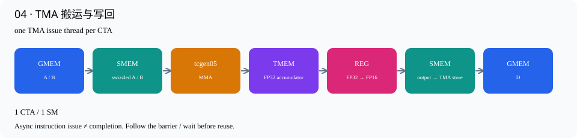

# 04 · TMA 搬运与写回

源码：[v04_tma.cu](../kernels/v04_tma.cu) · [交互逐行讲解](v04_tma.html)

普通 global load→线程寄存器→shared store 被 TMA load 替换。CPU先编码TMA descriptor，GPU选出的一个线程发起搬运。descriptor描述源张量形状、stride、目标swizzle与tile形状，并不携带矩阵数据。

`CUTE_GRID_CONSTANT` 很关键：descriptor作为整个grid共享的只读kernel参数保留。否则编译器可能把取地址的参数复制到线程local memory，TMA使用该地址会失败。首次开发确实暴露过这个问题，当前源码已修正。

每次 A/B 预期字节数=128*64*2*2=32768。full barrier既等线程arrival，也等这些TMA字节完成。full就绪后才读SMEM；MMA的done完成后才复用SMEM。两条barrier保护不同事件，不能互换。

写回按128×64切两轮：TMEM→FP32寄存器→FP16寄存器→swizzled SMEM→TMA store。`tma_store_fence`使普通shared store对TMA可见，CTA同步等待所有线程完成写入；发起线程commit并wait，最后再次CTA同步才能覆盖这块输出SMEM。此版每个阶段仍立即等待，异步指令尚未充分重叠。

## 数据路径



## 编译运行

```bash
./build.sh v04_tma
./build/v04_tma 4096 4096 4096
```

## 逐行讲解

每个有效源码行都有对应解释；纯空行不编号说明。类型/参数换行继续属于同一个CuTe表达式。

|行|原始代码|解释|
|---|---|---|
|1|`// CUDA C++ / CuTe — 原书第 4 步。`|说明性注释，不生成机器指令。对应的中文机制解释见本节开头和下面的实际语句。|
|2|`// Generated by scripts/materialize.py; edit include/ development templates,`|说明性注释，不生成机器指令。对应的中文机制解释见本节开头和下面的实际语句。|
|3|`// then regenerate.`|说明性注释，不生成机器指令。对应的中文机制解释见本节开头和下面的实际语句。|
|4|`#include "common.cuh"`|引入CUDA/CuTe、错误检查或C++标准库声明；这不是运行时加载Python包。|
|5|`namespace study {`|建立本项目命名空间，或简写CuTe名字；不改变数据布局或GPU调度。|
|6|`using namespace cute;`|建立本项目命名空间，或简写CuTe名字；不改变数据布局或GPU调度。|
|7|`using Mma = decltype(make_tiled_mma(`|把底层MMA atom包装为CuTe TiledMMA，让后续分片、descriptor和gemm调用使用一致的映射。|
|8|`SM100_MMA_F16BF16_SS<H, H, float, 128, 128, UMMA::Major::K,`|选择单CTA的FP16/BF16 SMEM×SMEM MMA原语，FP32累加；后续M/N和Major参数给出指令形状。|
|9|`UMMA::Major::K>{}));`|本行继续上方表达式的参数/类型：选择单CTA的FP16/BF16 SMEM×SMEM MMA原语，FP32累加；后续M/N和Major参数给出指令形状。|
|10|`using Tile = Shape<_128, _128, _64>;`|定义编译期MMA tile形状(M,N,K)，此处K=64由4条K16 MMA组成。|
|11|`using ShapeA = decltype(partition_shape_A(Mma{}, Shape<_128, _64>{}));`|在编译期推导MMA分片后的操作数shape。例如单CTA A的128×64变为((128,16),1,4)。|
|12|`using LA =`|定义静态layout或shape类型：输入layout服务MMA，LD服务128×64的输出TMA分块。|
|13|`decltype(UMMA::tile_to_mma_shape(UMMA::Layout_K_SW128_Atom<H>{}, ShapeA{}));`|以128-byte swizzle atom为基础，铺成MMA要求的shared-memory布局；使用partition_shape得到的形状而非随意手写descriptor。|
|14|`} // namespace study`|结束当前代码块或类型声明；作用域对应上方最近的函数、循环或条件分支。|
|16|`namespace study {`|建立本项目命名空间，或简写CuTe名字；不改变数据布局或GPU调度。|
|17|`using LD = decltype(group<0, 2>(`|定义静态layout或shape类型：输入layout服务MMA，LD服务128×64的输出TMA分块。|
|18|`tile_to_shape(UMMA::Layout_K_SW128_Atom<H>{}, Shape<_128, _64>{})));`|将小的swizzle atom铺成128×64输出SMEM tile；group<0,2>将两个逻辑轴打包，方便epilogue/TMA分片。|
|19|`template <int Stages> struct TmaStorage {`|定义每CTA的shared-memory存储结构；内含A/B、输出buffer和barrier元数据。|
|20|`alignas(128) ArrayEngine<H, cosize_v<LA>> a[Stages], b[Stages];`|预留真正的shared-memory数组。cosize_v按layout的地址范围计算容量，alignas保证TMA/descriptor要求的对齐。|
|21|`alignas(128) ArrayEngine<H, cosize_v<LD>> d;`|预留真正的shared-memory数组。cosize_v按layout的地址范围计算容量，alignas保证TMA/descriptor要求的对齐。|
|22|`alignas(16) uint64_t full[Stages], done;`|预留64-bit mbarrier对象；数组下标表示stage或consumer，不是GPU地址轴。|
|23|`alignas(16) uint32_t tmem;`|在SMEM中保存TMEM基地址。它只是一个32-bit地址值，不是整个TMEM存储数组。|
|24|`};`|结束当前代码块或类型声明；作用域对应上方最近的函数、循环或条件分支。|
|25|`template <class TA, class TB, class TD, class CA, class CB, class CD>`|声明C++模板参数；CuTe的Tensor/layout类型在编译时决定，运行时不做Python解释。|
|26|`__global__ void tma_kernel(TA a, TB b, TD d, CUTE_GRID_CONSTANT CA const tma_a,`|TMA descriptor是grid级只读参数。防止取地址时被复制到线程local memory；TMA必须拿到可访问的descriptor地址。|
|27|`CUTE_GRID_CONSTANT CB const tma_b,`|TMA descriptor是grid级只读参数。防止取地址时被复制到线程local memory；TMA必须拿到可访问的descriptor地址。|
|28|`CUTE_GRID_CONSTANT CD const tma_d, int tiles_m,`|TMA descriptor是grid级只读参数。防止取地址时被复制到线程local memory；TMA必须拿到可访问的descriptor地址。|
|29|`int tiles_n) {`|本行继续上方表达式的参数/类型：TMA descriptor是grid级只读参数。防止取地址时被复制到线程local memory；TMA必须拿到可访问的descriptor地址。|
|30|`extern __shared__ char buf[];`|声明动态shared memory，由host launch第三个参数决定字节数。这里不是每个线程各分配一份。|
|31|`auto &s = *reinterpret_cast<TmaStorage<1> *>(buf);`|把动态shared字节区解释为已定义Storage结构；各字段的偏移和对齐由C++编译器确定。|
|32|`Mma mma;`|构造本线程的轻量MMA描述对象，包含累加模式等状态；不是在每个线程里分配一个Tensor Core。|
|33|`TMEM::Allocator1Sm alloc;`|创建TMEM分配器接口对象；真正申请发生在allocate调用。|
|34|`bool warp0 = threadIdx.x / 32 == 0, elected = elect_one_sync();`|识别warp0。分配TMEM要求完整warp参与；TMA则还要进一步选一个线程。|
|35|`if (warp0)`|本warp承担TMEM分配/释放或串行版本的MMA发射；其他warps继续等待或负责结果搬运。|
|36|`alloc.allocate(128, &s.tmem);`|由一个完整warp协作申请TMEM列数，并把基地址写到SMEM里的tmem字段；全CTA/cluster同步后其他线程才能使用。|
|37|`if (threadIdx.x == 0) {`|仅一个线程初始化shared barrier，避免重复初始化破坏其状态。|
|38|`for (int i = 0; i < 1; ++i)`|遍历固定数量的barrier或当前线程的寄存器元素；具体容量由本版stage数/fragment shape决定。|
|39|`initialize_barrier(s.full[i], 1);`|初始化输入就绪barrier。一个producer arrival配合预期TMA字节数，确定本轮输入是否全部到达。|
|40|`initialize_barrier(s.done, 1);`|初始化MMA完成barrier；计数1指一个完成通知，不表示只有一个线程可以等待。|
|41|`}`|结束当前代码块或类型声明；作用域对应上方最近的函数、循环或条件分支。|
|42|`__syncthreads();`|整个CTA的执行同步。所有需要参与的线程都必须到达；它本身不会等待尚未提交到barrier的异步MMA/TMA。|
|43|`int first = blockIdx.x;`|初始任务编号取blockIdx.x，每个CTA从不同起点开始。|
|44|`int step = 4 >= 6 ? gridDim.x : tiles_m * tiles_n;`|持久化模式中每轮任务号加gridDim.x；普通多CTA模式只有一个任务。|
|45|`int done_phase = 0;`|初始化跨迭代状态。iteration选择stage/phase；done_phase或round追踪反复使用的完成barrier。|
|46|`int tile_round = 0;`|初始化已处理的输出tile轮数。第6版跨tile复用barrier时，用它计算每个stage应等待的phase。|
|47|`for (int ti = first; ti < tiles_m * tiles_n; ti += step) {`|持久化任务循环：当前CTA/cluster处理编号间隔为grid/cluster_count的一系列输出tiles。各角色必须使用相同编号顺序。|
|48|`// Group-M raster: adjacent tiles reuse B and a bounded M group reuses A in`|说明性注释，不生成机器指令。对应的中文机制解释见本节开头和下面的实际语句。|
|49|`// L2.`|说明性注释，不生成机器指令。对应的中文机制解释见本节开头和下面的实际语句。|
|50|`int bm = ti % tiles_m, bn = ti / tiles_m;`|准备输出tile的二维索引；持久化版本随后用grouped_tile按8行M分组计算。|
|51|`if constexpr (4 >= 6)`|编译期分支：常量条件决定保留哪条路径，未选中的单/双CTA或单/双buffer路径不会在运行时执行。|
|52|`grouped_tile(ti, tiles_m, tiles_n, bm, bn);`|把持久化逻辑tile编号映射为8行M一组的二维坐标，以限制A/B在L2中的复用距离。|
|53|`auto coord = make_coord(bm, bn, _);`|把输出tile坐标和保留的K轴组合起来；下划线表示这一轴暂不固定。|
|54|`auto cta = mma.get_slice(_0{});`|取得当前CTA在MMA中的份额。Blackwell的这个slice参数是peer CTA编号，不是CUDA threadIdx。|
|55|`auto ga = local_tile(a, Tile{}, coord, Step<_1, X, _1>{});`|选取当前输出任务的A窗口：M方向由bm和consumer决定，保留K tile轴用于循环。|
|56|`auto gb = local_tile(b, Tile{}, coord, Step<X, _1, _1>{});`|选取当前输出任务的B窗口：N方向由bn决定，保留K tile轴。多个consumer共用bn，所以可以复用B。|
|57|`auto gd = local_tile(d, Tile{}, coord, Step<_1, _1, X>{});`|选取本任务的输出窗口；本CTA或本consumer只写它拥有的M/N坐标，避免输出竞争。|
|58|`auto pa = cta.partition_A(ga);`|按MMA的CTA分片规则重排输入tile的逻辑坐标。1-CTA时全部属于本CTA；2-CTA时只取本侧输入。|
|59|`auto pb = cta.partition_B(gb);`|按MMA的CTA分片规则重排输入tile的逻辑坐标。1-CTA时全部属于本CTA；2-CTA时只取本侧输入。|
|60|`auto pd = cta.partition_C(gd);`|按MMA映射取得本CTA输出的逻辑布局。双CTA的每侧只拥有128行，但都覆盖MMA的全部N列。|
|61|`auto acc = cta.make_fragment_C(pd);`|创建TMEM accumulator的布局视图；此时还没有申请硬件TMEM，或者要在下一行绑定已申请地址。|
|62|`acc.data() = s.tmem;`|为静态TMEM layout绑定真正的硬件基地址。第9版再加consumer×256列，使两个累加器互不覆盖。|
|63|`int nk = size<3>(pa);`|计算K tile轮数：第1版固定1次，其余版本K/64次。K必须能被64整除。|
|64|`mma.accumulate_ = UMMA::ScaleOut::Zero;`|让后续第一条MMA忽略原TMEM值，相当于以0开始本输出tile的累加；无需另发清零kernel。|
|65|`// v4: one buffer and immediate wait. v5: prefetch the next tile to another`|说明性注释，不生成机器指令。对应的中文机制解释见本节开头和下面的实际语句。|
|66|`// buffer.`|说明性注释，不生成机器指令。对应的中文机制解释见本节开头和下面的实际语句。|
|67|`if (warp0 && elected) {`|将TMA操作限制到一个线程；整个warp重复发射会重复搬运并破坏预期事务计数。|
|68|`auto sa = make_tensor(make_smem_ptr(s.a[0].begin()), LA{});`|把shared buffer地址和swizzled layout组合成CuTe Tensor视图；布局决定逻辑坐标如何落到物理SMEM。|
|69|`auto sb = make_tensor(make_smem_ptr(s.b[0].begin()), LA{});`|把shared buffer地址和swizzled layout组合成CuTe Tensor视图；布局决定逻辑坐标如何落到物理SMEM。|
|70|`auto [ag, as] =`|C++结构化绑定接收TMA分片结果：ag是源global坐标视图，as是目标shared-memory视图。下一行调用tma_partition。|
|71|`tma_partition(tma_a, _0{}, Layout<_1>{}, group_modes<0, 3>(sa),`|把MMA分片/epilogue分片转成TMA的源、目标视图。ag/bg/dg是global坐标，as/bs/ds是shared目标或源；尚未搬数据。|
|72|`group_modes<0, 3>(pa));`|本行继续上方表达式的参数/类型：把MMA分片/epilogue分片转成TMA的源、目标视图。ag/bg/dg是global坐标，as/bs/ds是shared目标或源；尚未搬数据。|
|73|`auto [bg, bs] =`|C++结构化绑定接收B的TMA分片：bg是源global坐标，bs是对应shared目标。|
|74|`tma_partition(tma_b, _0{}, Layout<_1>{}, group_modes<0, 3>(sb),`|把MMA分片/epilogue分片转成TMA的源、目标视图。ag/bg/dg是global坐标，as/bs/ds是shared目标或源；尚未搬数据。|
|75|`group_modes<0, 3>(pb));`|本行继续上方表达式的参数/类型：把MMA分片/epilogue分片转成TMA的源、目标视图。ag/bg/dg是global坐标，as/bs/ds是shared目标或源；尚未搬数据。|
|76|`set_barrier_transaction_bytes(s.full[0], 32768);`|向full barrier登记本轮TMA应完成的字节数并arrival。它只登记期望，不会自己搬数据。|
|77|`copy(tma_a.with(s.full[0]), ag(_, 0), as);`|发起TMA异步加载：从global坐标对应tile搬到当前stage的SMEM，并将完成字节记到with指定的barrier。|
|78|`copy(tma_b.with(s.full[0]), bg(_, 0), bs);`|发起TMA异步加载：从global坐标对应tile搬到当前stage的SMEM，并将完成字节记到with指定的barrier。|
|79|`}`|结束当前代码块或类型声明；作用域对应上方最近的函数、循环或条件分支。|
|80|`for (int kt = 0; kt < nk; ++kt) {`|沿K以64为单位分块。每一轮负责一个完整A/B输入stage，stage可跨输出tile循环复用。|
|81|`int stage = kt % 1;`|用绝对或当前K迭代号对stage数取模，选中要读写的那份shared buffer。|
|82|`auto sa = make_tensor(make_smem_ptr(s.a[stage].begin()), LA{});`|把shared buffer地址和swizzled layout组合成CuTe Tensor视图；布局决定逻辑坐标如何落到物理SMEM。|
|83|`auto sb = make_tensor(make_smem_ptr(s.b[stage].begin()), LA{});`|把shared buffer地址和swizzled layout组合成CuTe Tensor视图；布局决定逻辑坐标如何落到物理SMEM。|
|84|`wait_barrier(s.full[stage],`|MMA侧等待当前stage本轮TMA字节全部到达；phase用于区分反复使用同一barrier的不同轮次。|
|85|`(tile_round * ((nk + 1 - 1 - stage) / 1) + kt / 1) & 1);`|本行继续上方表达式的参数/类型：MMA侧等待当前stage本轮TMA字节全部到达；phase用于区分反复使用同一barrier的不同轮次。|
|86|`if constexpr (1 == 2) {`|编译期分支：常量条件决定保留哪条路径，未选中的单/双CTA或单/双buffer路径不会在运行时执行。|
|87|`if (kt + 1 < nk && warp0 && elected) {`|只有确实存在下一K tile时才预取，避免末尾读取越界；还结合warp/elected限制发射者。|
|88|`auto na = make_tensor(make_smem_ptr(s.a[(kt + 1) % 1].begin()), LA{});`|把shared buffer地址和swizzled layout组合成CuTe Tensor视图；布局决定逻辑坐标如何落到物理SMEM。|
|89|`auto nb = make_tensor(make_smem_ptr(s.b[(kt + 1) % 1].begin()), LA{});`|把shared buffer地址和swizzled layout组合成CuTe Tensor视图；布局决定逻辑坐标如何落到物理SMEM。|
|90|`auto [ag, as] =`|C++结构化绑定接收TMA分片结果：ag是源global坐标视图，as是目标shared-memory视图。下一行调用tma_partition。|
|91|`tma_partition(tma_a, _0{}, Layout<_1>{}, group_modes<0, 3>(na),`|把MMA分片/epilogue分片转成TMA的源、目标视图。ag/bg/dg是global坐标，as/bs/ds是shared目标或源；尚未搬数据。|
|92|`group_modes<0, 3>(pa));`|本行继续上方表达式的参数/类型：把MMA分片/epilogue分片转成TMA的源、目标视图。ag/bg/dg是global坐标，as/bs/ds是shared目标或源；尚未搬数据。|
|93|`auto [bg, bs] =`|C++结构化绑定接收B的TMA分片：bg是源global坐标，bs是对应shared目标。|
|94|`tma_partition(tma_b, _0{}, Layout<_1>{}, group_modes<0, 3>(nb),`|把MMA分片/epilogue分片转成TMA的源、目标视图。ag/bg/dg是global坐标，as/bs/ds是shared目标或源；尚未搬数据。|
|95|`group_modes<0, 3>(pb));`|本行继续上方表达式的参数/类型：把MMA分片/epilogue分片转成TMA的源、目标视图。ag/bg/dg是global坐标，as/bs/ds是shared目标或源；尚未搬数据。|
|96|`set_barrier_transaction_bytes(s.full[(kt + 1) % 1], 32768);`|向full barrier登记本轮TMA应完成的字节数并arrival。它只登记期望，不会自己搬数据。|
|97|`copy(tma_a.with(s.full[(kt + 1) % 1]), ag(_, kt + 1), as);`|发起TMA异步加载：从global坐标对应tile搬到当前stage的SMEM，并将完成字节记到with指定的barrier。|
|98|`copy(tma_b.with(s.full[(kt + 1) % 1]), bg(_, kt + 1), bs);`|发起TMA异步加载：从global坐标对应tile搬到当前stage的SMEM，并将完成字节记到with指定的barrier。|
|99|`}`|结束当前代码块或类型声明；作用域对应上方最近的函数、循环或条件分支。|
|100|`}`|结束当前代码块或类型声明；作用域对应上方最近的函数、循环或条件分支。|
|101|`auto ra = cta.make_fragment_A(sa);`|把SMEM tensor转换成MMA操作数descriptor fragment；这里不执行SMEM→寄存器的数据复制。|
|102|`auto rb = cta.make_fragment_B(sb);`|把SMEM tensor转换成MMA操作数descriptor fragment；这里不执行SMEM→寄存器的数据复制。|
|103|`if (warp0) {`|本warp承担TMEM分配/释放或串行版本的MMA发射；其他warps继续等待或负责结果搬运。|
|104|`CUTE_UNROLL`|要求编译器展开静态短循环，减少循环控制；不表示这些MMA或load变成同时发射。|
|105|`for (int kb = 0; kb < size<2>(ra); ++kb) {`|一个BK64包含4个K16 MMA微块；此循环按descriptor的K偏移发出4条MMA。|
|106|`gemm(mma, ra(_, _, kb), rb(_, _, kb), acc);`|发一条K16的tcgen05 MMA，A/B参数是SMEM descriptor，结果累加到TMEM。调用异步；CuTe内部处理单线程发射。|
|107|`mma.accumulate_ = UMMA::ScaleOut::One;`|从下一条MMA开始保留已有TMEM结果并继续累加，不能在每个K tile开头重新清零。|
|108|`}`|结束当前代码块或类型声明；作用域对应上方最近的函数、循环或条件分支。|
|109|`cutlass::arch::umma_arrive(&s.done);`|为这轮K tile的MMA提交完成通知，下一次复用输入SMEM前等待它。|
|110|`}`|结束当前代码块或类型声明；作用域对应上方最近的函数、循环或条件分支。|
|111|`wait_barrier(s.done, done_phase);`|等本轮异步MMA完成。没有这一步就重写输入SMEM，会在Tensor Core仍读取时覆盖数据。|
|112|`done_phase ^= 1;`|同一完成barrier每完成一轮翻转phase，避免把旧完成事件认作新事件。|
|113|`if constexpr (1 == 1) {`|编译期分支：常量条件决定保留哪条路径，未选中的单/双CTA或单/双buffer路径不会在运行时执行。|
|114|`if (kt + 1 < nk && warp0 && elected) {`|只有确实存在下一K tile时才预取，避免末尾读取越界；还结合warp/elected限制发射者。|
|115|`auto [ag, as] =`|C++结构化绑定接收TMA分片结果：ag是源global坐标视图，as是目标shared-memory视图。下一行调用tma_partition。|
|116|`tma_partition(tma_a, _0{}, Layout<_1>{}, group_modes<0, 3>(sa),`|把MMA分片/epilogue分片转成TMA的源、目标视图。ag/bg/dg是global坐标，as/bs/ds是shared目标或源；尚未搬数据。|
|117|`group_modes<0, 3>(pa));`|本行继续上方表达式的参数/类型：把MMA分片/epilogue分片转成TMA的源、目标视图。ag/bg/dg是global坐标，as/bs/ds是shared目标或源；尚未搬数据。|
|118|`auto [bg, bs] =`|C++结构化绑定接收B的TMA分片：bg是源global坐标，bs是对应shared目标。|
|119|`tma_partition(tma_b, _0{}, Layout<_1>{}, group_modes<0, 3>(sb),`|把MMA分片/epilogue分片转成TMA的源、目标视图。ag/bg/dg是global坐标，as/bs/ds是shared目标或源；尚未搬数据。|
|120|`group_modes<0, 3>(pb));`|本行继续上方表达式的参数/类型：把MMA分片/epilogue分片转成TMA的源、目标视图。ag/bg/dg是global坐标，as/bs/ds是shared目标或源；尚未搬数据。|
|121|`set_barrier_transaction_bytes(s.full[0], 32768);`|向full barrier登记本轮TMA应完成的字节数并arrival。它只登记期望，不会自己搬数据。|
|122|`copy(tma_a.with(s.full[0]), ag(_, kt + 1), as);`|发起TMA异步加载：从global坐标对应tile搬到当前stage的SMEM，并将完成字节记到with指定的barrier。|
|123|`copy(tma_b.with(s.full[0]), bg(_, kt + 1), bs);`|发起TMA异步加载：从global坐标对应tile搬到当前stage的SMEM，并将完成字节记到with指定的barrier。|
|124|`}`|结束当前代码块或类型声明；作用域对应上方最近的函数、循环或条件分支。|
|125|`}`|结束当前代码块或类型声明；作用域对应上方最近的函数、循环或条件分支。|
|126|`}`|结束当前代码块或类型声明；作用域对应上方最近的函数、循环或条件分支。|
|127|`++tile_round;`|进入下一个输出tile，更新各stage的历史使用次数，以便计算正确的full phase。|
|128|`auto acc_epi = zipped_divide(acc, make_tile(Shape<_128, _64>{}));`|把完整输出拆成epilogue子tile和子tile编号。128×64只限制每轮处理量，不改变完整输出的形状。|
|129|`auto gd_epi = zipped_divide(pd, make_tile(Shape<_128, _64>{}));`|把完整输出拆成epilogue子tile和子tile编号。128×64只限制每轮处理量，不改变完整输出的形状。|
|130|`auto sd = make_tensor(make_smem_ptr(s.d.begin()), LD{});`|把shared buffer地址和swizzled layout组合成CuTe Tensor视图；布局决定逻辑坐标如何落到物理SMEM。|
|131|`auto [dg, ds] = tma_partition(tma_d, sd, gd_epi);`|把MMA分片/epilogue分片转成TMA的源、目标视图。ag/bg/dg是global坐标，as/bs/ds是shared目标或源；尚未搬数据。|
|132|`auto cp = make_tmem_copy(SM100_TMEM_LOAD_32dp32b1x{}, acc_epi(_, _0{}));`|用选定tcgen05 load atom和accumulator布局构造线程级复制方案；随后get_slice才取出当前线程的份额。|
|133|`auto th = cp.get_slice(threadIdx.x);`|取得当前CUDA线程在TMEM copy中的份额。这里的slice参数才是线程号。|
|134|`auto src = th.partition_S(acc_epi);`|按copy的线程映射取源分片；TMEM copy中它指当前线程要读的TMEM位置，不是另分配一块TMEM。|
|135|`auto dst = th.partition_D(sd);`|按同一个copy映射取目标分片，使每个源结果落到对应输出坐标；目标可能是SMEM或GMEM。|
|136|`auto rf = make_tensor<float>(shape(dst));`|按当前线程目标分片的形状创建FP32寄存器fragment，暂存从TMEM读出的结果。|
|137|`auto rh = make_fragment_like(dst);`|创建对应形状的FP16寄存器fragment，承接转换后的结果。寄存器是线程私有的。|
|138|`for (int ei = 0; ei < size<2>(src); ++ei) {`|遍历128×64的epilogue子块。BN128需2轮，BN256需4轮；同一输出SMEM buffer反复使用。|
|139|`copy(cp, src(_, _, ei), rf);`|真正执行TMEM→寄存器的load；cp规定本线程读取哪些lane/column，rf接收FP32结果。|
|140|`cutlass::arch::fence_view_async_tmem_load();`|发出tcgen05.wait::ld，等待本线程已发出的TMEM读取完成，再使用寄存器并允许回收TMEM。|
|141|`CUTE_UNROLL`|要求编译器展开静态短循环，减少循环控制；不表示这些MMA或load变成同时发射。|
|142|`for (int j = 0; j < size(rh); ++j)`|遍历固定数量的barrier或当前线程的寄存器元素；具体容量由本版stage数/fragment shape决定。|
|143|`rh(j) = H(rf(j));`|逐元素从FP32转换为FP16；这一步发生最终舍入，Tensor Core的内部累加精度仍是FP32。|
|144|`copy(rh, dst);`|真正执行FP16寄存器→目标存储。前三版dst是GMEM分片，TMA版本dst是swizzled输出SMEM分片。|
|145|`tma_store_fence();`|把writeback线程的shared store公布给TMA异步代理；所有写入线程都要执行，然后做WG/CTA同步。|
|146|`__syncthreads();`|整个CTA的执行同步。所有需要参与的线程都必须到达；它本身不会等待尚未提交到barrier的异步MMA/TMA。|
|147|`if (warp0 && elected) {`|将TMA操作限制到一个线程；整个warp重复发射会重复搬运并破坏预期事务计数。|
|148|`copy(tma_d, ds, dg(_, ei));`|发起SMEM→GMEM的TMA store。这个调用返回不代表数据已经写完，后面还要commit/wait。|
|149|`tma_store_arrive();`|当前发射线程提交此前TMA store组成的bulk async group。|
|150|`tma_store_wait<0>();`|当前发射线程等待已提交的TMA store组完成，保证输出SMEM可以安全复用。|
|151|`}`|结束当前代码块或类型声明；作用域对应上方最近的函数、循环或条件分支。|
|152|`__syncthreads();`|整个CTA的执行同步。所有需要参与的线程都必须到达；它本身不会等待尚未提交到barrier的异步MMA/TMA。|
|153|`}`|结束当前代码块或类型声明；作用域对应上方最近的函数、循环或条件分支。|
|154|`}`|结束当前代码块或类型声明；作用域对应上方最近的函数、循环或条件分支。|
|155|`if (warp0) {`|本warp承担TMEM分配/释放或串行版本的MMA发射；其他warps继续等待或负责结果搬运。|
|156|`alloc.release_allocation_lock();`|归还TMEM分配许可，让后续工作能够申请；这不等于已经释放当前TMEM内容。|
|157|`alloc.free(s.tmem, 128);`|释放先前申请的TMEM列。调用前必须确保所有相关线程和远端CTA已经不再访问它。|
|158|`}`|结束当前代码块或类型声明；作用域对应上方最近的函数、循环或条件分支。|
|159|`}`|结束当前代码块或类型声明；作用域对应上方最近的函数、循环或条件分支。|
|160|`void launch_tma(Problem p) {`|host侧入口，准备描述对象、配置kernel并发射；GPU运算在__global__函数内。|
|161|`auto a = make_tensor(make_gmem_ptr(p.a), make_layout(make_shape(p.m, p.k),`|把cudaMalloc得到的全局地址和形状/stride组合成CuTe Tensor；这个host侧对象描述内存，不复制矩阵。|
|162|`make_stride(p.k, _1{})));`|描述row-major布局：外层行移动K或N个元素，内层连续维度stride=1。stride单位是元素，不是字节。|
|163|`auto b = make_tensor(make_gmem_ptr(p.b), make_layout(make_shape(p.n, p.k),`|把cudaMalloc得到的全局地址和形状/stride组合成CuTe Tensor；这个host侧对象描述内存，不复制矩阵。|
|164|`make_stride(p.k, _1{})));`|描述row-major布局：外层行移动K或N个元素，内层连续维度stride=1。stride单位是元素，不是字节。|
|165|`auto d = make_tensor(make_gmem_ptr(p.d), make_layout(make_shape(p.m, p.n),`|把cudaMalloc得到的全局地址和形状/stride组合成CuTe Tensor；这个host侧对象描述内存，不复制矩阵。|
|166|`make_stride(p.n, _1{})));`|描述row-major布局：外层行移动K或N个元素，内层连续维度stride=1。stride单位是元素，不是字节。|
|167|`auto ca = make_tma_atom(SM90_TMA_LOAD{}, a, LA{}, Shape<_128, _64>{});`|在CPU上为输入tile编码TMA load descriptor，描述global形状/stride与目标shared layout。|
|168|`auto cb = make_tma_atom(SM90_TMA_LOAD{}, b, LA{}, Shape<_128, _64>{});`|在CPU上为输入tile编码TMA load descriptor，描述global形状/stride与目标shared layout。|
|169|`auto cd = make_tma_atom(SM90_TMA_STORE{}, d, LD{}, Shape<_128, _64>{});`|在CPU上为输出的128×64子tile编码TMA store descriptor，绑定D的形状和输出SMEM swizzle。|
|170|`auto ta = ca.get_tma_tensor(shape(a));`|从descriptor取得坐标型Tensor；里面是多轴global坐标表达式，不是普通可直接解引用的GPU指针。|
|171|`auto tb = cb.get_tma_tensor(shape(b));`|从descriptor取得坐标型Tensor；里面是多轴global坐标表达式，不是普通可直接解引用的GPU指针。|
|172|`auto td = cd.get_tma_tensor(shape(d));`|从descriptor取得坐标型Tensor；里面是多轴global坐标表达式，不是普通可直接解引用的GPU指针。|
|173|`auto fn = tma_kernel<decltype(ta), decltype(tb), decltype(td), decltype(ca),`|选择当前Tensor/descriptor类型对应的模板实例，取得真正的kernel入口地址。|
|174|`decltype(cb), decltype(cd)>;`|本行继续上方表达式的参数/类型：选择当前Tensor/descriptor类型对应的模板实例，取得真正的kernel入口地址。|
|175|`static bool configured = false;`|host端记住kernel属性是否已设置；不会在每个Graph节点里反复配置。|
|176|`if (!configured) {`|仅首次host调用进入配置分支；此处不是GPU线程分支。|
|177|`CUDA_OK(cudaFuncSetAttribute(fn,`|允许该kernel使用指定大小的动态SMEM；配置发生在host侧且只做一次，避免污染每次发射的host成本。|
|178|`cudaFuncAttributeMaxDynamicSharedMemorySize,`|允许该kernel使用指定大小的动态SMEM；配置发生在host侧且只做一次，避免污染每次发射的host成本。|
|179|`sizeof(TmaStorage<1>)));`|本行继续上方表达式的参数/类型：允许该kernel使用指定大小的动态SMEM；配置发生在host侧且只做一次，避免污染每次发射的host成本。|
|180|`configured = true;`|标记属性已配置，后续launch复用。|
|181|`}`|结束当前代码块或类型声明；作用域对应上方最近的函数、循环或条件分支。|
|182|`int tiles = (p.m / 128) * (p.n / 128);`|总输出tile数=(M/128)*(N/128)，用于决定普通grid或持久化grid的大小。|
|183|`int grid = 4 >= 6 ? std::min(tiles, p.sms) : tiles;`|限制持久化并行任务数不超过可用SM/cluster数，也不超过总tile数。更多工作由同一个CTA/cluster在循环里继续处理。|
|184|`fn<<<grid, 128, sizeof(TmaStorage<1>)>>>(ta, tb, td, ca, cb, cd, p.m / 128,`|真正发射CUDA kernel：依次指定grid、每CTA线程数、动态SMEM大小。矩阵分片的Tensor与descriptor作为参数传入。|
|185|`p.n / 128);`|本行继续上方表达式的参数/类型：真正发射CUDA kernel：依次指定grid、每CTA线程数、动态SMEM大小。矩阵分片的Tensor与descriptor作为参数传入。|
|186|`}`|结束当前代码块或类型声明；作用域对应上方最近的函数、循环或条件分支。|
|187|`} // namespace study`|结束当前代码块或类型声明；作用域对应上方最近的函数、循环或条件分支。|
|189|`void launch(Problem p) { study::launch_tma(p); }`|host侧入口，准备描述对象、配置kernel并发射；GPU运算在__global__函数内。|
|190|`constexpr int VERSION = 4;`|测试程序用这个编译期版本号检查允许的输入形状，并标记输出JSON。|
|191|`#include "runner_graph.cuh"`|引入共享C++测试入口：随机输入、CPU/完整cuBLAS参考、cuBLASLt选择与Graph计时。对应独立测试文档有逐行说明。|

## 实测

```json
{
  "version": 4,
  "m": 4096,
  "n": 4096,
  "k": 4096,
  "correct": true,
  "checked": 16777216,
  "max_abs": 0.0317611694,
  "median_ms": 0.493035227,
  "p10_ms": 0.492729604,
  "p90_ms": 0.49506402,
  "tflops": 278.76092,
  "cublas_ms": 0.0825088024,
  "cublasLt_ms": 0.0903743953,
  "speedup_vs_lt": 0.183302104,
  "lt_candidates": 8,
  "lt_choice": 0,
  "cublas_version": 130100,
  "cache_policy": "warm_replay",
  "gpu": "NVIDIA B300 SXM6 AC",
  "sms": 148
}
```

公共测试程序详见 [测试与基准](testing.md)。
