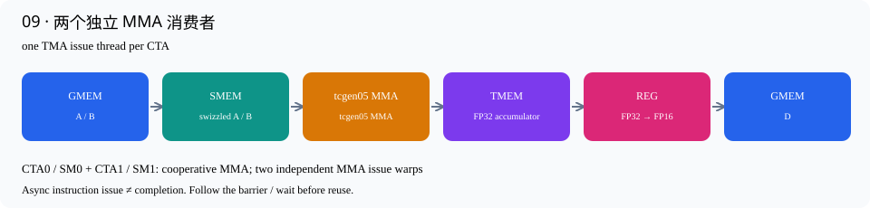

# 09 · 两个独立 MMA 消费者

源码：[v09_multi_consumer.cu](../kernels/v09_multi_consumer.cu) · [交互逐行讲解](v09_multi_consumer.html)

这里的“两个消费者”明确指两个独立MMA issue warp，不是一个warp轮流做两次MMA。WG2的warp0/1各推进自己的K-loop；warp3负责TMA。WG0/WG1分别写回consumer0/1。每CTA共384线程。

consumer0计算cluster tile的前256行，consumer1计算后256行；两者都计算相同256列，所以共享同一份B。一个cluster输出512×256。每个CTA每stage保存2份A（各128×64）和1份B（128×64），共48KiB；4stages共192KiB，两份128×64写回buffer再占32KiB。

两位消费者分别使用TMEM列[0,256)和[256,512)。消费者c在leader独立等待acc_empty[c]，消费full[stage]，发出MMA，然后通知empty[stage]。empty的初始化arrival count必须为2：只有两个消费者都确认读完，producer才能覆盖共享的B。

每个consumer最后发acc_full[c]，对应writeback WG只等待自己的slot。所以consumer0的写回无需等待consumer1的整个tile完成。任何将它们合并成一个issue warp或一个共同输出barrier的做法，都会削弱这种独立性。

每个writeback线程每轮拿64个FP32结果，转换并写回FP16；256 columns需要4轮。这是epilogue tile大小，与输入BK=64恰好同数值但含义不同。

## 数据路径



## 编译运行

```bash
./build.sh v09_multi_consumer
./build/v09_multi_consumer 4096 4096 4096
```

## 逐行讲解

每个有效源码行都有对应解释；纯空行不编号说明。类型/参数换行继续属于同一个CuTe表达式。

|行|原始代码|解释|
|---|---|---|
|1|`// CUDA C++ / CuTe — 原书第 9 步。`|说明性注释，不生成机器指令。对应的中文机制解释见本节开头和下面的实际语句。|
|2|`// Generated by scripts/materialize.py; edit include/ development templates,`|说明性注释，不生成机器指令。对应的中文机制解释见本节开头和下面的实际语句。|
|3|`// then regenerate.`|说明性注释，不生成机器指令。对应的中文机制解释见本节开头和下面的实际语句。|
|4|`#include "common.cuh"`|引入CUDA/CuTe、错误检查或C++标准库声明；这不是运行时加载Python包。|
|5|`namespace study {`|建立本项目命名空间，或简写CuTe名字；不改变数据布局或GPU调度。|
|6|`using namespace cute;`|建立本项目命名空间，或简写CuTe名字；不改变数据布局或GPU调度。|
|7|`using LD = decltype(group<0, 2>(`|定义静态layout或shape类型：输入layout服务MMA，LD服务128×64的输出TMA分块。|
|8|`tile_to_shape(UMMA::Layout_K_SW128_Atom<H>{}, Shape<_128, _64>{})));`|将小的swizzle atom铺成128×64输出SMEM tile；group<0,2>将两个逻辑轴打包，方便epilogue/TMA分片。|
|9|`} // namespace study`|结束当前代码块或类型声明；作用域对应上方最近的函数、循环或条件分支。|
|11|`namespace study {`|建立本项目命名空间，或简写CuTe名字；不改变数据布局或GPU调度。|
|12|`struct WSConfig {`|集中定义本版的静态MMA形状、线程数、TMEM容量与SMEM结构。|
|13|`static constexpr int BM = 128 * 2, BN = 128 * 2, Threads = 128 * (2 + 1),`|本版编译期配置：BM/BN是每个consumer合作MMA覆盖的形状，Threads含writeback和管理WG，Cols是TMEM列总数。|
|14|`Cols = BN * 2;`|TMEM列数=每个consumer的BN×consumer数量；第9版256×2=512列。|
|15|`using Op = std::conditional_t<`|在编译期选择单CTA或双CTA的类型。只会为本版选中的类型生成执行路径。|
|16|`2 == 1,`|本行继续上方表达式的参数/类型：在编译期选择单CTA或双CTA的类型。只会为本版选中的类型生成执行路径。|
|17|`SM100_MMA_F16BF16_SS<H, H, float, 128, 128, UMMA::Major::K,`|选择单CTA的FP16/BF16 SMEM×SMEM MMA原语，FP32累加；后续M/N和Major参数给出指令形状。|
|18|`UMMA::Major::K>,`|本行继续上方表达式的参数/类型：选择单CTA的FP16/BF16 SMEM×SMEM MMA原语，FP32累加；后续M/N和Major参数给出指令形状。|
|19|`SM100_MMA_F16BF16_2x1SM_SS<H, H, float, 256, 256, UMMA::Major::K,`|选择双CTA的FP16/BF16 SMEM×SMEM MMA原语，FP32累加，M/N=256/256；K-major表示K连续。|
|20|`UMMA::Major::K>>;`|本行继续上方表达式的参数/类型：选择双CTA的FP16/BF16 SMEM×SMEM MMA原语，FP32累加，M/N=256/256；K-major表示K连续。|
|21|`using MM = decltype(make_tiled_mma(Op{}));`|把底层MMA atom包装为CuTe TiledMMA，让后续分片、descriptor和gemm调用使用一致的映射。|
|22|`using T = Shape<Int<BM>, Int<BN>, _64>;`|定义编译期MMA tile形状(M,N,K)，此处K=64由4条K16 MMA组成。|
|23|`using AShape = decltype(partition_shape_A(MM{}, Shape<Int<BM>, _64>{}));`|在编译期推导MMA分片后的操作数shape。例如单CTA A的128×64变为((128,16),1,4)。|
|24|`using BShape = decltype(partition_shape_B(MM{}, Shape<Int<BN>, _64>{}));`|在编译期推导MMA分片后的操作数shape。例如单CTA A的128×64变为((128,16),1,4)。|
|25|`using AL = decltype(UMMA::tile_to_mma_shape(UMMA::Layout_K_SW128_Atom<H>{},`|以128-byte swizzle atom为基础，铺成MMA要求的shared-memory布局；使用partition_shape得到的形状而非随意手写descriptor。|
|26|`AShape{}));`|本行继续上方表达式的参数/类型：以128-byte swizzle atom为基础，铺成MMA要求的shared-memory布局；使用partition_shape得到的形状而非随意手写descriptor。|
|27|`using BL = decltype(UMMA::tile_to_mma_shape(UMMA::Layout_K_SW128_Atom<H>{},`|以128-byte swizzle atom为基础，铺成MMA要求的shared-memory布局；使用partition_shape得到的形状而非随意手写descriptor。|
|28|`BShape{}));`|本行继续上方表达式的参数/类型：以128-byte swizzle atom为基础，铺成MMA要求的shared-memory布局；使用partition_shape得到的形状而非随意手写descriptor。|
|29|`struct Storage {`|定义每CTA的shared-memory存储结构；内含A/B、输出buffer和barrier元数据。|
|30|`alignas(128) ArrayEngine<H, cosize_v<AL>> a[4][2];`|预留真正的shared-memory数组。cosize_v按layout的地址范围计算容量，alignas保证TMA/descriptor要求的对齐。|
|31|`alignas(128) ArrayEngine<H, cosize_v<BL>> b[4];`|预留真正的shared-memory数组。cosize_v按layout的地址范围计算容量，alignas保证TMA/descriptor要求的对齐。|
|32|`alignas(128) ArrayEngine<H, cosize_v<LD>> d[2];`|预留真正的shared-memory数组。cosize_v按layout的地址范围计算容量，alignas保证TMA/descriptor要求的对齐。|
|33|`alignas(16) uint64_t full[4], empty[4], acc_full[2], acc_empty[2];`|预留64-bit mbarrier对象；数组下标表示stage或consumer，不是GPU地址轴。|
|34|`alignas(16) uint32_t tmem;`|在SMEM中保存TMEM基地址。它只是一个32-bit地址值，不是整个TMEM存储数组。|
|35|`};`|结束当前代码块或类型声明；作用域对应上方最近的函数、循环或条件分支。|
|36|`};`|结束当前代码块或类型声明；作用域对应上方最近的函数、循环或条件分支。|
|37|`CUTE_DEVICE void mma_arrive(uint64_t *bar) {`|设备侧的MMA完成通知包装，屏蔽单/双CTA commit形式差异。|
|38|`if constexpr (2 == 1)`|编译期分支：常量条件决定保留哪条路径，未选中的单/双CTA或单/双buffer路径不会在运行时执行。|
|39|`cutlass::arch::umma_arrive(bar);`|单CTA的MMA完成通知辅助函数；和双CTA分支提供相同的上层含义。|
|40|`else`|进入与上方条件互补的分支；编译期常量条件会让其中一条路径直接消失。|
|41|`cutlass::arch::umma_arrive_multicast_2x1SM(bar, 3);`|发出tcgen05 commit，待本warp此前MMA完成后通知mask选中的CTAs；mask3=二进制11，即两侧都通知。|
|42|`}`|结束当前代码块或类型声明；作用域对应上方最近的函数、循环或条件分支。|
|43|`template <class TA, class TB, class TD, class CA, class CB, class CD>`|声明C++模板参数；CuTe的Tensor/layout类型在编译时决定，运行时不做Python解释。|
|44|`__global__ void ws_kernel(TA a, TB b, TD d, CUTE_GRID_CONSTANT CA const ca,`|TMA descriptor是grid级只读参数。防止取地址时被复制到线程local memory；TMA必须拿到可访问的descriptor地址。|
|45|`CUTE_GRID_CONSTANT CB const cb,`|TMA descriptor是grid级只读参数。防止取地址时被复制到线程local memory；TMA必须拿到可访问的descriptor地址。|
|46|`CUTE_GRID_CONSTANT CD const cd, int mt, int nt) {`|TMA descriptor是grid级只读参数。防止取地址时被复制到线程local memory；TMA必须拿到可访问的descriptor地址。|
|47|`using CF = WSConfig;`|为本版已经确定的配置/类型建立局部别名，缩短后续CuTe表达式；不会发出GPU指令。|
|48|`using MM = typename CF::MM;`|为本版已经确定的配置/类型建立局部别名，缩短后续CuTe表达式；不会发出GPU指令。|
|49|`using Tile = typename CF::T;`|定义编译期MMA tile形状(M,N,K)，此处K=64由4条K16 MMA组成。|
|50|`using AL = typename CF::AL;`|为本版已经确定的配置/类型建立局部别名，缩短后续CuTe表达式；不会发出GPU指令。|
|51|`using BL = typename CF::BL;`|为本版已经确定的配置/类型建立局部别名，缩短后续CuTe表达式；不会发出GPU指令。|
|52|`extern __shared__ char buf[];`|声明动态shared memory，由host launch第三个参数决定字节数。这里不是每个线程各分配一份。|
|53|`auto &s = *reinterpret_cast<typename CF::Storage *>(buf);`|把动态shared字节区解释为已定义Storage结构；各字段的偏移和对齐由C++编译器确定。|
|54|`int warp = threadIdx.x / 32, peer = blockIdx.x % 2, cluster = blockIdx.x / 2,`|计算warp号、peer CTA号和cluster号；这是线程职责与跨SM合作的基础坐标。|
|55|`cluster_count = gridDim.x / 2;`|物理grid的CTA数量除以CTA组大小，得到本次并行驻留的逻辑cluster数。|
|56|`bool leader = peer == 0, elected = elect_one_sync();`|peer==0识别leader；elect_one_sync从当前warp选出一个线程，用于只能单线程发射的TMA操作。|
|57|`MM mma;`|构造本线程的轻量MMA描述对象，包含累加模式等状态；不是在每个线程里分配一个Tensor Core。|
|58|`auto cta = mma.get_slice(peer);`|取得当前CTA在MMA中的份额。Blackwell的这个slice参数是peer CTA编号，不是CUDA threadIdx。|
|59|`using Alloc =`|选择单CTA或双CTA协作TMEM分配器，必须和MMA的CTA group一致。|
|60|`std::conditional_t<2 == 1, TMEM::Allocator1Sm, TMEM::Allocator2Sm>;`|在编译期选择单CTA或双CTA的类型。只会为本版选中的类型生成执行路径。|
|61|`Alloc alloc;`|创建TMEM分配器接口对象；真正申请发生在allocate调用。|
|62|`if (warp == 0)`|本warp承担TMEM分配/释放或串行版本的MMA发射；其他warps继续等待或负责结果搬运。|
|63|`alloc.allocate(CF::Cols, &s.tmem);`|由一个完整warp协作申请TMEM列数，并把基地址写到SMEM里的tmem字段；全CTA/cluster同步后其他线程才能使用。|
|64|`if (threadIdx.x == 0) {`|仅一个线程初始化shared barrier，避免重复初始化破坏其状态。|
|65|`for (int i = 0; i < 4; ++i) {`|遍历固定数量的barrier或当前线程的寄存器元素；具体容量由本版stage数/fragment shape决定。|
|66|`initialize_barrier(s.full[i], 1);`|初始化输入就绪barrier。一个producer arrival配合预期TMA字节数，确定本轮输入是否全部到达。|
|67|`initialize_barrier(s.empty[i], 2);`|初始化输入buffer回收barrier。期望到达数等于MMA消费者数；只有所有消费者读完B，producer才可覆盖该stage。|
|68|`}`|结束当前代码块或类型声明；作用域对应上方最近的函数、循环或条件分支。|
|69|`for (int i = 0; i < 2; ++i) {`|遍历固定数量的barrier或当前线程的寄存器元素；具体容量由本版stage数/fragment shape决定。|
|70|`initialize_barrier(s.acc_full[i], 1);`|初始化结果就绪barrier，每个consumer的最后一批MMA完成后通知一次。|
|71|`initialize_barrier(s.acc_empty[i], 128 * 2);`|初始化TMEM回收barrier，收集所有对应writeback线程的通知。双CTA下期望256次arrival。|
|72|`}`|结束当前代码块或类型声明；作用域对应上方最近的函数、循环或条件分支。|
|73|`}`|结束当前代码块或类型声明；作用域对应上方最近的函数、循环或条件分支。|
|74|`if constexpr (2 == 2)`|编译期分支：常量条件决定保留哪条路径，未选中的单/双CTA或单/双buffer路径不会在运行时执行。|
|75|`cluster_sync();`|两个CTA都到达cluster级同步点，保证初始化可见或退出前远端访问完成。不要把CTA内同步当作cluster同步。|
|76|`else`|进入与上方条件互补的分支；编译期常量条件会让其中一条路径直接消失。|
|77|`__syncthreads();`|整个CTA的执行同步。所有需要参与的线程都必须到达；它本身不会等待尚未提交到barrier的异步MMA/TMA。|
|78|`// Producer warp: fills a ring. A stage is reusable only after MMA releases`|说明性注释，不生成机器指令。对应的中文机制解释见本节开头和下面的实际语句。|
|79|`// it.`|说明性注释，不生成机器指令。对应的中文机制解释见本节开头和下面的实际语句。|
|80|`if (warp == 4 * 2 + 3) {`|进入TMA producer warp。这里的常量表达式由本版consumer数量决定，和讲义中的WG角色表对应。|
|81|`int iteration = 0;`|初始化跨迭代状态。iteration选择stage/phase；done_phase或round追踪反复使用的完成barrier。|
|82|`for (int ti = cluster; ti < mt * nt; ti += cluster_count) {`|持久化任务循环：当前CTA/cluster处理编号间隔为grid/cluster_count的一系列输出tiles。各角色必须使用相同编号顺序。|
|83|`int bm, bn;`|准备输出tile的二维索引；持久化版本随后用grouped_tile按8行M分组计算。|
|84|`grouped_tile(ti, mt, nt, bm, bn);`|把持久化逻辑tile编号映射为8行M一组的二维坐标，以限制A/B在L2中的复用距离。|
|85|`for (int kt = 0; kt < size<1>(a) / 64; ++kt, ++iteration) {`|沿K以64为单位分块。每一轮负责一个完整A/B输入stage，stage可跨输出tile循环复用。|
|86|`int st = iteration % 4;`|用绝对或当前K迭代号对stage数取模，选中要读写的那份shared buffer。|
|87|`if (iteration >= 4)`|环形buffer第一次使用天然为空；从第二圈开始，必须等上一圈消费完成。|
|88|`wait_barrier(s.empty[st], ((iteration / 4) - 1) & 1);`|producer等待这个stage上一轮的MMA消费全部结束，之后才能覆盖它。|
|89|`if (elected) {`|将TMA操作限制到一个线程；整个warp重复发射会重复搬运并破坏预期事务计数。|
|90|`if (leader)`|仅leader登记双CTA共同的TMA完成字节或推进MMA，避免两侧重复执行同一合作计算。|
|91|`set_barrier_transaction_bytes(`|向full barrier登记本轮TMA应完成的字节数并arrival。它只登记期望，不会自己搬数据。|
|92|`s.full[st], 2 * (2 * cosize_v<AL> + cosize_v<BL>)*sizeof(H));`|本行继续上方表达式的参数/类型：向full barrier登记本轮TMA应完成的字节数并arrival。它只登记期望，不会自己搬数据。|
|93|`CUTE_UNROLL`|要求编译器展开静态短循环，减少循环控制；不表示这些MMA或load变成同时发射。|
|94|`for (int c = 0; c < 2; ++c) {`|逐个consumer加载不同A或初始化独立barrier。最终版的MMA主循环本身由独立warp执行，不在一个warp里轮流计算。|
|95|`auto ga = local_tile(a, Tile{}, make_coord(bm * 2 + c, bn, _),`|选取当前输出任务的A窗口：M方向由bm和consumer决定，保留K tile轴用于循环。|
|96|`Step<_1, X, _1>{});`|本行继续上方表达式的参数/类型：选取当前输出任务的A窗口：M方向由bm和consumer决定，保留K tile轴用于循环。|
|97|`auto pa = cta.partition_A(ga);`|按MMA的CTA分片规则重排输入tile的逻辑坐标。1-CTA时全部属于本CTA；2-CTA时只取本侧输入。|
|98|`auto sa = make_tensor(make_smem_ptr(s.a[st][c].begin()), AL{});`|把shared buffer地址和swizzled layout组合成CuTe Tensor视图；布局决定逻辑坐标如何落到物理SMEM。|
|99|`auto [ag, as] =`|C++结构化绑定接收TMA分片结果：ag是源global坐标视图，as是目标shared-memory视图。下一行调用tma_partition。|
|100|`tma_partition(ca, _0{}, Layout<_1>{}, group_modes<0, 3>(sa),`|把MMA分片/epilogue分片转成TMA的源、目标视图。ag/bg/dg是global坐标，as/bs/ds是shared目标或源；尚未搬数据。|
|101|`group_modes<0, 3>(pa));`|本行继续上方表达式的参数/类型：把MMA分片/epilogue分片转成TMA的源、目标视图。ag/bg/dg是global坐标，as/bs/ds是shared目标或源；尚未搬数据。|
|102|`copy(ca.with(s.full[st]), ag(_, kt), as);`|发起TMA异步加载：从global坐标对应tile搬到当前stage的SMEM，并将完成字节记到with指定的barrier。|
|103|`}`|结束当前代码块或类型声明；作用域对应上方最近的函数、循环或条件分支。|
|104|`auto gb = local_tile(b, Tile{}, make_coord(bm * 2, bn, _),`|选取当前输出任务的B窗口：N方向由bn决定，保留K tile轴。多个consumer共用bn，所以可以复用B。|
|105|`Step<X, _1, _1>{});`|本行继续上方表达式的参数/类型：选取当前输出任务的B窗口：N方向由bn决定，保留K tile轴。多个consumer共用bn，所以可以复用B。|
|106|`auto pb = cta.partition_B(gb);`|按MMA的CTA分片规则重排输入tile的逻辑坐标。1-CTA时全部属于本CTA；2-CTA时只取本侧输入。|
|107|`auto sb = make_tensor(make_smem_ptr(s.b[st].begin()), BL{});`|把shared buffer地址和swizzled layout组合成CuTe Tensor视图；布局决定逻辑坐标如何落到物理SMEM。|
|108|`auto [bg, bs] =`|C++结构化绑定接收B的TMA分片：bg是源global坐标，bs是对应shared目标。|
|109|`tma_partition(cb, _0{}, Layout<_1>{}, group_modes<0, 3>(sb),`|把MMA分片/epilogue分片转成TMA的源、目标视图。ag/bg/dg是global坐标，as/bs/ds是shared目标或源；尚未搬数据。|
|110|`group_modes<0, 3>(pb));`|本行继续上方表达式的参数/类型：把MMA分片/epilogue分片转成TMA的源、目标视图。ag/bg/dg是global坐标，as/bs/ds是shared目标或源；尚未搬数据。|
|111|`copy(cb.with(s.full[st]), bg(_, kt), bs);`|发起TMA异步加载：从global坐标对应tile搬到当前stage的SMEM，并将完成字节记到with指定的barrier。|
|112|`}`|结束当前代码块或类型声明；作用域对应上方最近的函数、循环或条件分支。|
|113|`}`|结束当前代码块或类型声明；作用域对应上方最近的函数、循环或条件分支。|
|114|`}`|结束当前代码块或类型声明；作用域对应上方最近的函数、循环或条件分支。|
|115|`}`|结束当前代码块或类型声明；作用域对应上方最近的函数、循环或条件分支。|
|116|`// Exactly 2 independent MMA issue warps, matching the book's consumer`|说明性注释，不生成机器指令。对应的中文机制解释见本节开头和下面的实际语句。|
|117|`// definition.`|说明性注释，不生成机器指令。对应的中文机制解释见本节开头和下面的实际语句。|
|118|`if (warp >= 4 * 2 && warp < 4 * 2 + 2 && leader) {`|只让leader CTA内的指定MMA issue warp进入；第9版两条warp指令流各推进自己的consumer。|
|119|`int c = warp - 4 * 2;`|MMA issue warp号决定consumer编号，各warp有独立的K-loop和accumulator范围。|
|120|`int iteration = 0, round = 0;`|初始化跨迭代状态。iteration选择stage/phase；done_phase或round追踪反复使用的完成barrier。|
|121|`for (int ti = cluster; ti < mt * nt; ti += cluster_count, ++round) {`|持久化任务循环：当前CTA/cluster处理编号间隔为grid/cluster_count的一系列输出tiles。各角色必须使用相同编号顺序。|
|122|`int bm, bn;`|准备输出tile的二维索引；持久化版本随后用grouped_tile按8行M分组计算。|
|123|`grouped_tile(ti, mt, nt, bm, bn);`|把持久化逻辑tile编号映射为8行M一组的二维坐标，以限制A/B在L2中的复用距离。|
|124|`auto gd = local_tile(d, Tile{}, make_coord(bm * 2 + c, bn, _),`|选取本任务的输出窗口；本CTA或本consumer只写它拥有的M/N坐标，避免输出竞争。|
|125|`Step<_1, _1, X>{});`|本行继续上方表达式的参数/类型：选取本任务的输出窗口；本CTA或本consumer只写它拥有的M/N坐标，避免输出竞争。|
|126|`auto pd = cta.partition_C(gd);`|按MMA映射取得本CTA输出的逻辑布局。双CTA的每侧只拥有128行，但都覆盖MMA的全部N列。|
|127|`auto acc = cta.make_fragment_C(pd);`|创建TMEM accumulator的布局视图；此时还没有申请硬件TMEM，或者要在下一行绑定已申请地址。|
|128|`acc.data() = s.tmem + c * CF::BN;`|为静态TMEM layout绑定真正的硬件基地址。第9版再加consumer×256列，使两个累加器互不覆盖。|
|129|`if (round)`|第一次输出无需等待旧TMEM；从第二个输出tile开始等待上一轮writeback完成。|
|130|`wait_barrier(s.acc_empty[c], (round - 1) & 1);`|当前MMA消费者等待上一输出tile的TMEM被用完。只等待自己的slot，不等待另一位消费者的整个输出。|
|131|`mma.accumulate_ = UMMA::ScaleOut::Zero;`|让后续第一条MMA忽略原TMEM值，相当于以0开始本输出tile的累加；无需另发清零kernel。|
|132|`for (int kt = 0; kt < size<1>(a) / 64; ++kt, ++iteration) {`|沿K以64为单位分块。每一轮负责一个完整A/B输入stage，stage可跨输出tile循环复用。|
|133|`int st = iteration % 4;`|用绝对或当前K迭代号对stage数取模，选中要读写的那份shared buffer。|
|134|`wait_barrier(s.full[st], (iteration / 4) & 1);`|MMA侧等待当前stage本轮TMA字节全部到达；phase用于区分反复使用同一barrier的不同轮次。|
|135|`auto sb = make_tensor(make_smem_ptr(s.b[st].begin()), BL{});`|把shared buffer地址和swizzled layout组合成CuTe Tensor视图；布局决定逻辑坐标如何落到物理SMEM。|
|136|`auto rb = cta.make_fragment_B(sb);`|把SMEM tensor转换成MMA操作数descriptor fragment；这里不执行SMEM→寄存器的数据复制。|
|137|`auto sa = make_tensor(make_smem_ptr(s.a[st][c].begin()), AL{});`|把shared buffer地址和swizzled layout组合成CuTe Tensor视图；布局决定逻辑坐标如何落到物理SMEM。|
|138|`auto ra = cta.make_fragment_A(sa);`|把SMEM tensor转换成MMA操作数descriptor fragment；这里不执行SMEM→寄存器的数据复制。|
|139|`CUTE_UNROLL`|要求编译器展开静态短循环，减少循环控制；不表示这些MMA或load变成同时发射。|
|140|`for (int kb = 0; kb < size<2>(ra); ++kb) {`|一个BK64包含4个K16 MMA微块；此循环按descriptor的K偏移发出4条MMA。|
|141|`gemm(mma, ra(_, _, kb), rb(_, _, kb), acc);`|发一条K16的tcgen05 MMA，A/B参数是SMEM descriptor，结果累加到TMEM。调用异步；CuTe内部处理单线程发射。|
|142|`mma.accumulate_ = UMMA::ScaleOut::One;`|从下一条MMA开始保留已有TMEM结果并继续累加，不能在每个K tile开头重新清零。|
|143|`}`|结束当前代码块或类型声明；作用域对应上方最近的函数、循环或条件分支。|
|144|`// Every consumer signals once: producer expects 2 completions before`|说明性注释，不生成机器指令。对应的中文机制解释见本节开头和下面的实际语句。|
|145|`// reusing A/B.`|说明性注释，不生成机器指令。对应的中文机制解释见本节开头和下面的实际语句。|
|146|`mma_arrive(&s.empty[st]);`|当前MMA consumer提交输入消费完成通知。共享B的stage需要所有consumer的完成通知才能回收。|
|147|`}`|结束当前代码块或类型声明；作用域对应上方最近的函数、循环或条件分支。|
|148|`mma_arrive(&s.acc_full[c]);`|本消费者整个K-loop结束，提交自己那段TMEM的结果就绪通知。|
|149|`}`|结束当前代码块或类型声明；作用域对应上方最近的函数、循环或条件分支。|
|150|`}`|结束当前代码块或类型声明；作用域对应上方最近的函数、循环或条件分支。|
|151|`// Each consumer warpgroup writes one accumulator tile through its own SMEM`|说明性注释，不生成机器指令。对应的中文机制解释见本节开头和下面的实际语句。|
|152|`// buffer.`|说明性注释，不生成机器指令。对应的中文机制解释见本节开头和下面的实际语句。|
|153|`if (threadIdx.x < 128 * 2) {`|只有writeback warpgroup进入epilogue；producer/MMA warps不参与其128线程named barrier。|
|154|`int c = threadIdx.x / 128, tid = threadIdx.x % 128, round = 0;`|根据writeback线程所在warpgroup选择consumer，并用局部tid=threadIdx%128套用TMEM copy映射。|
|155|`for (int ti = cluster; ti < mt * nt; ti += cluster_count, ++round) {`|持久化任务循环：当前CTA/cluster处理编号间隔为grid/cluster_count的一系列输出tiles。各角色必须使用相同编号顺序。|
|156|`int bm, bn;`|准备输出tile的二维索引；持久化版本随后用grouped_tile按8行M分组计算。|
|157|`grouped_tile(ti, mt, nt, bm, bn);`|把持久化逻辑tile编号映射为8行M一组的二维坐标，以限制A/B在L2中的复用距离。|
|158|`auto gd = local_tile(d, Tile{}, make_coord(bm * 2 + c, bn, _),`|选取本任务的输出窗口；本CTA或本consumer只写它拥有的M/N坐标，避免输出竞争。|
|159|`Step<_1, _1, X>{});`|本行继续上方表达式的参数/类型：选取本任务的输出窗口；本CTA或本consumer只写它拥有的M/N坐标，避免输出竞争。|
|160|`auto pd = cta.partition_C(gd);`|按MMA映射取得本CTA输出的逻辑布局。双CTA的每侧只拥有128行，但都覆盖MMA的全部N列。|
|161|`auto acc = cta.make_fragment_C(pd);`|创建TMEM accumulator的布局视图；此时还没有申请硬件TMEM，或者要在下一行绑定已申请地址。|
|162|`acc.data() = s.tmem + c * CF::BN;`|为静态TMEM layout绑定真正的硬件基地址。第9版再加consumer×256列，使两个累加器互不覆盖。|
|163|`wait_barrier(s.acc_full[c], round & 1);`|writeback WG等待对应consumer的MMA完成，随后才允许读取这一段TMEM。|
|164|`auto ae = zipped_divide(acc, make_tile(Shape<_128, _64>{}));`|把完整输出拆成epilogue子tile和子tile编号。128×64只限制每轮处理量，不改变完整输出的形状。|
|165|`auto de = zipped_divide(pd, make_tile(Shape<_128, _64>{}));`|把完整输出拆成epilogue子tile和子tile编号。128×64只限制每轮处理量，不改变完整输出的形状。|
|166|`auto sd = make_tensor(make_smem_ptr(s.d[c].begin()), LD{});`|把shared buffer地址和swizzled layout组合成CuTe Tensor视图；布局决定逻辑坐标如何落到物理SMEM。|
|167|`auto [dg, ds] = tma_partition(cd, sd, de);`|把MMA分片/epilogue分片转成TMA的源、目标视图。ag/bg/dg是global坐标，as/bs/ds是shared目标或源；尚未搬数据。|
|168|`auto cp = make_tmem_copy(SM100_TMEM_LOAD_32dp32b1x{}, ae(_, _0{}));`|用选定tcgen05 load atom和accumulator布局构造线程级复制方案；随后get_slice才取出当前线程的份额。|
|170|`auto th = cp.get_slice(tid);`|取得当前CUDA线程在TMEM copy中的份额。这里的slice参数才是线程号。|
|171|`auto src = th.partition_S(ae);`|按copy的线程映射取源分片；TMEM copy中它指当前线程要读的TMEM位置，不是另分配一块TMEM。|
|172|`auto dst = th.partition_D(sd);`|按同一个copy映射取目标分片，使每个源结果落到对应输出坐标；目标可能是SMEM或GMEM。|
|173|`auto rf = make_tensor<float>(shape(dst));`|按当前线程目标分片的形状创建FP32寄存器fragment，暂存从TMEM读出的结果。|
|174|`auto rh = make_fragment_like(dst);`|创建对应形状的FP16寄存器fragment，承接转换后的结果。寄存器是线程私有的。|
|175|`for (int ei = 0; ei < size<2>(src); ++ei) {`|遍历128×64的epilogue子块。BN128需2轮，BN256需4轮；同一输出SMEM buffer反复使用。|
|176|`copy(cp, src(_, _, ei), rf);`|真正执行TMEM→寄存器的load；cp规定本线程读取哪些lane/column，rf接收FP32结果。|
|177|`cutlass::arch::fence_view_async_tmem_load();`|发出tcgen05.wait::ld，等待本线程已发出的TMEM读取完成，再使用寄存器并允许回收TMEM。|
|178|`CUTE_UNROLL`|要求编译器展开静态短循环，减少循环控制；不表示这些MMA或load变成同时发射。|
|179|`for (int j = 0; j < size(rh); ++j)`|遍历固定数量的barrier或当前线程的寄存器元素；具体容量由本版stage数/fragment shape决定。|
|180|`rh(j) = H(rf(j));`|逐元素从FP32转换为FP16；这一步发生最终舍入，Tensor Core的内部累加精度仍是FP32。|
|181|`copy(rh, dst);`|真正执行FP16寄存器→目标存储。前三版dst是GMEM分片，TMA版本dst是swizzled输出SMEM分片。|
|182|`tma_store_fence();`|把writeback线程的shared store公布给TMA异步代理；所有写入线程都要执行，然后做WG/CTA同步。|
|183|`cutlass::arch::NamedBarrier::sync(128, c);`|只同步当前consumer的128个writeback线程。barrier ID按consumer区分，不能在这里使用要求整个CTA到齐的__syncthreads。|
|184|`if (tid == 0) {`|仅本writeback WG的线程0发起并等待TMA store，其他线程通过named barrier与它会合。|
|185|`copy(cd, ds, dg(_, ei));`|发起SMEM→GMEM的TMA store。这个调用返回不代表数据已经写完，后面还要commit/wait。|
|186|`tma_store_arrive();`|当前发射线程提交此前TMA store组成的bulk async group。|
|187|`tma_store_wait<0>();`|当前发射线程等待已提交的TMA store组完成，保证输出SMEM可以安全复用。|
|188|`}`|结束当前代码块或类型声明；作用域对应上方最近的函数、循环或条件分支。|
|189|`cutlass::arch::NamedBarrier::sync(128, c);`|只同步当前consumer的128个writeback线程。barrier ID按consumer区分，不能在这里使用要求整个CTA到齐的__syncthreads。|
|190|`}`|结束当前代码块或类型声明；作用域对应上方最近的函数、循环或条件分支。|
|191|`if constexpr (2 == 2)`|编译期分支：常量条件决定保留哪条路径，未选中的单/双CTA或单/双buffer路径不会在运行时执行。|
|192|`cutlass::arch::ClusterBarrier::arrive(&s.acc_empty[c], 0, 1);`|写回线程报告TMEM已用完；双CTA时送到CTA0的acc_empty[c]。每个线程到达一次，合计128×CTA组大小次。|
|193|`else`|进入与上方条件互补的分支；编译期常量条件会让其中一条路径直接消失。|
|194|`cutlass::arch::ClusterBarrier::arrive(&s.acc_empty[c]);`|写回线程报告TMEM已用完；双CTA时送到CTA0的acc_empty[c]。每个线程到达一次，合计128×CTA组大小次。|
|195|`}`|结束当前代码块或类型声明；作用域对应上方最近的函数、循环或条件分支。|
|196|`}`|结束当前代码块或类型声明；作用域对应上方最近的函数、循环或条件分支。|
|197|`if constexpr (2 == 2)`|编译期分支：常量条件决定保留哪条路径，未选中的单/双CTA或单/双buffer路径不会在运行时执行。|
|198|`cluster_sync();`|两个CTA都到达cluster级同步点，保证初始化可见或退出前远端访问完成。不要把CTA内同步当作cluster同步。|
|199|`else`|进入与上方条件互补的分支；编译期常量条件会让其中一条路径直接消失。|
|200|`__syncthreads();`|整个CTA的执行同步。所有需要参与的线程都必须到达；它本身不会等待尚未提交到barrier的异步MMA/TMA。|
|201|`if (warp == 0) {`|本warp承担TMEM分配/释放或串行版本的MMA发射；其他warps继续等待或负责结果搬运。|
|202|`alloc.release_allocation_lock();`|归还TMEM分配许可，让后续工作能够申请；这不等于已经释放当前TMEM内容。|
|203|`alloc.free(s.tmem, CF::Cols);`|释放先前申请的TMEM列。调用前必须确保所有相关线程和远端CTA已经不再访问它。|
|204|`}`|结束当前代码块或类型声明；作用域对应上方最近的函数、循环或条件分支。|
|205|`}`|结束当前代码块或类型声明；作用域对应上方最近的函数、循环或条件分支。|
|206|`void launch_ws(Problem p) {`|host侧入口，准备描述对象、配置kernel并发射；GPU运算在__global__函数内。|
|207|`using CF = WSConfig;`|为本版已经确定的配置/类型建立局部别名，缩短后续CuTe表达式；不会发出GPU指令。|
|208|`using MM = typename CF::MM;`|为本版已经确定的配置/类型建立局部别名，缩短后续CuTe表达式；不会发出GPU指令。|
|209|`using Tile = typename CF::T;`|定义编译期MMA tile形状(M,N,K)，此处K=64由4条K16 MMA组成。|
|210|`auto a = make_tensor(make_gmem_ptr(p.a), make_layout(make_shape(p.m, p.k),`|把cudaMalloc得到的全局地址和形状/stride组合成CuTe Tensor；这个host侧对象描述内存，不复制矩阵。|
|211|`make_stride(p.k, _1{})));`|描述row-major布局：外层行移动K或N个元素，内层连续维度stride=1。stride单位是元素，不是字节。|
|212|`auto b = make_tensor(make_gmem_ptr(p.b), make_layout(make_shape(p.n, p.k),`|把cudaMalloc得到的全局地址和形状/stride组合成CuTe Tensor；这个host侧对象描述内存，不复制矩阵。|
|213|`make_stride(p.k, _1{})));`|描述row-major布局：外层行移动K或N个元素，内层连续维度stride=1。stride单位是元素，不是字节。|
|214|`auto d = make_tensor(make_gmem_ptr(p.d), make_layout(make_shape(p.m, p.n),`|把cudaMalloc得到的全局地址和形状/stride组合成CuTe Tensor；这个host侧对象描述内存，不复制矩阵。|
|215|`make_stride(p.n, _1{})));`|描述row-major布局：外层行移动K或N个元素，内层连续维度stride=1。stride单位是元素，不是字节。|
|216|`auto cluster_layout = tiled_divide(make_layout(Shape<Int<2>, _1, _1>{}),`|构造(V,M,N,K)形式的cluster布局，V表示一次MMA的peer CTA轴。双CTA时V大小为2。|
|217|`make_tile(typename MM::AtomThrID{}));`|本行继续上方表达式的参数/类型：构造(V,M,N,K)形式的cluster布局，V表示一次MMA的peer CTA轴。双CTA时V大小为2。|
|218|`using CopyOp = std::conditional_t<2 == 1, SM90_TMA_LOAD, SM100_TMA_2SM_LOAD>;`|在编译期选择单CTA或双CTA的类型。只会为本版选中的类型生成执行路径。|
|219|`auto ca = make_tma_atom_A_sm100(CopyOp{}, a, typename CF::AL{}, Tile{}, MM{},`|在CPU上创建A的TMA descriptor，结合MMA和cluster layout进行CTA级分配；双CTA下每侧只搬自己那份。|
|220|`cluster_layout);`|本行继续上方表达式的参数/类型：在CPU上创建A的TMA descriptor，结合MMA和cluster layout进行CTA级分配；双CTA下每侧只搬自己那份。|
|221|`auto cb = make_tma_atom_B_sm100(CopyOp{}, b, typename CF::BL{}, Tile{}, MM{},`|在CPU上创建B的TMA descriptor；双CTA下两侧各持一半N方向输入，两者一起服务完整MMA输出。|
|222|`cluster_layout);`|本行继续上方表达式的参数/类型：在CPU上创建B的TMA descriptor；双CTA下两侧各持一半N方向输入，两者一起服务完整MMA输出。|
|223|`auto cd = make_tma_atom(SM90_TMA_STORE{}, d, LD{}, Shape<_128, _64>{});`|在CPU上为输出的128×64子tile编码TMA store descriptor，绑定D的形状和输出SMEM swizzle。|
|224|`auto ta = ca.get_tma_tensor(shape(a));`|从descriptor取得坐标型Tensor；里面是多轴global坐标表达式，不是普通可直接解引用的GPU指针。|
|225|`auto tb = cb.get_tma_tensor(shape(b));`|从descriptor取得坐标型Tensor；里面是多轴global坐标表达式，不是普通可直接解引用的GPU指针。|
|226|`auto td = cd.get_tma_tensor(shape(d));`|从descriptor取得坐标型Tensor；里面是多轴global坐标表达式，不是普通可直接解引用的GPU指针。|
|227|`auto fn = ws_kernel<decltype(ta), decltype(tb), decltype(td), decltype(ca),`|选择当前Tensor/descriptor类型对应的模板实例，取得真正的kernel入口地址。|
|228|`decltype(cb), decltype(cd)>;`|本行继续上方表达式的参数/类型：选择当前Tensor/descriptor类型对应的模板实例，取得真正的kernel入口地址。|
|229|`static bool configured = false;`|host端记住kernel属性是否已设置；不会在每个Graph节点里反复配置。|
|230|`if (!configured) {`|仅首次host调用进入配置分支；此处不是GPU线程分支。|
|231|`CUDA_OK(cudaFuncSetAttribute(fn,`|允许该kernel使用指定大小的动态SMEM；配置发生在host侧且只做一次，避免污染每次发射的host成本。|
|232|`cudaFuncAttributeMaxDynamicSharedMemorySize,`|允许该kernel使用指定大小的动态SMEM；配置发生在host侧且只做一次，避免污染每次发射的host成本。|
|233|`sizeof(typename CF::Storage)));`|本行继续上方表达式的参数/类型：允许该kernel使用指定大小的动态SMEM；配置发生在host侧且只做一次，避免污染每次发射的host成本。|
|234|`configured = true;`|标记属性已配置，后续launch复用。|
|235|`}`|结束当前代码块或类型声明；作用域对应上方最近的函数、循环或条件分支。|
|236|`int mt = p.m / (CF::BM * 2), nt = p.n / CF::BN;`|计算逻辑cluster tile网格的M/N大小；M要同时除以单consumer的BM和consumer数量。|
|237|`int clusters = std::min(mt * nt, p.sms / 2);`|限制持久化并行任务数不超过可用SM/cluster数，也不超过总tile数。更多工作由同一个CTA/cluster在循环里继续处理。|
|238|`if constexpr (2 == 1)`|编译期分支：常量条件决定保留哪条路径，未选中的单/双CTA或单/双buffer路径不会在运行时执行。|
|239|`fn<<<clusters, CF::Threads, sizeof(typename CF::Storage)>>>(ta, tb, td, ca,`|真正发射CUDA kernel：依次指定grid、每CTA线程数、动态SMEM大小。矩阵分片的Tensor与descriptor作为参数传入。|
|240|`cb, cd, mt, nt);`|本行继续上方表达式的参数/类型：真正发射CUDA kernel：依次指定grid、每CTA线程数、动态SMEM大小。矩阵分片的Tensor与descriptor作为参数传入。|
|241|`else {`|进入与上方条件互补的分支；编译期常量条件会让其中一条路径直接消失。|
|242|`cudaLaunchConfig_t config{};`|初始化CUDA扩展启动配置结构，后续填写cluster属性。|
|243|`config.gridDim = dim3(clusters * 2);`|填写cluster launch参数：grid/block维度、动态SMEM字节数、stream和属性数组。|
|244|`config.blockDim = dim3(CF::Threads);`|填写cluster launch参数：grid/block维度、动态SMEM字节数、stream和属性数组。|
|245|`config.dynamicSmemBytes = sizeof(typename CF::Storage);`|填写cluster launch参数：grid/block维度、动态SMEM字节数、stream和属性数组。|
|246|`config.stream = cudaStreamPerThread;`|填写cluster launch参数：grid/block维度、动态SMEM字节数、stream和属性数组。|
|247|`cudaLaunchAttribute attr{};`|初始化CUDA扩展启动配置结构，后续填写cluster属性。|
|248|`attr.id = cudaLaunchAttributeClusterDimension;`|为launch设置cluster维度；只有这样两个CTA才获得同cluster的协作与调度保证。|
|249|`attr.val.clusterDim = {2, 1, 1};`|cluster形状设为(2,1,1)；这是CTA的组织方式，不是CUDA block里线程的形状。|
|250|`config.attrs = &attr;`|填写cluster launch参数：grid/block维度、动态SMEM字节数、stream和属性数组。|
|251|`config.numAttrs = 1;`|填写cluster launch参数：grid/block维度、动态SMEM字节数、stream和属性数组。|
|252|`CUDA_OK(cudaLaunchKernelEx(&config, fn, ta, tb, td, ca, cb, cd, mt, nt));`|按显式cluster维度启动两个CTA合作的kernel，并放到统一的per-thread stream中以便Graph捕获。|
|253|`}`|结束当前代码块或类型声明；作用域对应上方最近的函数、循环或条件分支。|
|254|`}`|结束当前代码块或类型声明；作用域对应上方最近的函数、循环或条件分支。|
|255|`} // namespace study`|结束当前代码块或类型声明；作用域对应上方最近的函数、循环或条件分支。|
|257|`void launch(Problem p) { study::launch_ws(p); }`|host侧入口，准备描述对象、配置kernel并发射；GPU运算在__global__函数内。|
|258|`constexpr int VERSION = 9;`|测试程序用这个编译期版本号检查允许的输入形状，并标记输出JSON。|
|259|`#include "runner_graph.cuh"`|引入共享C++测试入口：随机输入、CPU/完整cuBLAS参考、cuBLASLt选择与Graph计时。对应独立测试文档有逐行说明。|

## 实测

```json
{
  "version": 9,
  "m": 4096,
  "n": 4096,
  "k": 4096,
  "correct": true,
  "checked": 16777216,
  "max_abs": 0.0317611694,
  "median_ms": 0.121664003,
  "p10_ms": 0.114803195,
  "p90_ms": 0.122080006,
  "tflops": 1129.65997,
  "cublas_ms": 0.0866992027,
  "cublasLt_ms": 0.0912799984,
  "speedup_vs_lt": 0.750262976,
  "lt_candidates": 8,
  "lt_choice": 0,
  "cublas_version": 130100,
  "cache_policy": "warm_replay",
  "gpu": "NVIDIA B300 SXM6 AC",
  "sms": 148
}
```

公共测试程序详见 [测试与基准](testing.md)。
